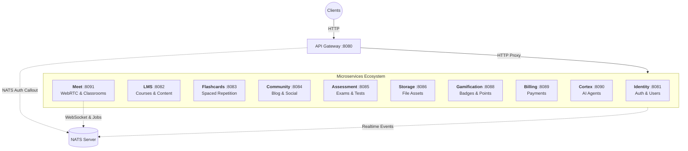

# Torii Nihongo Monorepo

Dự án chuyên biệt đào tạo tiếng Nhật trực tuyến kết hợp WebRTC và AI Agents. Monorepo được quản lý bởi **TurboRepo**, tích hợp hệ thống Microservices hiện đại giao tiếp qua **NATS Message Broker** và **Protobuf**.

## 🏗 Overall Monorepo Structure

```
torii-monorepo/
├── apps/
│   ├── server/               # NestJS Microservices Workspace
│   │   ├── modules/          # 8 Microservices độc lập
│   │   └── libs/             # Thư viện dùng chung (shared logic, nats, prisma)
│   ├── web-admin/            # React Admin Dashboard (Vite)
│   └── web-learner/          # Next.js Learning Platform
├── packages/
│   ├── protocol/             # Shared Protobuf definitions & generated code (@bufbuild/protobuf)
│   ├── schemas/              # Shared Zod schemas & DTO types (@workspace/schemas)
│   ├── ui/                   # Shared UI components
│   └── *-config/             # Cấu hình ESLint, TypeScript dùng chung
├── nats_server.conf          # Cấu hình NATS Server (JetStream, Auth Callout)
├── livekit.yaml              # Cấu hình LiveKit Server (Local Dev)
├── turbo.json                # TurboRepo config
└── pnpm-workspace.yaml       # PNPM Workspaces config
```

---

## 🛠 Local Development Setup

Để chạy dự án trên môi trường local, chúng ta sử dụng **Docker** cho các Infrastructure Services (DB, Redis, NATS, LiveKit) và chạy **Node.js** trực tiếp cho mã nguồn ứng dụng (Service/Frontend) để tận dụng trải nghiệm dev tốt nhất (Hot Reload, Debugging).

### 1. Prerequisites
- Docker & Docker Compose
- Node.js (v20+)
- PNPM (Package Manager)

### 2. Infrastructure Setup (Docker)
Khởi chạy toàn bộ hạ tầng cần thiết chỉ với một lệnh:

```bash
docker-compose up -d
```

Các services sẽ chạy tại:
- **PostgreSQL**: `localhost:5432` (User: `postgres`, Pass: `123456789`, DB: `wajlc`)
- **Redis**: `localhost:6379`
- **NATS**: `localhost:4222` (Monitor: `localhost:8222`)
- **LiveKit**: `localhost:7880` (API Key: `APIiYAA5w37Cfo2`, Secret: `6aNur7qqupeZhFYNOJVUyeXxXhVw8f4lm13pEDUx8SgB`)

Để dừng và xóa dữ liệu (nếu cần reset):
```bash
docker-compose down -v
```

### 3. Application Setup

1.  **Cài đặt dependencies:**
    ```bash
    pnpm install
    ```

2.  **Cấu hình biến môi trường:**
    Copy file mẫu và tạo file `.env` tại thư mục root:
    ```bash
    cp .env.example .env
    ```
    *Lưu ý: `.env.example` đã được cấu hình sẵn để kết nối với Infrastructure Docker mặc định.*

3.  **Database Migration & Generation:**
    ```bash
    cd apps/server
    pnpx prisma generate
    pnpx prisma db push
    ```
    *Lệnh `db push` sẽ đồng bộ schema Prisma vào database `wajlc` đang chạy trên Docker.*

4.  **Environment Variables (Service URLs):**
    Đảm bảo `.env` có các biến sau cho microservices:
    ```bash
    # Microservice Ports
    IDENTITY_HTTP_PORT=8081
    LMS_HTTP_PORT=8082
    FLASHCARDS_HTTP_PORT=8083
    COMMUNITY_HTTP_PORT=8084
    ASSESSMENT_HTTP_PORT=8085
    STORAGE_HTTP_PORT=8086
    GAMIFICATION_HTTP_PORT=8088
    BILLING_HTTP_PORT=8089
    CORTEX_HTTP_PORT=8090
    MEET_HTTP_PORT=8091
    
    # Service URLs (for Gateway proxy)
    IDENTITY_SERVICE_URL=http://localhost:8081
    LMS_SERVICE_URL=http://localhost:8082
    FLASHCARDS_SERVICE_URL=http://localhost:8083
    COMMUNITY_SERVICE_URL=http://localhost:8084
    ASSESSMENT_SERVICE_URL=http://localhost:8085
    STORAGE_SERVICE_URL=http://localhost:8086
    GAMIFICATION_SERVICE_URL=http://localhost:8088
    BILLING_SERVICE_URL=http://localhost:8089
    CORTEX_SERVICE_URL=http://localhost:8090
    MEET_SERVICE_URL=http://localhost:8091
    ```


### 4. Running the App

Chạy toàn bộ Backend Microservices ở chế độ Watch Mode:
```bash
# Tại root project
pnpm dev
# Hoặc chạy cụ thể backend:
pnpm --filter server dev
```

Chạy Frontend (nếu cần):
```bash
pnpm --filter web-admin dev
pnpm --filter web-learner dev
```

---

## 🎨 UI Library (shadcn/ui)

Dự án sử dụng **shadcn/ui** tập trung tại `@workspace/ui`. Để cài đặt thêm component mới:

```bash
cd packages/ui
pnpm dlx shadcn@latest add [component-name]
```

---

## 🛰 Microservices Architecture (HTTP + NATS Hybrid)

Hệ thống backend được chia thành các **Domain Services độc lập**, giao tiếp qua **HTTP REST API** (cho request/response) và **NATS Message Broker** (cho realtime events và async jobs). Kiến trúc này tập trung vào các nghiệp vụ lõi (Learning, Real-time Class, AI) thay vì chia theo chức năng kỹ thuật.

### 🏛 System Architecture



### 📡 Communication Patterns

**1. HTTP (Request/Response):**
- Client → Gateway → Microservice HTTP endpoint
- Synchronous CRUD operations
- RESTful API design

**2. NATS (Realtime & Async):**
- Auth callout for LiveKit (Meet service)
- WebSocket communication (Meet service)
- Async job processing (transcoding, analytics)
- Inter-service events (optional)

### 🧩 Service Domains (Modules)

| Service | Port | Protocol | Trách nhiệm chính (Bounded Context) |
|:---|:---|:---|:---|
| **Gateway** | `8080` | HTTP | Entry point duy nhất, HTTP proxy routing, Authentication guard (Auth Callout via NATS). |
| **Identity** | `8081` | HTTP | **Core Auth**: Đăng ký, đăng nhập, Quản lý User, RBAC. **Tính năng mới**: Refresh Token Rotation, Dual-Mode Auth (Cookie/Web & JSON/Mobile), Secure Mobile Flow. |
| **LMS** | `8082` | HTTP | **Learning Core**: Quản lý khóa học, bài học (Lessons), lộ trình học tập, tracking tiến độ học viên. |
| **Flashcards** | `8083` | HTTP | **Study Tool**: Quản lý bộ thẻ (Decks), thuật toán Spaced Repetition (SRS) để ôn tập từ vựng. |
| **Community** | `8084` | HTTP | **Social**: Blog, Bình luận, Profile xã hội và Hệ thống thông báo (Notification Center). |
| **Assessment** | `8085` | HTTP | **Testing Engine**: Ngân hàng câu hỏi, bài kiểm tra (Quiz), tổ chức thi thử JLPT và chấm điểm tự động. |
| **Storage** | `8086` | HTTP | **Assets**: Quản lý upload/download file tập trung, tích hợp S3/MinIO. |
| **Gamification** | `8088` | HTTP | **Engagement**: Hệ thống điểm thưởng, huy hiệu (Badges), bảng xếp hạng (Leaderboards) và Streaks. |
| **Billing** | `8089` | HTTP | **Finance**: Xử lý thanh toán, hóa đơn (Invoices), mã giảm giá (Coupons) và quản lý doanh thu. |
| **Cortex** | `8090` | HTTP | **AI Brain**: Hệ thống Multi-Agent (Sensei, Analytics, Proctoring). Là "trung tâm trí tuệ" của nền tảng. |
| **Meet** | `8091` | HTTP + NATS | **Live Class Engine**: Quản lý phóng học ảo, tích hợp LiveKit (WebRTC), Recording, Whiteboard. NATS cho realtime WebSocket và auth callout. |

### 🔌 Service Communication Examples

**HTTP Request Flow (Room Creation):**
```
Client → Gateway:8080/auth/room/create
       → Meet:8091/auth/room/create
       → RoomCreateService.createRoom()
       → PostgreSQL
       ← Response
```

**NATS Realtime Flow (WebSocket Events):**
```
WebSocket Client → NATS (system worker stream)
                 → Meet NATS Controller
                 → Process PING, raise hand, etc.
                 → Broadcast via NATS
                 → All connected clients
```

**LiveKit Auth Callout:**
```
LiveKit → NATS (auth.request)
        → Gateway NatsAuthModule
        → Verify JWT token
        ← Auth response
```

---

---

## 📦 Protocol Workflow

**Cập nhật Protocol:**
1.  Chỉnh sửa file `.proto` trong `packages/protocol/proto/`.
2.  Generate code:
    ```bash
    cd packages/protocol
    pnpm run clean
    pnpm run generate
    pnpm run build
    ```

### 5. Shared Schemas & DTOs
Sử dụng `@workspace/schemas` cho Zod schemas và TypeScript types được chia sẻ giữa Backend và Frontend.
```bash
pnpm --filter @workspace/schemas run build # Sau khi thay đổi nội dung schemas
```

**Happy Coding! 🚀**
