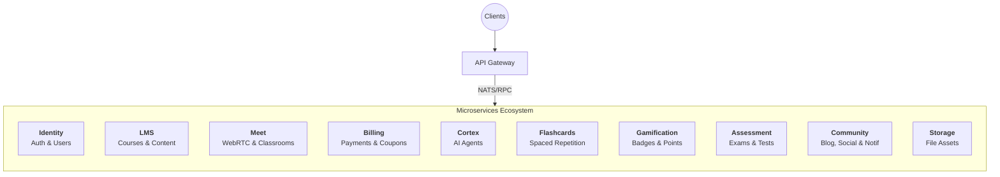

# Torii Nihongo Monorepo

Dự án chuyên biệt đào tạo tiếng Nhật trực tuyến kết hợp WebRTC và AI Agents. Monorepo được quản lý bởi **TurboRepo**, tích hợp hệ thống Microservices hiện đại giao tiếp qua **NATS Message Broker** và **Protobuf**.

## 🏗 Overall Monorepo Structure

```
torii-monorepo/
├── apps/
│   ├── server/               # NestJS Microservices Workspace
│   │   ├── modules/          # 8 Microservices độc lập
│   │   └── libs/             # Thư viện dùng chung (shared logic, nats, prisma)
│   ├── web-admin/            # React Admin Dashboard (Vite)
│   └── web-learner/          # Next.js Learning Platform
├── packages/
│   ├── protocol/             # Shared Protobuf definitions & generated code (@bufbuild/protobuf)
│   ├── schemas/              # Shared Zod schemas & DTO types (@workspace/schemas)
│   ├── ui/                   # Shared UI components
│   └── *-config/             # Cấu hình ESLint, TypeScript dùng chung
├── nats_server.conf          # Cấu hình NATS Server (JetStream, Auth Callout)
├── livekit.yaml              # Cấu hình LiveKit Server (Local Dev)
├── turbo.json                # TurboRepo config
└── pnpm-workspace.yaml       # PNPM Workspaces config
```

---

## 🛠 Local Development Setup

Để chạy dự án trên môi trường local, chúng ta sử dụng **Docker** cho các Infrastructure Services (DB, Redis, NATS, LiveKit) và chạy **Node.js** trực tiếp cho mã nguồn ứng dụng (Service/Frontend) để tận dụng trải nghiệm dev tốt nhất (Hot Reload, Debugging).

### 1. Prerequisites
- Docker & Docker Compose
- Node.js (v20+)
- PNPM (Package Manager)

### 2. Infrastructure Setup (Docker)
Khởi chạy toàn bộ hạ tầng cần thiết chỉ với một lệnh:

```bash
docker-compose up -d
```

Các services sẽ chạy tại:
- **PostgreSQL**: `localhost:5432` (User: `postgres`, Pass: `123456789`, DB: `wajlc`)
- **Redis**: `localhost:6379`
- **NATS**: `localhost:4222` (Monitor: `localhost:8222`)
- **LiveKit**: `localhost:7880` (API Key: `APIiYAA5w37Cfo2`, Secret: `6aNur7qqupeZhFYNOJVUyeXxXhVw8f4lm13pEDUx8SgB`)

Để dừng và xóa dữ liệu (nếu cần reset):
```bash
docker-compose down -v
```

### 3. Application Setup

1.  **Cài đặt dependencies:**
    ```bash
    pnpm install
    ```

2.  **Cấu hình biến môi trường:**
    Copy file mẫu và tạo file `.env` tại thư mục root:
    ```bash
    cp .env.example .env
    ```
    *Lưu ý: `.env.example` đã được cấu hình sẵn để kết nối với Infrastructure Docker mặc định.*

3.  **Database Migration & Generation:**
    ```bash
    cd apps/server
    pnpx prisma generate
    pnpx prisma db push
    ```
    *Lệnh `db push` sẽ đồng bộ schema Prisma vào database `wajlc` đang chạy trên Docker.*

### 4. Running the App

Chạy toàn bộ Backend Microservices ở chế độ Watch Mode:
```bash
# Tại root project
pnpm dev
# Hoặc chạy cụ thể backend:
pnpm --filter server dev
```

Chạy Frontend (nếu cần):
```bash
pnpm --filter web-admin dev
pnpm --filter web-learner dev
```

---

## 🎨 UI Library (shadcn/ui)

Dự án sử dụng **shadcn/ui** tập trung tại `@workspace/ui`. Để cài đặt thêm component mới:

```bash
cd packages/ui
pnpm dlx shadcn@latest add [component-name]
```

---

## 🛰 Microservices Architecture (Domain-Driven)

Toàn bộ hệ thống backend được chia thành các **Domain Services** giao tiếp qua **NATS Message Broker** và **Protobuf**. Kiến trúc này tập trung vào các nghiệp vụ lõi (Learning, Real-time Class, AI) thay vì chia theo chức năng kỹ thuật.

### 🏛 System Map



### 🧩 Service Domains (Modules)

| Directory Name | Domain Name | Ports | Trách nhiệm chính (Bounded Context) |
|:---|:---|:---|:---|
| `gateway` | **Gateway** | `8080` | Entry point duy nhất, xử lý HTTP requests, Authentication guard (Auth Callout), và routing qua NATS. |
| `module/identity` | **Identity** | - | **Core Auth**: Đăng ký, đăng nhập, Quản lý User, RBAC (Roles & Permissions). Là "Single Source of Truth" về danh tính. |
| `module/lms` | **LMS** | - | **Learning Core**: Quản lý khóa học, bài học (Lessons), lộ trình học tập, tracking tiến độ học viên. |
| `module/meet` | **Meet** | - | **Live Class Engine**: Quản lý phòng học ảo, tích hợp LiveKit (WebRTC), Recording, Whiteboard và điểm danh thời gian thực. |
| `module/cortex` | **Cortex** | - | **AI Brain**: Hệ thống Multi-Agent (Sensei, Analytics, Proctoring). Là "trung tâm trí tuệ" của nền tảng. |
| `module/flashcards` | **Flashcards** | - | **Study Tool**: Quản lý bộ thẻ (Decks), thuật toán Spaced Repetition (SRS) để ôn tập từ vựng. |
| `module/gamification`| **Gamification**| - | **Engagement**: Hệ thống điểm thưởng, huy hiệu (Badges), bảng xếp hạng (Leaderboards) và Streaks. |
| `module/assessment`| **Assessment**| - | **Testing Engine**: Ngân hàng câu hỏi, bài kiểm tra (Quiz), tổ chức thi thử JLPT và chấm điểm tự động. |
| `module/billing` | **Billing** | - | **Finance**: Xử lý thanh toán, hóa đơn (Invoices), mã giảm giá (Coupons) và quản lý doanh thu. |
| `module/community` | **Community** | - | **Social**: Blog, Bình luận, Profile xã hội và Hệ thống thông báo (Notification Center). |
| `module/storage` | **Storage** | - | **Assets**: Quản lý upload/download file tập trung, tích hợp S3/MinIO. |

---

## 📦 Protocol Workflow

**Cập nhật Protocol:**
1.  Chỉnh sửa file `.proto` trong `packages/protocol/proto/`.
2.  Generate code:
    ```bash
    cd packages/protocol
    pnpm run clean
    pnpm run generate
    pnpm run build
    ```

### 5. Shared Schemas & DTOs
Sử dụng `@workspace/schemas` cho Zod schemas và TypeScript types được chia sẻ giữa Backend và Frontend.
```bash
pnpm --filter @workspace/schemas run build # Sau khi thay đổi nội dung schemas
```

**Happy Coding! 🚀**
