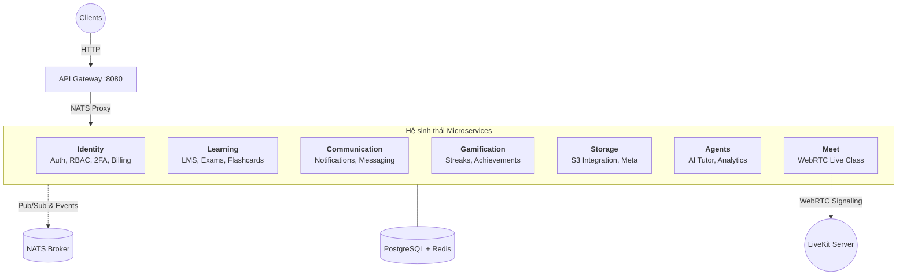

# Torii Nihongo Monorepo
Hệ thống học tiếng Nhật trực tuyến tích hợp Live Class (WebRTC) và AI Tutor (FastMCP). Monorepo được kiến trúc theo mô hình **Microservices** hiện đại, giao tiếp hybrid giữa **HTTP REST** và **NATS Message Broker**.

## 🌐 Danh sách Domains
- **Backend API (Gateway)**: [api.torii.sbs](https://api.torii.sbs)
- **Learning platform**: [app.torii.sbs](https://app.torii.sbs)
- **Live Class**: [meet.torii.sbs](https://meet.torii.sbs)
- **Hệ quản trị (Admin)**: [admin.torii.sbs](https://admin.torii.sbs)

## 🏗 Cấu trúc Monorepo

```
torii-monorepo/
├── apps/
│   ├── server/               # NestJS Microservices Workspace
│   │   ├── modules/          # 8 Microservices độc lập (gateway, identity, learning, agents, meet, gamification, communication, storage)
│   │   └── libs/             # Thư viện dùng chung (shared logic, nats, prisma, shared-schemas)
│   ├── web-admin/            # React Admin Dashboard (Vite)
│   └── web-learner/          # Next.js Learning Platform
├── packages/
│   ├── protocol/             # Định nghĩa Protobuf & mã nguồn generate (@workspace/protocol)
│   ├── schemas/              # Zod schemas & DTO types dùng chung (@workspace/schemas)
│   ├── ui/                   # Shared UI components (shadcn/ui)
│   └── *-config/             # Cấu hình ESLint, TypeScript dùng chung
├── nats_server.conf          # Cấu hình NATS Server (JetStream, Auth Callout)
├── livekit.yaml              # Cấu hình LiveKit Server (Local Dev)
├── turbo.json                # TurboRepo config
└── pnpm-workspace.yaml       # PNPM Workspaces config
```

---

## 🛰 Kiến trúc Microservices (HTTP + NATS Hybrid)

Backend được xây dựng dựa trên sự kết hợp giữa **NestJS** và **NATS Message Broker**. API Gateway đóng vai trò là "cửa ngõ" duy nhất, điều hành luồng dữ liệu sang các microservices nghiệp vụ qua giao thức mạng hiệu năng cao.

### 🏛 Sơ đồ Kiến trúc Hệ thống



### 📡 Mô hình Giao tiếp

1.  **HTTP REST (External):** Client tương tác với Gateway qua REST API. Gateway thực hiện Authentication, Rate Limiting và định tuyến request.
2.  **NATS Message Pattern (Internal):** Gateway proxy các request phức tạp sang các service khác qua NATS (Request-Response).
3.  **NATS Event-Driven (Internal):** Các service giao tiếp bất đồng bộ qua sự kiện (ví dụ: `Learning` phát sự kiện `LESSON_COMPLETE`, `Gamification` nhận và cập nhật Streak).

### 🧩 Chi tiết các Microservices

| Service | Protocol | Vai trò & Trách nhiệm |
|:---|:---|:---|
| **Gateway** | HTTP / NATS | Entry point chính (Port 8080), xử lý Auth Guard, Proxy routing qua NATS. |
| **Identity** | NATS | Quản lý định danh (Login/OAuth), Phân quyền (RBAC), Bảo mật (2FA), Thanh toán (Payments). |
| **Learning** | NATS | LMS Core: Khóa học, Bài học, Thi cử (Exams), Cộng đồng (Blog), Flashcards (SRS). |
| **Communication**| NATS | Trung tâm thông báo (In-app, Email, Push). |
| **Storage** | NATS | Quản lý tập tin, tích hợp S3, xử lý metadata file. |
| **Gamification** | NATS | Hệ thống Streak, Huy hiệu (Achievements), Điểm thưởng (XP). |
| **Agents** | NATS | Trí tuệ nhân tạo: AI Sensei hỗ trợ học tập qua FastMCP. |
| **Meet** | NATS / WebRTC | Lớp học trực tuyến WebRTC, tích hợp LiveKit. |

---

## 🧩 Danh sách các Modules nghiệp vụ nội bộ

#### **Identity Service**
- **Auth & 2FA**: Xử lý đăng ký, đăng nhập email/Google, xác thực 2 lớp TOTP.
- **Users & Profile**: Quản lý thông tin cá nhân và cài đặt người dùng.
- **Authorization**: Hệ thống phân quyền RBAC dựa trên Role và Permissions.
- **Payments & Billing**: Tích hợp thanh toán khóa học và quản lý hóa đơn.
- **Audit Logs**: Lưu vết các hành động quan trọng để bảo mật.

#### **Learning Service**
- **LMS Engine**: Quản lý nội dung khóa học theo phân cấp Course -> Module -> Lesson.
- **Assessment**: Hệ thống ngân hàng câu hỏi, tạo đề thi và chấm điểm tự động.
- **Flashcards (SRS)**: Học từ vựng qua thẻ nhớ với thuật toán lặp lại ngắt quãng.
- **Community**: Forum và Blog nơi người dùng chia sẻ kinh nghiệm học tập.
- **Learning Progress**: Theo dõi tiến độ hoàn thành bài học và khóa học.

#### **Storage Service**
- **S3 Storage**: Tích hợp Amazon S3 / Cloudflare R2 để lưu trữ multimedia content.
- **File Meta**: Quản lý quyền truy cập và thông tin chi tiết của từng file.

#### **Gamification Service**
- **Streak System**: Theo dõi tần suất học tập hàng ngày để tạo thói quen.
- **Achievements**: Hệ thống huy hiệu dựa trên các cột mốc quan trọng.

---

## 🛠 Hướng dẫn Triển khai & Phát triển

### 1. Yêu cầu hệ thống
- Docker & Docker Compose
- Node.js v20+ & pnpm

### 2. Thiết lập hạ tầng (Infrastructure)
```bash
# Khởi chạy DB, Redis, NATS, LiveKit
docker compose up -d
```

### 3. Thiết lập ứng dụng
```bash
# Cài đặt dependency
pnpm install

# Tạo file cấu hình
cp .env.example .env

# Đồng bộ Database schema
cd apps/server
npx prisma generate
npx prisma db push

# Build shared packages
pnpm --filter @workspace/schemas run build
pnpm --filter @workspace/protocol run generate
pnpm --filter @workspace/protocol run build
```

### 4. Chạy dự án (Development)
```bash
# Chạy toàn bộ hệ thống (Backend + Frontend)
pnpm dev

# Chạy cụ thể Backend
pnpm --filter server dev
```

### 5. Docker Deployment (VPS)
```bash
# Cập nhật và triển khai image mới
docker compose pull
docker compose up -d

# Dọn dẹp tài nguyên thừa
docker image prune -f
```

---
**Torii Nihongo Team** - *Bringing AI and WebRTC to Language Learning.* 🚀
