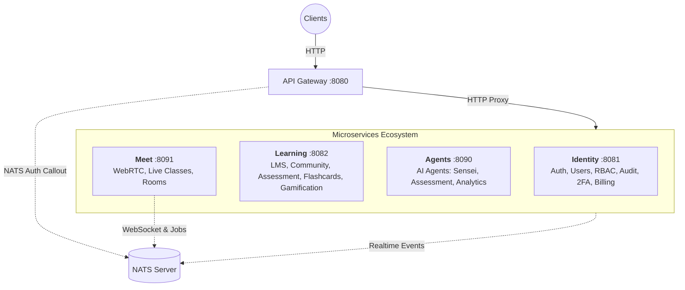

# Torii Nihongo Monorepo

Dự án chuyên biệt đào tạo tiếng Nhật trực tuyến kết hợp WebRTC và AI Agents. Monorepo được quản lý bởi **TurboRepo**, tích hợp hệ thống Microservices hiện đại giao tiếp qua **NATS Message Broker** và **Protobuf**.

## 🏗 Overall Monorepo Structure

```
torii-monorepo/
├── apps/
│   ├── server/               # NestJS Microservices Workspace
│   │   ├── modules/          # 4 Microservices độc lập (gateway, identity, learning, agents, meet)
│   │   └── libs/             # Thư viện dùng chung (shared logic, nats, prisma)
│   ├── web-admin/            # React Admin Dashboard (Vite)
│   └── web-learner/          # Next.js Learning Platform
├── packages/
│   ├── protocol/             # Shared Protobuf definitions & generated code (@bufbuild/protobuf)
│   ├── schemas/              # Shared Zod schemas & DTO types (@workspace/schemas)
│   ├── ui/                   # Shared UI components
│   └── *-config/             # Cấu hình ESLint, TypeScript dùng chung
├── nats_server.conf          # Cấu hình NATS Server (JetStream, Auth Callout)
├── livekit.yaml              # Cấu hình LiveKit Server (Local Dev)
├── turbo.json                # TurboRepo config
└── pnpm-workspace.yaml       # PNPM Workspaces config
```

---

## 🛠 Local Development Setup

Để chạy dự án trên môi trường local, chúng ta sử dụng **Docker** cho các Infrastructure Services (DB, Redis, NATS, LiveKit) và chạy **Node.js** trực tiếp cho mã nguồn ứng dụng (Service/Frontend) để tận dụng trải nghiệm dev tốt nhất (Hot Reload, Debugging).

### 1. Prerequisites
- Docker & Docker Compose
- Node.js (v20+)
- PNPM (Package Manager)

### 2. Infrastructure Setup (Docker)
Khởi chạy toàn bộ hạ tầng cần thiết chỉ với một lệnh:

```bash
docker-compose up -d
```

Các services sẽ chạy tại:
- **PostgreSQL**: `localhost:5432` (User: `postgres`, Pass: `123456789`, DB: `wajlc`)
- **Redis**: `localhost:6379`
- **NATS**: `localhost:4222` (Monitor: `localhost:8222`)
- **LiveKit**: `localhost:7880` (API Key: `APIiYAA5w37Cfo2`, Secret: `6aNur7qqupeZhFYNOJVUyeXxXhVw8f4lm13pEDUx8SgB`)

Để dừng và xóa dữ liệu (nếu cần reset):
```bash
docker-compose down -v
```

### 3. Application Setup

1.  **Cài đặt dependencies:**
    ```bash
    pnpm install
    ```

2.  **Cấu hình biến môi trường:**
    Copy file mẫu và tạo file `.env` tại thư mục root:
    ```bash
    cp .env.example .env
    ```
    *Lưu ý: `.env.example` đã được cấu hình sẵn để kết nối với Infrastructure Docker mặc định.*

3.  **Database Migration & Generation:**
    ```bash
    cd apps/server
    pnpx prisma generate
    pnpx prisma db push
    ```
    *Lệnh `db push` sẽ đồng bộ schema Prisma vào database `wajlc` đang chạy trên Docker.*

4.  **Environment Variables (Service URLs):**
    Đảm bảo `.env` có các biến sau cho microservices:
    ```bash
    # Microservice Ports (4 main services)
    GATEWAY_PORT=8080
    IDENTITY_HTTP_PORT=8081
    LEARNING_HTTP_PORT=8082
    AGENTS_HTTP_PORT=8090
    MEET_HTTP_PORT=8091
    
    # Service URLs (for Gateway proxy)
    IDENTITY_SERVICE_URL=http://localhost:8081
    LEARNING_SERVICE_URL=http://localhost:8082
    AGENTS_SERVICE_URL=http://localhost:8090
    MEET_SERVICE_URL=http://localhost:8091
    ```


### 4. Running the App

Chạy toàn bộ Backend Microservices ở chế độ Watch Mode:
```bash
# Tại root project
pnpm dev
# Hoặc chạy cụ thể backend:
pnpm --filter server dev
```

Chạy Frontend (nếu cần):
```bash
pnpm --filter web-admin dev
pnpm --filter web-learner dev
```

---

## 🎨 UI Library (shadcn/ui)

Dự án sử dụng **shadcn/ui** tập trung tại `@workspace/ui`. Để cài đặt thêm component mới:

```bash
cd packages/ui
pnpm dlx shadcn@latest add [component-name]
```

---

## 🛰 Microservices Architecture (HTTP + NATS Hybrid)

Hệ thống backend được chia thành **4 Domain Services độc lập**, giao tiếp qua **HTTP REST API** (cho request/response) và **NATS Message Broker** (cho realtime events và async jobs). Kiến trúc này tập trung vào các nghiệp vụ lõi (Identity, Learning, AI, Real-time Class) với mô hình consolidated để dễ quản lý và triển khai.

### 🏛 System Architecture



### 📡 Communication Patterns

**1. HTTP (Request/Response):**
- Client → Gateway → Microservice HTTP endpoint
- Synchronous CRUD operations
- RESTful API design

**2. NATS (Realtime & Async):**
- Auth callout for LiveKit (Meet service)
- WebSocket communication (Meet service)
- Async job processing (transcoding, analytics)
- Inter-service events (optional)

### 🧩 Service Domains (Modules)

| Service | Port | Protocol | Trách nhiệm chính (Bounded Context) |
|:---|:---|:---|:---|
| **Gateway** | `8080` | HTTP | Entry point duy nhất, HTTP proxy routing, Authentication guard (Auth Callout via NATS). |
| **Identity** | `8081` | HTTP | **Core Auth & User Management**: Đăng ký, đăng nhập, Quản lý User, RBAC, Audit Logs, 2FA, **Billing & Payments** (Invoices, Transactions). |
| **Learning** | `8082` | HTTP | **Unified Learning Platform**: <br>• **LMS**: Courses, Modules, Lessons, Wishlists, Reviews<br>• **Community**: Blogs, Comments, Notifications<br>• **Assessment**: Question Banks, Exams, Attempts, Sessions<br>• **Flashcards**: Decks, Cards, SRS Algorithm<br>• **Gamification**: Points, Badges, Leaderboards |
| **Agents** | `8090` | HTTP | **AI Brain**: Multi-Agent System (Sensei Agent, Assessment Agent, Analytics Agent). Là "trung tâm trí tuệ" của nền tảng, hỗ trợ học tập thông minh. |
| **Meet** | `8091` | HTTP + NATS | **Live Class Engine**: Quản lý phòng học ảo, tích hợp LiveKit (WebRTC), Recording, Polls, Waiting Room, Breakout Rooms. NATS cho realtime WebSocket và auth callout. |

### 🔌 Service Communication Examples

**HTTP Request Flow (Course Creation):**
```
Client → Gateway:8080/api/courses
       → Learning:8082/courses
       → CourseService.createCourse()
       → PostgreSQL
       ← Response
```

**NATS Realtime Flow (WebSocket Events):**
```
WebSocket Client → NATS (system worker stream)
                 → Meet NATS Controller
                 → Process PING, raise hand, etc.
                 → Broadcast via NATS
                 → All connected clients
```

**LiveKit Auth Callout:**
```
LiveKit → NATS (auth.request)
        → Gateway NatsAuthModule
        → Verify JWT token
        ← Auth response
```

### 📂 Service Internal Modules

#### **Identity Service** (`apps/server/modules/identity`)
- **Auth Module**: Registration, Login, JWT/Firebase Auth, OAuth (Google)
- **Users Module**: User management, profile updates
- **RBAC Module**: Role-Based Access Control, permissions
- **Audit Module**: Audit logs for security tracking
- **Two-Factor Auth Module**: TOTP-based 2FA
- **Payments Module**: Billing, invoices, transactions

#### **Learning Service** (`apps/server/modules/learning`)
- **Course Module**: Course CRUD, enrollment
- **Module Module**: Course modules/chapters
- **Lesson Module**: Lesson content, progress tracking
- **Wishlist Module**: Course wishlists
- **Review Module**: Course reviews and ratings
- **Blog Module**: Community blog posts
- **Blog Comment Module**: Comments on blog posts
- **Notification Module**: User notifications
- **Question Bank Module**: Question repository for exams
- **Exam Module**: Exam creation, attempts, sessions
- **Flashcard Deck Module**: Flashcard deck management
- **Flashcard Module**: Individual flashcards, SRS algorithm
- **Gamification Module**: Points, badges, leaderboards

#### **Agents Service** (`apps/server/modules/agents`)
- **Sensei Agent Module**: AI tutor for personalized learning
- **Assessment Agent Module**: AI-powered assessment and grading
- **Analytics Agent Module**: Learning analytics and insights
- **FastMCP Module**: Fast Model Context Protocol integration

#### **Meet Service** (`apps/server/modules/meet`)
- **Room Module**: Virtual classroom management, LiveKit integration
- **Polls Module**: Real-time polling in classes
- **Waiting Room Module**: Pre-class waiting room
- **User Room Settings Module**: Per-user room preferences
- **Breakout Rooms**: Small group sessions

---

---

## 📦 Protocol Workflow

**Cập nhật Protocol:**
1.  Chỉnh sửa file `.proto` trong `packages/protocol/proto/`.
2.  Generate code:
    ```bash
    pnpm --filter @workspace/protocol run generate
    pnpm --filter @workspace/protocol run build
    ```

### 5. Shared Schemas & DTOs
Sử dụng `@workspace/schemas` cho Zod schemas và TypeScript types được chia sẻ giữa Backend và Frontend.
```bash
pnpm --filter @workspace/schemas run build # Sau khi thay đổi nội dung schemas
```

**Happy Coding! 🚀**

---

## 🐳 Docker Deployment Guide

Hướng dẫn chi tiết quy trình deploy hệ thống Microservices lên VPS sử dụng Docker và Docker Compose.

### 1. Prerequisites (Yêu cầu)
- **VPS Server**: Đã cài đặt Docker và Docker Compose.
- **Docker Hub Account**: Để chứa Docker Images (giúp tiết kiệm tài nguyên build trên VPS).
- **Local Machine**: Máy tính cá nhân để build image.

### 2. Workflow Overview (Quy trình)
Để tối ưu hiệu suất và dung lượng ổ cứng cho VPS, chúng ta sẽ áp dụng quy trình:
1.  **Chỉnh sửa Code** ở máy local.
2.  **Build Image** ở máy local.
3.  **Push Image** lên Docker Hub.
4.  **Pull Image** về VPS và chạy.

---

### 3. Step-by-Step Deployment

#### Bước 1: Setup trên Local Machine (Lần đầu & khi cập nhật code)

1.  **Đăng nhập Docker Hub:**
    ```bash
    docker login
    # Nhập username và password Docker Hub của bạn
    ```

2.  **Build Docker Image:**
    Lệnh này sẽ build một image duy nhất chứa toàn bộ code backend (monorepo).
    Thay `your_username` bằng tên tài khoản Docker Hub của bạn.
    ```bash
    # Tại thư mục gốc (torii-monorepo)
    docker build -t your_username/torii-backend:latest -f apps/server/Dockerfile .
    ```

3.  **Push Image lên Docker Hub:**
    ```bash
    docker push your_username/torii-backend:latest
    ```

#### Bước 2: Setup trên VPS (Lần đầu tiên)

1.  **Clone code hoặc copy các file config cần thiết:**
    Thực tế bạn chỉ cần các file sau trên VPS:
    - `docker-compose.yml`
    - `.env`
    - `nats_server.conf`
    - `livekit.yaml`

2.  **Cấu hình biến môi trường (`.env`):**
    Tạo file `.env` trên VPS và đảm bảo có biến `DOCKER_USERNAME`:
    ```bash
    # ... Các biến môi trường khác ...
    DOCKER_USERNAME=your_username  # <-- QUAN TRỌNG: Để docker-compose biết tải image từ đâu
    ```

3.  **Database Migration (Quan trọng!):**
    Khi mới deploy lần đầu, database sẽ trống rỗng. Bạn cần chạy migration để tạo các bảng.
    
    *Cách 1: Chạy lệnh one-off từ container (Khuyên dùng)*
    Sau khi đã chạy `docker-compose up` (xem bước 3 bên dưới), hãy chạy lệnh này để đồng bộ schema vào DB:
    ```bash
    # Chạy lệnh này trên VPS
    docker-compose exec identity npx prisma db push
    ```
    *(Lưu ý: Chỉ cần chạy ở 1 service bất kỳ như `identity` vì chúng dùng chung DB và Source Code)*

    *Cách 2: Nếu reset database*
    Nếu bạn muốn xóa sạch dữ liệu và làm lại từ đầu:
    ```bash
    docker-compose down -v  # Xóa cả volumes chứa dữ liệu
    docker-compose up -d
    docker-compose exec identity npx prisma db push
    ```

#### Bước 3: Deploy / Update trên VPS

Mỗi khi bạn đã push image mới lên Docker Hub (Bước 1), hãy chạy các lệnh sau trên VPS để cập nhật:

```bash
# 1. Tải image mới nhất về
docker-compose pull

# 2. Re-create các container với image mới
docker-compose up -d

# 3. (Tuỳ chọn) Dọn dẹp image cũ cho đỡ chật ổ cứng
docker system prune -f
```

---

### 4. Data Persistence (Dữ liệu lưu ở đâu?)

Bạn không cần lo lắng về việc mất dữ liệu khi restart container hay deploy image mới. Dữ liệu được lưu trữ an toàn trong các **Docker Volumes**:

- **PostgreSQL Data**: Lưu tại volume `pgdata`.
- **Redis Data**: Lưu tại volume `redisdata`.
- **NATS Stream Data**: Lưu tại volume `natsdata`.
- **LiveKit Data**: Lưu tại volume `livekitdata`.

Các volumes này nằm trên ổ cứng của VPS (thường ở `/var/lib/docker/volumes/`) và độc lập với vòng đời của Container. Chỉ khi nào bạn chạy lệnh `docker-compose down -v` (có cờ `-v`) thì dữ liệu mới bị xóa.

---

### 5. Troubleshooting (Gỡ lỗi)

**Lỗi "No space left on device":**
Ổ cứng VPS bị đầy do chứa quá nhiều image cũ hoặc cache build.
-> Chạy: `docker system prune -a --volumes -f` để dọn dẹp sạch sẽ.

**Lỗi Service không start được:**
Chạy `docker-compose logs --tail 100 [service_name]` để xem log chi tiết.
Ví dụ: `docker-compose logs --tail 100 gateway`.

**Kiểm tra kết nối nội bộ:**
Nếu các service không nhìn thấy nhau, hãy chắc chắn file `docker-compose.yml` ở root đã định nghĩa các biến `SERVICE_URL` trỏ vào tên service (vd: `http://identity:8081`) chứ không phải `localhost`.
