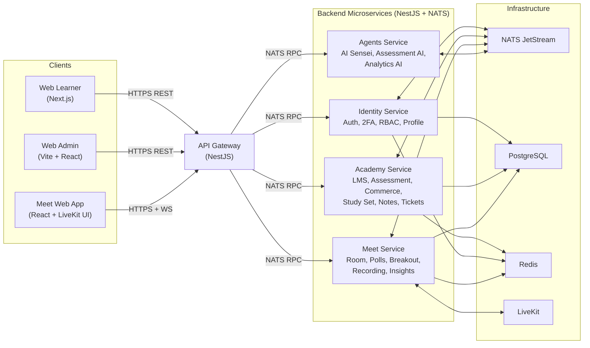
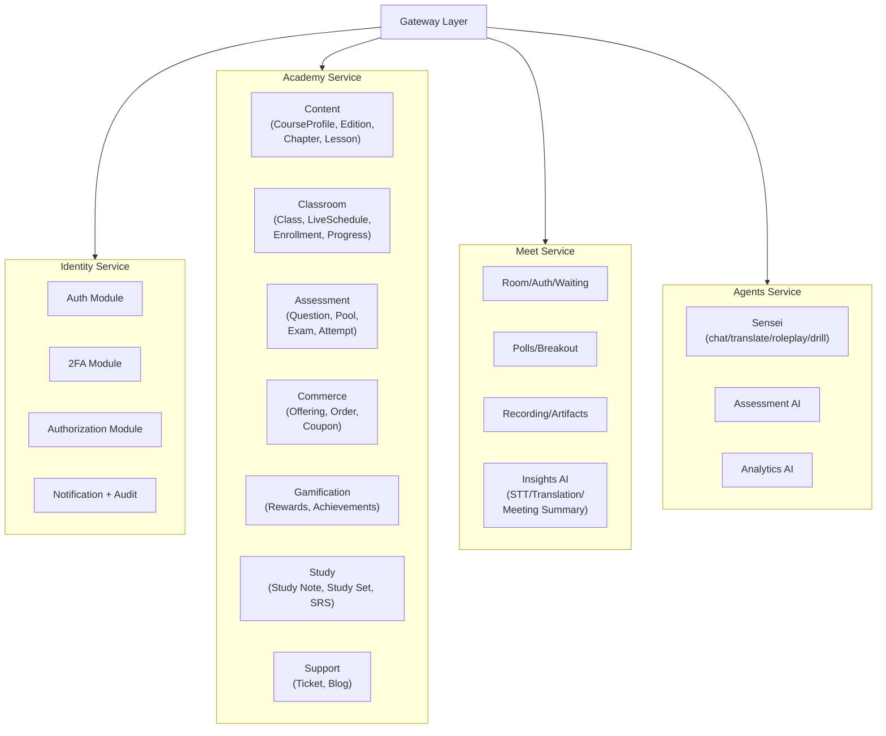
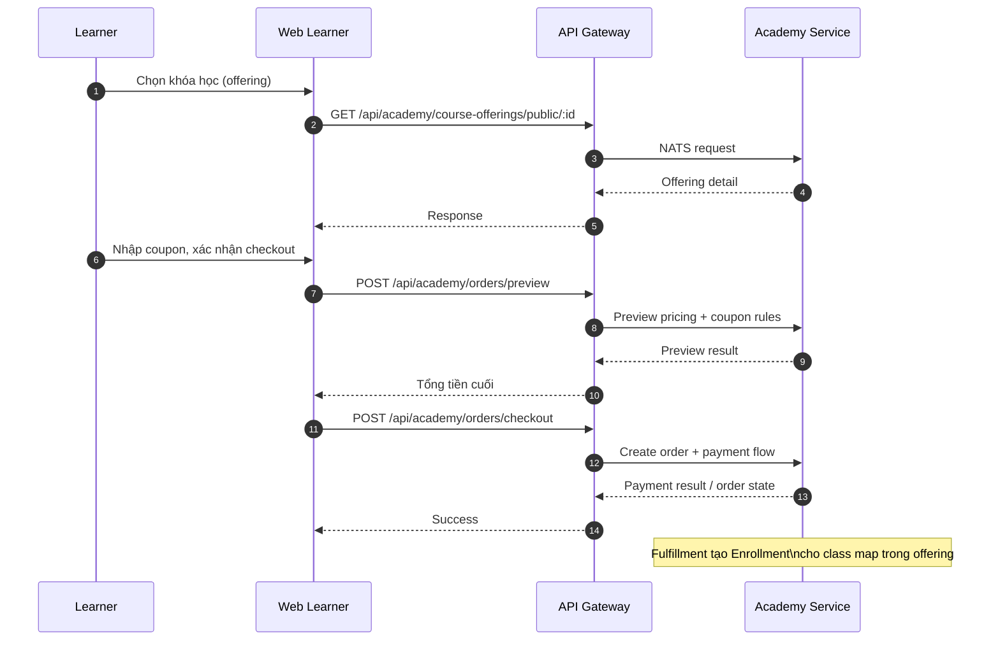
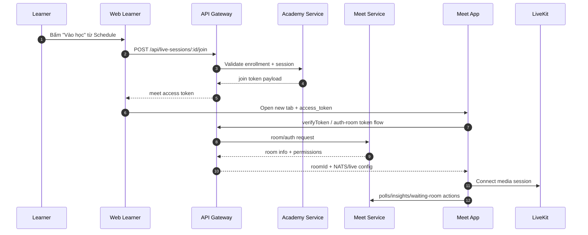
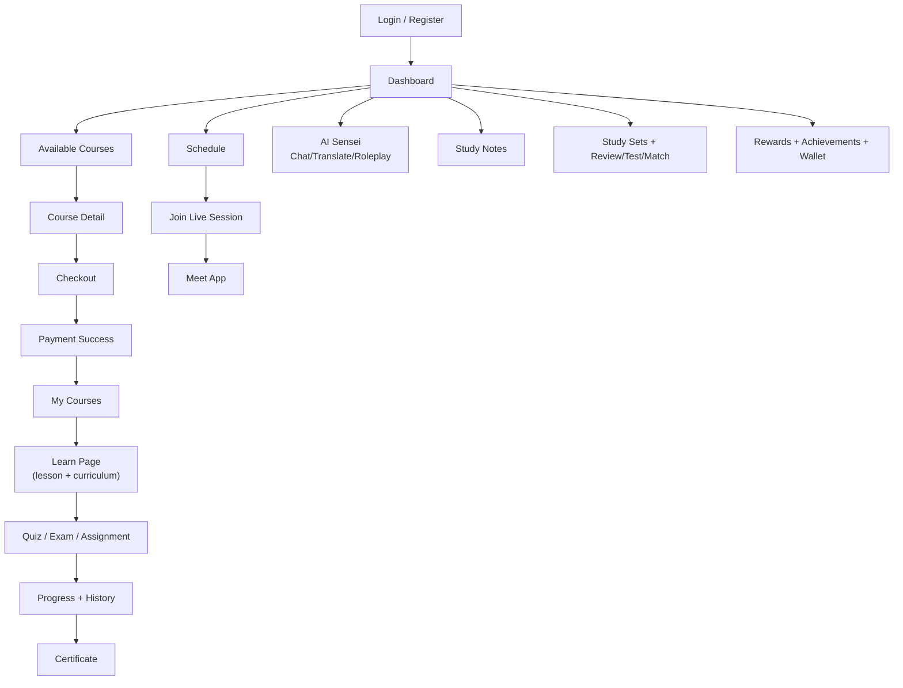
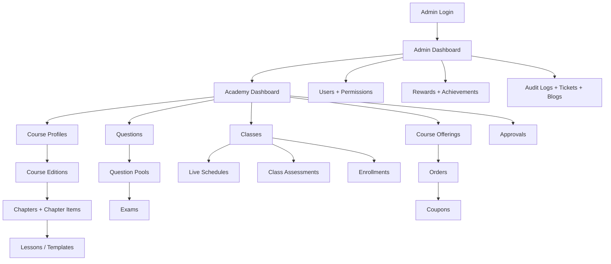
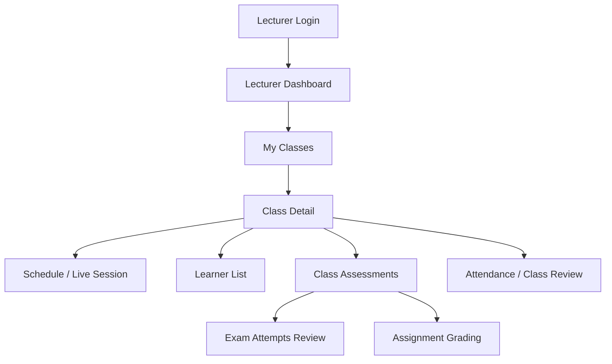
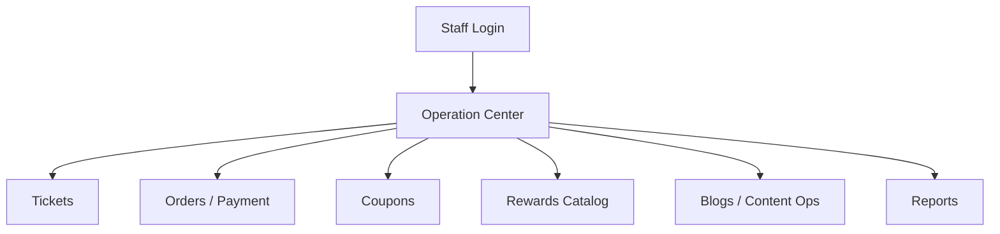
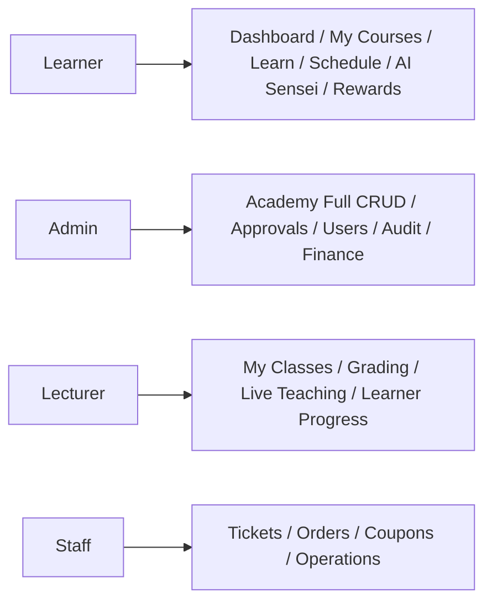

# Torii System Design & Screen Flows (Mermaid)

Tài liệu này tập trung vào:

1. **System design** tổng quan bằng Mermaid.
2. **Screen flow theo role** để thuyết trình nghiệp vụ UI/UX.

---

## 1) System Context Diagram

---

## 2) Container / Module View (Backend)

---

## 3) Core Runtime Flows

### 3.1 Learner -> Checkout -> Enrollment

### 3.2 Learner -> Join Live Session -> Meet App

---

## 4) Screen Flow by Role

## 4.1 Learner Screen Flow

## 4.2 Admin (LMS/Operation) Screen Flow

## 4.3 Lecturer Screen Flow

## 4.4 Staff Support / Finance Screen Flow

---

## 5) Role-to-Screen Matrix (Quick)

---

## 6) Suggested Presentation Order

1. Mở đầu bằng **System Context Diagram**.
2. Đi vào **Container View** để nói rõ trách nhiệm từng service.
3. Trình bày 2 flow runtime:  
   - Checkout -> Enrollment,  
   - Join Live -> Meet.
4. Kết thúc bằng **Screen Flow theo role** để chứng minh tính hoàn chỉnh từ backend tới UI.

