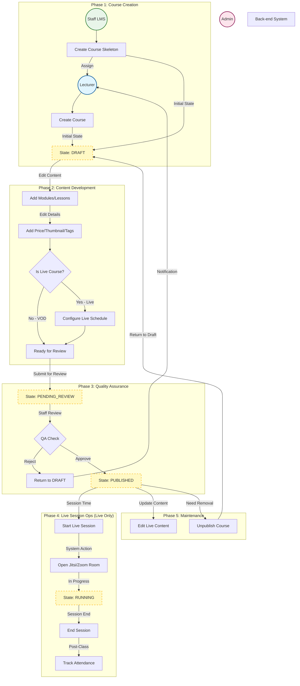

```mermaid
graph TD
    %% Actors
    Lecturer((Lecturer))
    Staff((Staff LMS))
    Admin((Admin))
    System[Back-end System]

    %% Main Subgraphs
    subgraph Creation_Phase ["Phase 1: Course Creation"]
        direction TB
        L_Create[Create Course]
        S_Create[Create Course Skeleton]
        
        Lecturer --> L_Create
        Staff --> S_Create
        
        S_Create -->|Assign| Lecturer
        
        L_Create -->|Initial State| Draft[State: DRAFT]
        S_Create -->|Initial State| Draft
    end

    subgraph Content_Dev ["Phase 2: Content Development"]
        direction TB
        Draft -->|Edit Content| AddModules[Add Modules/Lessons]
        AddModules -->|Edit Details| AddMetadata[Add Price/Thumbnail/Tags]
        
        AddMetadata --> CheckType{Is Live Course?}
        CheckType -->|No - VOD| ReviewReady[Ready for Review]
        CheckType -->|Yes - Live| LiveConfig[Configure Live Schedule]
        LiveConfig --> ReviewReady
    end

    subgraph Review_Phase ["Phase 3: Quality Assurance"]
        direction TB
        ReviewReady -->|Submit for Review| Pending[State: PENDING_REVIEW]
        
        Pending -->|Staff Review| QA_Check{QA Check}
        QA_Check -->|Reject| NeedsChanges[Return to DRAFT]
        NeedsChanges -->|Notification| Lecturer
        
        QA_Check -->|Approve| Published[State: PUBLISHED]
    end

    subgraph Live_Operations ["Phase 4: Live Session Ops (Live Only)"]
        direction TB
        Published -->|Session Time| StartSession[Start Live Session]
        StartSession -->|System Action| OpenRoom[Open Jitsi/Zoom Room]
        OpenRoom -->|In Progress| Running[State: RUNNING]
        Running -->|Session End| EndSession[End Session]
        EndSession -->|Post-Class| Attendance[Track Attendance]
    end

    subgraph Maintenance ["Phase 5: Maintenance"]
        direction TB
        Published -->|Update Content| EditLive[Edit Live Content]
        Published -->|Need Removal| Unpublish[Unpublish Course]
        Unpublish -->|Return to Draft| Draft
    end

    %% RBAC Permissions Styling
    classDef lecturer fill:#e1f5fe,stroke:#01579a,stroke-width:2px;
    classDef staff fill:#e8f5e9,stroke:#2e7d32,stroke-width:2px;
    classDef admin fill:#fce4ec,stroke:#880e4f,stroke-width:2px;
    classDef state fill:#fff9c4,stroke:#fbc02d,stroke-width:2px,stroke-dasharray: 5 5;

    class Lecturer lecturer;
    class Staff staff;
    class Admin admin;
    class Draft,Pending,Published,Running state;
```
