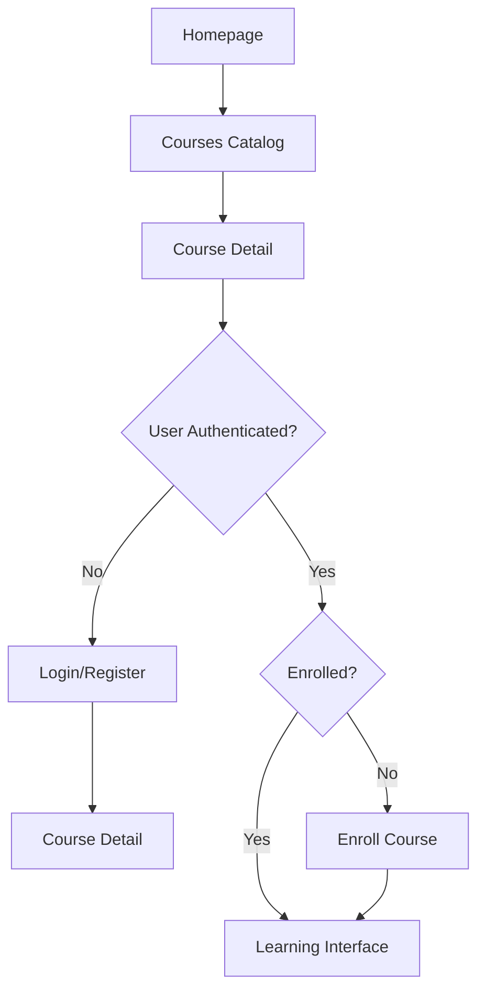
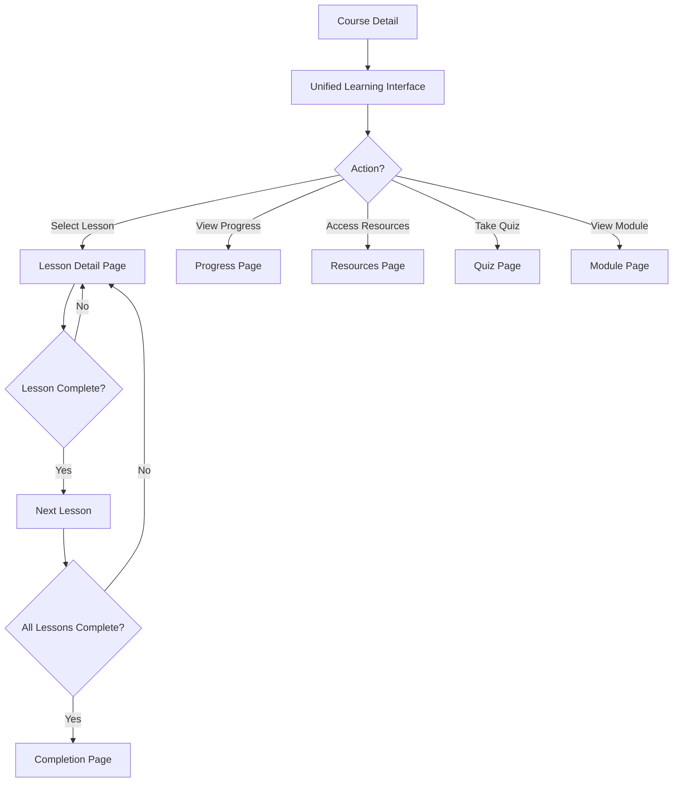
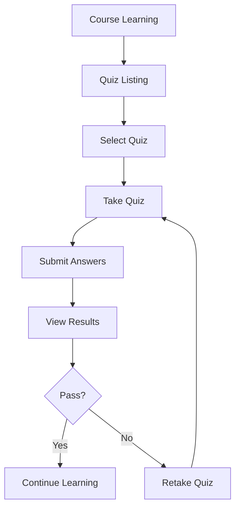
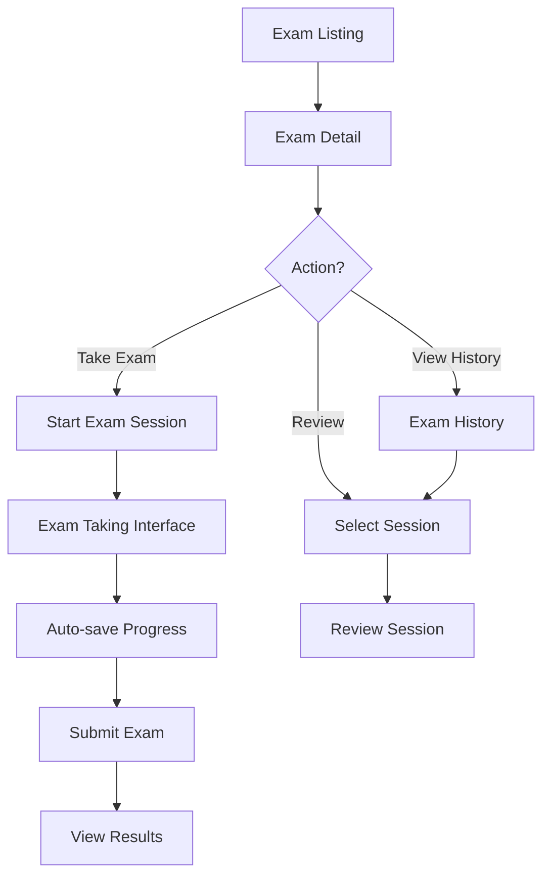

# Sơ đồ Navigation Flow - Torii Nihongo Elearning Platform

## 📊 Tổng quan

Tài liệu này mô tả chi tiết flow điều hướng của người dùng trong hệ thống elearning, từ discovery đến completion.

---

## 🎯 User Journey Map

### 1. Discovery Phase (Khám phá)

```
Homepage (/)
    ↓
Courses Catalog (/courses)
    ↓
Course Detail (/courses/[slug])
    ├─→ Enroll → Dashboard
    ├─→ Preview → Learning
    └─→ Reviews → Social Proof
```

### 2. Learning Phase (Học tập)

```
Course Detail (/courses/[slug])
    ↓
Unified Learning Interface (/courses/[slug]/learn)
    ├─→ Select Lesson → Lesson Detail (/courses/[slug]/learn/lessons/[lessonId])
    ├─→ View Progress → Progress Page (/courses/[slug]/progress)
    ├─→ Access Resources → Resources Page (/courses/[slug]/resources)
    ├─→ Take Quiz → Quiz Page (/courses/[slug]/quizzes/[quizId])
    └─→ View Module → Module Page (/courses/[slug]/modules/[moduleId])
```

### 3. Completion Phase (Hoàn thành)

```
Complete All Lessons
    ↓
Completion Page (/courses/[slug]/completion)
    ├─→ Download Certificate → Certificate Page (/courses/[slug]/certificate)
    ├─→ View Progress → Progress Page (/courses/[slug]/progress)
    └─→ Explore More → Courses Catalog (/courses)
```

### 4. Assessment Phase (Đánh giá)

```
Course Learning
    ↓
Quiz Listing (/courses/[slug]/quizzes)
    ↓
Take Quiz (/courses/[slug]/quizzes/[quizId])
    ↓
Review Results
```

### 5. Exam Phase (Thi cử)

```
Exam Listing (/exams)
    ↓
Exam Detail (/exams/[examId])
    ├─→ Take Exam → Exam Taking (/exams/[examId]/take)
    ├─→ View History → Exam History (/exams/[examId]/history)
    └─→ Review Session → Exam Review (/exams/[examId]/review/[sessionId])
```

---

## 🔄 Detailed Navigation Flows

### Flow 1: Course Discovery & Enrollment



### Flow 2: Learning Experience



### Flow 3: Quiz Flow



### Flow 4: Exam Flow



---

## 🗺️ Route Structure Map

### Public Routes (Marketing)

```
/                           # Homepage
├── /courses                # Course catalog
│   └── /courses/[slug]     # Course detail
├── /exams                  # Exam listing
└── /auth/*                 # Authentication
```

### Learning Routes (Protected)

```
/courses/[slug]
├── /learn                  # Unified learning interface ⭐
│   └── /lessons/[lessonId] # Lesson detail
├── /progress               # Progress tracking
├── /resources              # Course resources
├── /quizzes                # Quiz listing
│   └── /quizzes/[quizId]   # Take quiz
├── /modules/[moduleId]     # Module overview
├── /completion             # Completion page
└── /certificate            # Certificate download
```

### Dashboard Routes (Protected)

```
/dashboard                  # Dashboard home
├── /my-courses            # My enrolled courses
├── /learning              # Learning hub (redirects to /courses/[slug]/learn)
├── /certificates          # All certificates
├── /profile              # User profile
├── /payment              # Payment history
└── /settings             # Settings
```

### Exam Routes (Protected)

```
/exams                     # Exam listing
└── /exams/[examId]
    ├── /                  # Exam detail
    ├── /take              # Take exam
    ├── /history           # Exam history
    └── /review/[sessionId] # Review session
```

---

## 🎨 UI/UX Navigation Patterns

### 1. Breadcrumb Navigation

```
Home > Courses > [Course Title] > Learn > Lesson
Home > Courses > [Course Title] > Progress
Home > Exams > [Exam Title] > Take
```

### 2. Sidebar Navigation (Learning Interface)

```
Course Sidebar
├── Course Info
├── Progress Indicator
├── Modules (Expandable)
│   ├── Module 1
│   │   ├── Lesson 1 ✓
│   │   ├── Lesson 2 → (Current)
│   │   └── Lesson 3
│   └── Module 2
└── Quick Actions
    ├── Progress
    ├── Resources
    └── Quizzes
```

### 3. Top Navigation Bar

```
[Logo] [Courses] [Exams] [Dashboard] [Profile]
```

### 4. Bottom Navigation (Mobile)

```
[Home] [Courses] [Learning] [Exams] [Profile]
```

---

## 🔗 Key Navigation Links

### From Course Detail Page

- **"Bắt đầu học"** → `/courses/[slug]/learn`
- **"Xem tiến độ"** → `/courses/[slug]/progress`
- **"Tài liệu"** → `/courses/[slug]/resources`
- **"Bài kiểm tra"** → `/courses/[slug]/quizzes`
- **"Curriculum"** → Scroll to curriculum section

### From Learning Interface

- **Lesson Card** → `/courses/[slug]/learn/lessons/[lessonId]`
- **Module Header** → `/courses/[slug]/modules/[moduleId]`
- **Progress Button** → `/courses/[slug]/progress`
- **Resources Button** → `/courses/[slug]/resources`
- **Back to Course** → `/courses/[slug]`

### From Dashboard

- **"Tiếp tục học"** → `/courses/[slug]/learn`
- **"Khóa học của tôi"** → `/dashboard/my-courses`
- **"Xem tiến độ"** → `/courses/[slug]/progress`

### From Exam Listing

- **Exam Card** → `/exams/[examId]`
- **"Làm bài"** → `/exams/[examId]/take`
- **"Lịch sử"** → `/exams/[examId]/history`

---

## 📱 Mobile Navigation

### Bottom Tab Bar (Mobile)

```
┌─────────────────────────────────┐
│  [🏠]  [📚]  [🎓]  [📝]  [👤]  │
│  Home Courses Learn Exams Profile│
└─────────────────────────────────┘
```

### Drawer Menu (Mobile)

```
┌─────────────────────┐
│ ☰ Menu              │
├─────────────────────┤
│ 📚 Khóa học của tôi │
│ 🎓 Tiếp tục học     │
│ 📊 Tiến độ          │
│ 🏆 Chứng chỉ        │
│ ⚙️  Cài đặt         │
└─────────────────────┘
```

---

## 🚀 Quick Actions

### Floating Action Buttons (FAB)

**Learning Interface:**
- Quick access to current lesson
- Jump to progress
- Access resources

**Exam Interface:**
- Flag question
- Navigate questions
- Submit exam

---

## 🔄 Redirects & Fallbacks

### Automatic Redirects

1. **Dashboard Learning** → **Unified Learning**
   ```
   /dashboard/learning/[slug] → /courses/[slug]/learn
   ```

2. **Old Lesson Route** → **New Lesson Route**
   ```
   /courses/[slug]/lessons/[lessonId] → /courses/[slug]/learn/lessons/[lessonId]
   ```

### Fallback Routes

- **404 Course** → `/courses` (with message)
- **404 Lesson** → `/courses/[slug]/learn` (with message)
- **Unauthorized** → `/login?redirect=[current-url]`

---

## 📊 Navigation Analytics Points

### Key Metrics to Track

1. **Discovery**
   - Homepage → Courses conversion
   - Course detail views
   - Enrollment rate

2. **Learning**
   - Lesson completion rate
   - Time spent per lesson
   - Progress page views
   - Resource downloads

3. **Assessment**
   - Quiz completion rate
   - Quiz retake rate
   - Average quiz scores

4. **Completion**
   - Course completion rate
   - Certificate downloads
   - Share actions

---

## 🎯 Best Practices Applied

### ✅ SEO-Friendly URLs
- Slug-based routes: `/courses/tieng-nhat-n5-co-ban`
- Descriptive paths: `/courses/[slug]/learn/lessons/[lessonId]`

### ✅ RESTful Structure
- Nested resources: `courses → lessons → lessonId`
- Consistent patterns: `/exams/[examId]/take`

### ✅ User-Centric Navigation
- Clear breadcrumbs
- Intuitive sidebar
- Quick actions
- Mobile-friendly

### ✅ Progressive Disclosure
- Module expansion
- Lesson details on demand
- Resource access when needed

---

## 🔮 Future Enhancements

### Planned Navigation Features

1. **Learning Paths**
   ```
   /learning-paths
   └── /learning-paths/[pathId]
       └── /courses/[slug]
   ```

2. **Study Groups**
   ```
   /community/study-groups
   └── /community/study-groups/[groupId]
   ```

3. **Live Classes**
   ```
   /live-classes
   └── /live-classes/[classId]
       └── /live-classes/[classId]/join
   ```

4. **Instructor Dashboard**
   ```
   /instructor
   ├── /instructor/courses
   └── /instructor/courses/[slug]/manage
   ```

---

## 📝 Notes

- All learning routes are **protected** (require authentication)
- Marketing routes are **public** (SEO-friendly)
- Dashboard routes are **protected** (user-specific)
- Exam routes are **protected** (tracked sessions)

---

**Last Updated:** 2024
**Version:** 1.0

