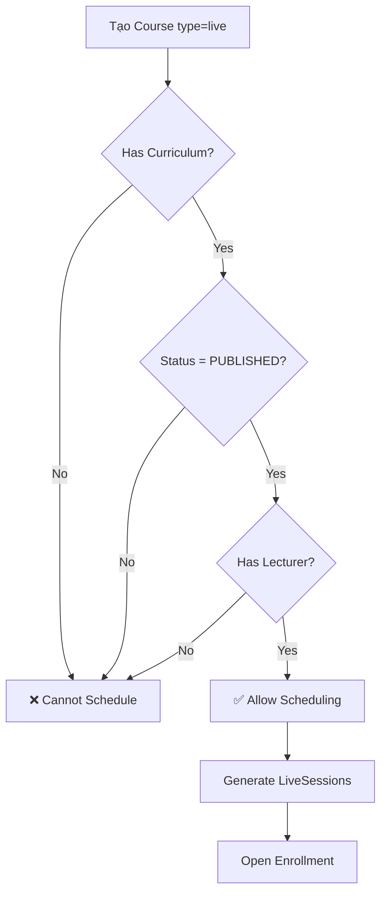

# Live Course Flow Refactor - E-Learning Tiếng Nhật

> **Mục đích:** Phân tích và đề xuất refactor flow khóa học Live (WebRTC) cho hệ thống E-Learning dạy tiếng Nhật Torii.  
> **Ngày tạo:** 27 Feb 2026  
> **Tác giả:** System Analysis  
> **Trạng thái:** 🔴 DRAFT - Chờ review và phê duyệt

---

## 📋 Mục lục

1. [Flow hiện tại và vấn đề](#1-flow-hiện-tại-và-vấn-đề)
2. [Nghiệp vụ thực tế E-Learning](#2-nghiệp-vụ-thực-tế-e-learning)
3. [Flow mới được đề xuất](#3-flow-mới-được-đề-xuất)
4. [Chi tiết kỹ thuật](#4-chi-tiết-kỹ-thuật)
5. [Migration Plan](#5-migration-plan)
6. [Testing Checklist](#6-testing-checklist)

---

## 1. Flow hiện tại và vấn đề

### 1.1 Flow hiện tại

```
[Admin/Staff] Tạo Course (type=live)
    ↓
[Admin/Staff] Gán Giảng viên cho Course (lecturerId)
    ↓
[Admin/Staff] Tạo TeachingSchedule (dayOfWeek, startTime, duration)
    ↓
⚡ TỰ ĐỘNG: generateLiveSessions(scheduleId, 8 weeks)
    - Tạo 8 LiveSession với meetingId
    - Status: "scheduled"
    - Không kiểm tra nội dung khóa học
    ↓
[Lecturer] Start session → Tạo room Meet (WebRTC)
    ↓
[Learner] Join session → Học live
    ↓
[Lecturer] End session → Kết thúc
```

**Code hiện tại:**

```typescript
// teaching-schedule.service.ts (Line 92)
async assignSchedule(requester: Requester, dto: TeachingScheduleCreateDTO) {
    // ... validation ...
    
    const schedule = await this.prisma.teachingSchedule.create({...});
    
    // ⚠️ VẤN ĐỀ: Tạo 8 tuần sessions NGAY LẬP TỨC
    await this.generateLiveSessions(schedule.id, 8);
    
    return schedule;
}

// Line 231
private async generateLiveSessions(scheduleId: string, weeks: number) {
    // ... tạo mảng sessions ...
    
    sessions.push({
        courseId: schedule.courseId,
        lecturerId: schedule.lecturerId,
        scheduleId: schedule.id,
        title: `${schedule.course.title} - Buổi học tuần ${i + 1}`,
        meetingId: `live-${uuidv4().substring(0, 8)}`, // ⚠️ Tạo meetingId trước
        scheduledAt,
        duration: schedule.duration,
        status: 'scheduled',
    });
    
    await this.prisma.liveSession.createMany({ data: sessions });
}
```

### 1.2 Vấn đề nghiêm trọng

#### 🔴 **Vấn đề 1: Tạo lịch trước khi có nội dung**
- **Hiện tại:** Tạo 8 tuần LiveSessions ngay khi gán lịch
- **Vấn đề:** 
  - ❌ Chưa có syllabus (chương trình học)
  - ❌ Chưa có modules/lessons
  - ❌ Chưa có tài liệu PDF
  - ❌ Chưa có bài tập/quiz
  - ❌ Chưa qua duyệt nội dung

#### 🔴 **Vấn đề 2: Live Course = KHÔNG có curriculum**
```tsx
// learn/page.tsx (Line 44-52)
if (courseData.type === 'vod') {
    // VOD: Navigate to first lesson
    const curriculumData = await courseApi.getCurriculum(courseData.id)
    router.replace(`/courses/${slug}/learn/lessons/${firstLesson.id}`)
}
// ⚠️ Live: CHỈ hiển thị danh sách sessions
// → Học viên KHÔNG thể xem tài liệu, làm bài tập
```

**Hậu quả:**
- ❌ Học viên không có tài liệu chuẩn bị trước buổi học
- ❌ Không có bài tập sau buổi học
- ❌ Không có quiz đánh giá
- ❌ Không có recording để xem lại (chưa có lesson để lưu)

#### 🔴 **Vấn đề 3: Tạo meetingId quá sớm**
- **Hiện tại:** `meetingId = "live-{random}"` được tạo trong `generateLiveSessions()`
- **Vấn đề:**
  - ❌ meetingId tồn tại 8 tuần trước khi dùng
  - ❌ Không linh hoạt (thay đổi lịch → meetingId cũ thừa)
  - ❌ Security risk (meetingId có thể leak trước buổi học)

#### 🔴 **Vấn đề 4: Không có approval flow**
- Course status: `draft` → `pending_review` → `published`
- **Nhưng:** Live course có thể lên lịch ngay cả khi `status = draft`
- **Vấn đề:**
  - ❌ Khóa học chưa duyệt đã có lịch dạy
  - ❌ Nội dung chưa đầy đủ đã mở đăng ký

---

## 2. Nghiệp vụ thực tế E-Learning

### 2.1 Quy trình chuẩn của khóa học Online

Tham khảo các nền tảng: Udemy, Coursera, edX, Duolingo, Memrise

```
1. Chuẩn bị nội dung
   ├── Định nghĩa mục tiêu học (Learning Outcomes)
   ├── Thiết kế syllabus (chương trình học)
   ├── Tạo modules và lessons
   ├── Upload tài liệu (PDF, slides)
   ├── Thiết kế quiz/assignments
   └── Review nội dung
   
2. Approval & Publishing
   ├── Submit for review
   ├── QA check nội dung
   ├── Duyệt (approve/reject)
   └── Publish course
   
3. Scheduling (CHỈ SAU KHI PUBLISHED)
   ├── Giảng viên/Staff tạo lịch fixed
   ├── Tạo LiveSessions theo tuần
   └── Mở đăng ký (enrollment)
   
4. Học viên đăng ký
   ├── Xem syllabus đầy đủ
   ├── Xem lịch học
   ├── Thanh toán/enroll
   └── Chuẩn bị học
   
5. Trước buổi học
   ├── Học viên xem tài liệu trước (pre-reading)
   ├── Làm bài tập chuẩn bị (optional)
   └── Nhận reminder (email/notification)
   
6. Trong buổi học
   ├── Join live session (WebRTC)
   ├── Tương tác với giảng viên
   ├── Recording tự động
   └── Attendance tracking
   
7. Sau buổi học
   ├── Recording tự động link vào lesson
   ├── Học viên xem lại bài giảng
   ├── Làm bài tập/quiz
   └── Thảo luận (discussions)
```

### 2.2 Yêu cầu riêng cho dạy tiếng Nhật

#### **A. Cấu trúc nội dung**

```
Khóa học tiếng Nhật N5
├── Module 1: Chữ cái Hiragana (Tuần 1-2)
│   ├── Lesson 1.1: あ行 (a, i, u, e, o) - [Video lý thuyết + PDF]
│   ├── Lesson 1.2: か行 - [Video + Worksheet PDF]
│   ├── Quiz 1: Kiểm tra Hiragana
│   └── Assignment 1: Viết luyện tập
│
├── Module 2: Ngữ pháp cơ bản (Tuần 3-4)
│   ├── Lesson 2.1: Câu là/là không (です/じゃありません)
│   │   ├── Tài liệu: grammar-desu.pdf
│   │   ├── Video: Giải thích ngữ pháp (20 phút)
│   │   └── Practice Sheet: exercises.pdf
│   ├── → LiveSession 1: Học trực tuyến (90 phút) ← ĐÂY MỚI LÀ LIVE
│   │   ├── Link to Lesson 2.1 (để lưu recording sau)
│   │   ├── Material: slides.pdf
│   │   └── Status: scheduled → live → ended
│   ├── Lesson 2.2: Recording buổi học tuần 3
│   │   ├── Video: Recording from LiveSession 1
│   │   └── Notes: Ghi chú giảng viên
│   ├── Quiz 2: Kiểm tra ngữ pháp
│   └── Assignment 2: Viết câu
│
└── Module 3-8: ...
```

**Key points:**
- ✅ **Lesson-Centric**: LiveSession phải luôn gắn với một Lesson (vị trí học) và một Module (chùm chủ đề).
- ✅ **contentType: 'live_session'**: Giảng viên tạo sẵn các bài học "chờ" buổi Live.
- ✅ **Auto-linking**: Khi gán lịch, hệ thống sẽ tự tìm các Lesson type 'live_session' để map vào, nếu thiếu sẽ tự tạo thêm bài học placeholder.
- ✅ **Pre-materials**: Tài liệu PDF, video lý thuyết nằm trong cùng Module/Lesson để học viên dễ tiếp cận.
- ✅ **Post-materials**: Quiz, assignment đi kèm sau buổi live.

#### **B. Timeline & Nghiệp vụ thực tế**

Khóa học 8 tuần, 3 buổi/tuần (Thứ 2-4-6):

```
1. Nội dung (Curriculum): 
   - Giảng viên soạn sẵn 4-8 Modules tùy ý.
   - Mỗi Module chứa tài liệu (PDF, Quizzes).
   - Đây là "Sách giáo khoa" cố định.

2. Lịch học (LiveSessions): 
   - Admin gán lịch 3 buổi/tuần.
   - Hệ thống tạo 24 "Ô lịch" trống.
   - Mỗi ô lịch chỉ có Title (Buổi 1, 2, 3...) và Thời gian.

3. Trong buổi học:
   - Giảng viên dạy theo giáo trình đã soạn.
   - Dạy đến đâu dừng ở đó.

4. Sau buổi học:
   - Recording được lưu lại.
   - Giảng viên (hoặc hệ thống) gán Video này vào đúng Lesson đã dạy để học viên xem lại.
```

---

## 3. Flow mới được đề xuất

### 3.1 Luồng tổng quan

```
┌─────────────────────────────────────────────┐
│ Phase 1: CONTENT PREPARATION                │
│ (4-6 tuần trước khai giảng)                │
└─────────────────────────────────────────────┘
    ↓
[Lecturer/Admin] Tạo Course (type=live, status=draft)
    ↓
[Lecturer] Soạn curriculum:
    - Tạo Modules (8 modules cho 8 tuần)
    - Tạo Lessons (Video lý thuyết, PDF materials)
    - Tạo Quiz/Assignments
    - Link lessons với buổi live (metadata)
    ↓
[Lecturer] Submit for review (status → pending_review)
    ↓
[Admin] Review nội dung:
    ✓ Syllabus đầy đủ?
    ✓ Materials uploaded?
    ✓ Lesson count ≥ minimum?
    ↓
[Admin] Approve → Status: PUBLISHED

┌─────────────────────────────────────────────┐
│ Phase 2: SCHEDULING                         │
│ (1-2 tuần trước khai giảng)               │
└─────────────────────────────────────────────┘
    ↓
[Staff/Admin] Validate:
    ✓ Course status = PUBLISHED
    ✓ Has curriculum (modules.length > 0)
    ✓ Has lecturer assigned
    ↓
[Staff/Admin] Tạo TeachingSchedule
    ↓
⚡ TỰ ĐỘNG: generateLiveSessions()
    - Tạo skeleton LiveSessions (NO meetingId yet)
    - Auto-link to lessons (via metadata)
    - Status: "scheduled"
    ↓
[System] Mở enrollment
    ↓
[Learner] Đăng ký → Xem syllabus & lịch học

┌─────────────────────────────────────────────┐
│ Phase 3: BEFORE CLASS                       │
│ (1-2 ngày trước buổi học)                  │
└─────────────────────────────────────────────┘
    ↓
[System] Send reminders (email, push notification)
    ↓
[Learner] Pre-reading:
    - Xem video lý thuyết
    - Đọc PDF materials
    - Làm pre-quiz (optional)

┌─────────────────────────────────────────────┐
│ Phase 4: DURING CLASS                       │
└─────────────────────────────────────────────┘
    ↓
[Lecturer] Start session (30 phút trước - 5 phút sau)
    ↓
⚡ TỰ ĐỘNG: Create WebRTC room
    - Generate meetingId
    - Create room via Meet API
    - Update LiveSession.meetingId
    - Status → "live"
    ↓
[Learner/Lecturer] Join session
    ↓
[WebRTC] Recording bắt đầu tự động
    ↓
[Lecturer] End session
    ↓
⚡ TỰ ĐỘNG: Update status
    - Status → "ended"
    - [TODO] Recording processing (Xử lý sau)

┌─────────────────────────────────────────────┐
│ Phase 5: AFTER CLASS                        │
└─────────────────────────────────────────────┘
    ↓
[System] Notification: "Bài giảng mới sẵn sàng"
    ↓
[Learner] Xem lại recording
    ↓
[Learner] Làm bài tập/quiz
    ↓
[Learner] Thảo luận (discussions)

### 3.2 Các trường hợp đặc biệt

#### **A. Ad-hoc Sessions (Buổi học bổ trợ)**
- Cho phép Admin/Lecturer tạo `LiveSession` lẻ không thông qua `TeachingSchedule`.
- Khi tạo, bắt buộc chọn `moduleId` để link vào đúng tuần học.
- Hỗ trợ dạy bù hoặc dạy ôn tập thêm.

#### **B. Reschedule (Đổi lịch)**
- Khi thay đổi `scheduledAt` của một `LiveSession`:
    - Nếu Session đã "ended": Không cho phép đổi.
    - Nếu Session là "scheduled": Cho phép đổi, tự động gửi Notification/Email cho Learner.
    - Giữ nguyên `moduleId` mapping để không làm xáo trộn lộ trình học.
```

### 3.2 Validation Gates



---

## 4. Chi tiết kỹ thuật

### 4.1 Database Schema Changes

#### **A. LiveSession (bổ sung columns)**

```prisma
model LiveSession {
  id            String    @id @default(dbgenerated("gen_random_uuid()"))
  courseId      String    @map("course_id")
  lecturerId    String?   @map("lecturer_id")
  scheduleId    String?   @map("schedule_id")
  
  // ✅ NEW: Link to curriculum
  moduleId      String?   @map("module_id") @db.Uuid
  lessonId      String?   @map("lesson_id") @db.Uuid  // Lesson để lưu recording
  
  title         String    @db.VarChar(255)
  description   String?   @db.Text
  scheduledAt   DateTime  @map("scheduled_at")
  duration      Int       @default(90)
  
  // ✅ CHANGE: meetingId NULLABLE, tạo khi Start
  meetingId     String?   @map("meeting_id") @db.VarChar(100)
  
  // ✅ NEW: Recording
  recordingUrl  String?   @map("recording_url") @db.Text
  recordingDuration Int?  @map("recording_duration") // seconds
  
  status        String    @default("scheduled")
  createdAt     DateTime  @default(now())
  updatedAt     DateTime  @updatedAt
  
  // Relations
  course        Course    @relation(...)
  module        Module?   @relation(fields: [moduleId], references: [id])
  lesson        Lesson?   @relation(fields: [lessonId], references: [id])
  schedule      TeachingSchedule? @relation(...)
  attendances   Attendance[]
  
  @@index([moduleId])
  @@index([lessonId])
  @@map("live_sessions")
}
```

#### **B. Lesson (bổ sung phân loại)**

```prisma
model Lesson {
  // ... existing fields ...
  
  // ✅ CHANGE: Thêm type cho buổi live đang chờ
  contentType    String   // video | article | quiz | live_session | live_recording
  
  // ✅ NEW: Live session link
  liveSessionId  String?  @map("live_session_id") @db.Uuid
  
  // Relations
  liveSession    LiveSession? @relation(fields: [liveSessionId], references: [id])
  
  @@index([liveSessionId])
}
```

#### **C. Course (thêm validation fields)**

```prisma
model Course {
  // ... existing fields ...
  
  // ✅ NEW: Ready for scheduling flag
  isReadyForScheduling Boolean @default(false) @map("is_ready_for_scheduling")
  
  minimumLessons       Int?    @default(8) @map("minimum_lessons") // Live course cần ít nhất 8 lessons
}
```

#### **D. LessonMaterial (bổ sung phân loại)**

```prisma
model LessonMaterial {
  // ... existing fields ...
  
  // ✅ NEW: Phân loại thời điểm sử dụng
  usageType    String   @default("pre_class") // pre_class | post_class | recording
}
```

### 4.2 Backend Service Changes

#### **A. CourseService - Validation trước khi schedule**

```typescript
// course.service.ts - NEW METHOD
async validateForScheduling(courseId: string): Promise<{
  isValid: boolean;
  errors: string[];
}> {
  const course = await this.courseRepository.findById(courseId);
  const errors: string[] = [];
  
  // 1. Check status
  if (course.status !== CourseStatus.PUBLISHED) {
    errors.push('Khóa học phải ở trạng thái PUBLISHED');
  }
  
  // 2. Check type
  if (course.type !== 'live') {
    errors.push('Chỉ khóa học Live mới cần lên lịch');
  }
  
  // 3. Check lecturer
  if (!course.lecturerId) {
    errors.push('Khóa học chưa có giảng viên');
  }
  
  // 4. Check curriculum
  const modules = await this.moduleRepository.findByCourseId(courseId);
  if (modules.length === 0) {
    errors.push('Khóa học chưa có module nào');
  }
  
  const totalLessons = modules.reduce((sum, mod) => sum + mod.lessons.length, 0);
  if (totalLessons < (course.minimumLessons || 8)) {
    errors.push(`Khóa học cần ít nhất ${course.minimumLessons || 8} lessons`);
  }
  
  // 5. Check materials
  const lessonsWithoutMaterials = modules
    .flatMap(m => m.lessons)
    .filter(l => !l.videoUrl && !l.articleContent);
  
  if (lessonsWithoutMaterials.length > modules.length * 0.3) {
    errors.push('Quá nhiều lessons chưa có nội dung (>30%)');
  }
  
  return {
    isValid: errors.length === 0,
    errors,
  };
}
```

#### **B. TeachingScheduleService - Refactor assignSchedule**

```typescript
// teaching-schedule.service.ts - REFACTORED
async assignSchedule(requester: Requester, dto: TeachingScheduleCreateDTO) {
  if (!this.hasPermission(requester, 'live_class.schedule')) {
    throw new ForbiddenException('Only authorized staff can assign teaching schedules');
  }
  
  // ✅ NEW: Validate course trước khi schedule
  const validation = await this.courseService.validateForScheduling(dto.courseId);
  if (!validation.isValid) {
    throw new BadRequestException({
      message: 'Khóa học chưa sẵn sàng để lên lịch',
      errors: validation.errors,
    });
  }
  
  // Check lecturer availability
  const availability = await this.checkAvailability(...);
  if (!availability.available) {
    throw new ConflictException({...});
  }
  
  const schedule = await this.prisma.teachingSchedule.create({...});
  
  // ✅ CHANGE: Generate WITH curriculum mapping
  await this.generateLiveSessionsWithCurriculum(schedule.id, dto.courseId, 8);
  
  return schedule;
}

// ✅ NEW: Simple session generation (Just time slots)
private async generateLiveSessions(
  scheduleId: string,
  courseId: string,
  totalWeeks: number,
  sessionsPerWeek: number
) {
  const totalSessionsCount = totalWeeks * sessionsPerWeek;
  const sessions: any[] = [];
  
  // Logic tính toán ngày dựa trên dayOfWeek và startTime của schedule
  for (let i = 0; i < totalSessionsCount; i++) {
    const scheduledAt = this.calculateNextDate(i, schedule);
    
    sessions.push({
      courseId,
      scheduleId,
      title: `Buổi học thứ ${i + 1}`,
      scheduledAt,
      status: 'scheduled',
      meetingId: null, // Tạo khi Start
    });
  }
  
  await this.prisma.liveSession.createMany({ data: sessions });
}

// [TODO] Xử lý Recording
// Tạm thời chỉ kết thúc buổi học, việc lấy recording và link vào lesson sẽ được thực hiện sau
async endSession(requester: Requester, id: string): Promise<LiveSessionResponseDTO> {
  const updated = await this.liveSessionRepository.update(id, {
    status: 'ended' as any,
  });
  return this.mapper.map<any, LiveSessionResponseDTO>(updated, 'LiveSession', 'LiveSessionResponseDTO');
}
```
```

#### **C. LiveSessionService - Lazy create meetingId**

```typescript
// live-session.service.ts - REFACTORED
async startSession(requester: Requester, id: string): Promise<LiveSessionResponseDTO> {
  const existing = await this.liveSessionRepository.findById(id);
  
  if (!existing) {
    throw new NotFoundException('Live session not found');
  }
  
  if (existing.status === 'live') {
    throw new BadRequestException('Session is already live');
  }
  
  if (existing.status === 'ended') {
    throw new BadRequestException('Session has already ended');
  }
  
  // ✅ Check time window (30 phút trước - 5 phút sau)
  const now = new Date();
  const scheduledAt = new Date(existing.scheduledAt);
  const startWindow = new Date(scheduledAt.getTime() - 30 * 60 * 1000);
  const endWindow = new Date(scheduledAt.getTime() + 5 * 60 * 1000);
  
  if (now < startWindow) {
    throw new BadRequestException('Chỉ có thể bắt đầu buổi học từ 30 phút trước giờ');
  }
  
  if (now > endWindow) {
    throw new BadRequestException('Đã quá giờ bắt đầu buổi học (>5 phút)');
  }
  
  // ✅ CREATE meetingId NOW
  const meetingId = `live-${existing.courseId.substring(0, 8)}-${existing.id.substring(0, 8)}`;
  
  // Create WebRTC room (Keep existing room.create command)
  const roomReq = create(CreateRoomReqSchema, {
    roomId: meetingId,
    metadata: create(RoomMetadataSchema, {
        roomTitle: existing.title,
        // ... giữ nguyên config hiện tại ...
        roomFeatures: create(RoomCreateFeaturesSchema, {
            // ...
            recordingFeatures: create(RecordingFeaturesSchema, {
                isAllow: true,
                isAllowCloud: true,
                isAllowLocal: true,
                enableAutoCloudRecording: true, // Auto recording khi start
                onlyRecordAdminWebcams: false,
            }),
        })
    })
  });
  
  const roomResponse = await lastValueFrom(
    this.natsClient.send({ cmd: 'room.create' }, roomReq) // KHÔNG ĐỔI COMMAND
  );
  
  // Update session
  const updated = await this.liveSessionRepository.update(id, {
    meetingId,
    status: 'live' as any,
  });
  
  this.logger.log(`Live session ${id} started with meetingId=${meetingId}`);
  
  return this.mapper.map<any, LiveSessionResponseDTO>(updated, 'LiveSession', 'LiveSessionResponseDTO');
}

// [TODO] Implement recording logic

// [TODO] Implement recording process and Meet API integration
```

### 4.3 Frontend Changes

#### **A. Admin: Validation trước khi schedule**

```tsx
// teaching-schedule-sheet.tsx
const onSubmit = async (values: ScheduleFormValues) => {
    if (!course) return;
    
    // ✅ NEW: Validate course first
    try {
        const validation = await courseApi.validateForScheduling(course.id);
        
        if (!validation.isValid) {
            toast.error('Khóa học chưa sẵn sàng để lên lịch', {
                description: (
                    <ul className="list-disc pl-4 mt-2">
                        {validation.errors.map((err, i) => (
                            <li key={i}>{err}</li>
                        ))}
                    </ul>
                ),
            });
            return;
        }
    } catch (error) {
        toast.error('Không thể kiểm tra khóa học');
        return;
    }
    
    // ... existing schedule logic ...
};
```

#### **B. Learner: Unified learning page**

```tsx
// /courses/[slug]/learn/page.tsx - REFACTORED
export default function UnifiedLearningPage() {
    // ... existing code ...
    
    // ✅ REMOVE: Separate logic for live course
    // ❌ OLD:
    // if (course.type === 'live') {
    //     return <LiveSessionsList />
    // }
    
    // ✅ NEW: ALWAYS show curriculum + live block
    return (
        <div className="flex h-screen">
            <LearningSidebar
                curriculum={curriculum}
                courseId={course.id}
                isLiveCourse={course.type === 'live'}
            />
            
            <div className="flex-1 flex flex-col">
                {/* Live course: Show upcoming sessions at top */}
                {course.type === 'live' && (
                    <LiveSessionBanner courseId={course.id} />
                )}
                
                {/* Main content */}
                {currentLesson ? (
                    <LessonViewer lesson={currentLesson} />
                ) : (
                    <EmptyState message="Chọn bài học để bắt đầu" />
                )}
            </div>
        </div>
    );
}
```

#### **C. New component: LiveSessionBanner**

```tsx
// components/courses/live-session-banner.tsx
export function LiveSessionBanner({ courseId }: { courseId: string }) {
    const { data: sessions } = useLiveSessions(courseId);
    
    const nextSession = sessions
        ?.filter(s => s.status === 'scheduled' || s.status === 'live')
        .sort((a, b) => new Date(a.scheduledAt).getTime() - new Date(b.scheduledAt).getTime())
        [0];
    
    if (!nextSession) return null;
    
    const isLive = nextSession.status === 'live';
    const scheduledAt = new Date(nextSession.scheduledAt);
    const now = new Date();
    const hoursUntil = (scheduledAt.getTime() - now.getTime()) / (1000 * 60 * 60);
    
    return (
        <div className={cn(
            'px-6 py-4 border-b',
            isLive ? 'bg-destructive/10 border-destructive/20' : 'bg-primary/10 border-primary/20'
        )}>
            <div className="flex items-center justify-between gap-4">
                <div className="flex items-center gap-3">
                    <Video className="h-5 w-5" />
                    <div>
                        <p className="text-sm font-bold">
                            {isLive ? '🔴 ĐANG DIỄN RA' : `Buổi học tiếp theo: ${nextSession.title}`}
                        </p>
                        <p className="text-xs text-muted-foreground">
                            {isLive 
                                ? 'Tham gia ngay để không bỏ lỡ' 
                                : `${formatDateTime(scheduledAt)} ${hoursUntil < 24 ? `(còn ${Math.round(hoursUntil)} giờ)` : ''}`
                            }
                        </p>
                    </div>
                </div>
                
                {isLive && (
                    <Button onClick={() => handleJoin(nextSession.id)}>
                        Vào phòng học →
                    </Button>
                )}
            </div>
        </div>
    );
}
```

---

## 5. Implementation Strategy (No Migration Needed)

> [!IMPORTANT]
> Dự án không yêu cầu backward compatibility hoặc data migration. Tất cả dữ liệu cũ sẽ được xóa hoặc bỏ qua để áp dụng flow mới.

### 5.1 Phase 1: Clean State
- Xóa các `live_sessions` có trạng thái `scheduled` hiện tại.
- Cập nhật schema Prisma và đẩy lên database (`npx prisma db push`).

### 5.2 Phase 2: Core Backend Implementation
1. Cấu hình lại `LiveSession` schema với các field link tới `Module` và `Lesson`.
2. Refactor `TeachingScheduleService` để mapping Session 1:1 với `Module`.
3. Cập nhật `LiveSessionService` để trì hoãn việc tạo `meetingId` cho đến khi thực sự "Start".
4. Tích hợp `room.create` (NATS command cũ) với cấu hình auto-recording.

### 5.2 Phase 2: Backend Implementation

**Priority order:**
1. ✅ Database migration
2. ✅ Update `CourseService.validateForScheduling()`
3. ✅ Update `TeachingScheduleService.generateLiveSessionsWithCurriculum()`
4. ✅ Update `LiveSessionService.startSession()` - lazy meetingId
5. [TODO] Implement `LiveSessionService.processRecording()`
...
7. [TODO] Add API endpoint: `POST /api/live-sessions/:id/upload-recording` (manual upload)
8. ✅ Update interfaces and DTOs
9. ✅ Write tests

### 5.3 Phase 3: Frontend Implementation

**Priority order:**
1. ✅ Admin: Add validation check before scheduling
2. ✅ Admin: Show curriculum status in course detail
3. ✅ Learner: Refactor `/learn/page.tsx` - unified layout
4. ✅ Learner: Create `LiveSessionBanner` component
5. ✅ Learner: Update `LearningSidebar` - show live sessions
6. ✅ Learner: Handle `live_recording` lesson type
7. ✅ Update schemas and types
8. ✅ E2E testing

### 5.4 Phase 4: Testing & Rollout

```
Week 1: Backend implementation + DB migration
  ├── Day 1-2: Database migration
  ├── Day 3-4: Backend services
  └── Day 5: Unit tests

Week 2: Frontend implementation
  ├── Day 1-2: Admin panel
  ├── Day 3-4: Learner portal
  └── Day 5: Integration tests

Week 3: Testing & QA
  ├── Day 1-2: E2E testing
  ├── Day 3: Bug fixes
  └── Day 4-5: Staging deployment

Week 4: Production rollout
  ├── Day 1: Deploy to production
  ├── Day 2-3: Monitor & support
  └── Day 4-5: Documentation & training
```

---

## 6. Testing Checklist

### 6.1 Unit Tests

**Backend:**
- [ ] `CourseService.validateForScheduling()` - all validation scenarios
- [ ] `TeachingScheduleService.generateLiveSessionsWithCurriculum()` - curriculum mapping
- [ ] `LiveSessionService.startSession()` - time window validation, meetingId creation
- [ ] `LiveSessionService.processRecording()` - recording creation logic

**Frontend:**
- [ ] `validateForScheduling()` API call
- [ ] `LiveSessionBanner` component rendering
- [ ] Unified learn page routing

### 6.2 Integration Tests

- [ ] **Flow 1: Cannot schedule draft course**
  - Navigate to draft course → Try to schedule → Should show validation errors
  
- [ ] **Flow 2: Cannot schedule course without curriculum**
  - Create published course without modules → Try to schedule → Should reject
  
- [ ] **Flow 3: Successful scheduling**
  - Create published course with 8 modules → Schedule → Should generate 8 sessions without meetingId
  
- [ ] **Flow 4: Start session creates meetingId**
  - Schedule session → Start (within time window) → Should create meetingId and room
  
- [ ] **Flow 5: Start session too early/late**
  - Try start 1 hour before → Should reject
  - Try start 10 minutes after → Should reject
  
- [ ] **Flow 6: Recording after end session**
  - End session → Mock recording webhook → Should create lesson with videoUrl

### 6.3 E2E Tests

- [ ] **Lecturer workflow:**
  1. Create course → Add modules/lessons → Submit for review
  2. Admin approves → Schedule 8 weeks
  3. Start first session → Teach → End session
  4. Check recording appears in lesson
  
- [ ] **Learner workflow:**
  1. Browse courses → Find live course
  2. View syllabus (modules/lessons visible)
  3. Enroll → View schedule
  4. Join live session → Attend
  5. After session → Watch recording → Do quiz

### 6.4 Performance Tests

- [ ] Generate 50 sessions for 1 course → Should complete < 5s
- [ ] Process 10 recordings concurrently → No failures
- [ ] 100 learners join 1 session → WebRTC stable

---

## 7. Rollback Plan

Do không yêu cầu migration, rollback đơn giản là revert code về phiên bản trước và thực hiện `prisma db push` để quay lại schema cũ (nếu cấu trúc DB bị thay đổi nhiều).

---

## 8. Documentation Updates

Sau khi hoàn thành, cập nhật:

- [ ] `COURSE_FLOW_ANALYSIS_AND_BUSINESS_CASES.md` - Thêm flow mới
- [ ] `CHECKLIST_ELEARNING.md` - Check off completed items
- [ ] API documentation - Swagger/OpenAPI specs
- [ ] User guide - Hướng dẫn giảng viên/admin
- [ ] Training materials - Video tutorials

---

## 9. Risks & Mitigation

| Risk | Impact | Mitigation |
|------|--------|------------|
| Existing scheduled sessions bị miss meetingId | HIGH | Migration script tạo lại sessions |
| Recording processing fails | MEDIUM | Manual upload fallback |
| Curriculum mapping sai | MEDIUM | Admin UI để sửa manual |
| Time zone issues | LOW | Lưu UTC, convert client-side |

---

## 10. Success Metrics

Sau 4 tuần rollout, đánh giá:

- ✅ 100% live courses có curriculum đầy đủ trước khi schedule
- ✅ 90%+ recordings tự động link vào lessons
- ✅ 0 sessions bị tạo meetingId thừa (không dùng)
- ✅ Learner satisfaction ≥ 4.5/5 về flow học live
- ✅ Instructor satisfaction ≥ 4.5/5 về flow quản lý

---

## 11. Approval & Sign-off

| Role | Name | Status | Date |
|------|------|--------|------|
| Product Owner | _________ | ⏳ Pending | ___________ |
| Tech Lead | _________ | ⏳ Pending | ___________ |
| Backend Lead | _________ | ⏳ Pending | ___________ |
| Frontend Lead | _________ | ⏳ Pending | ___________ |
| QA Lead | _________ | ⏳ Pending | ___________ |

---

**📝 Notes:**
- Document này là DRAFT, cần review kỹ trước khi implement
- Các estimate time có thể thay đổi tùy team capacity
- Ưu tiên: Content preparation → Scheduling validation → Recording processing

**🔗 Related Documents:**
- [COURSE_FLOW_ANALYSIS_AND_BUSINESS_CASES.md](./COURSE_FLOW_ANALYSIS_AND_BUSINESS_CASES.md)
- [CHECKLIST_ELEARNING.md](../CHECKLIST_ELEARNING.md)
- Database schema: `apps/server/prisma/schema.prisma`

---

**Document Version:** 1.0  
**Last Updated:** 27 Feb 2026  
**Review Date:** ___________
