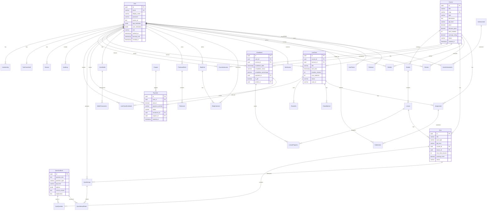

# Database Design - Torii Nihongo Learning Platform

## Project Information

**Capstone Project Name:**
- English: WebRTC-based live classes and FastMCP-powered AI feedback solution for a Japanese Learning Center
- Vietnamese: Giải pháp lớp học trực tuyến WebRTC và AI phản hồi thời gian thực bằng FastMCP cho trung tâm Nhật Ngữ
- Abbreviation: SP26SE005

## Database Overview

Hệ thống sử dụng **PostgreSQL** làm database chính với **Prisma ORM** để quản lý schema và migrations.

### Technology Stack
- Database: PostgreSQL
- ORM: Prisma
- Primary Key: UUID (gen_random_uuid())
- Timestamps: TIMESTAMP với timezone

## Entity Relationship Diagram (ERD)

## Database Schema Groups

### 1. User Management & Authentication
- Users, Roles, Permissions
- Authentication (Sessions, OAuth, 2FA)
- Audit Logs

### 2. Course Management
- Courses, Modules, Lessons
- Course Instructors
- Course Metadata & AI Context

### 3. Enrollment & Learning Progress
- Enrollments
- Lesson Progress Tracking
- Course Completion

### 4. Live Classes (WebRTC)
- Live Class Schedules
- Live Class Enrollments
- Room Management (LiveKit)
- Class Materials
- Attendance Tracking

### 5. Assessments & Quizzes
- Question Bank
- Quizzes (Practice, JLPT Mock)
- Quiz Attempts & Results

### 6. Payments & Financial
- Payments & Transactions
- Coupons & Promotions
- User Wallets & Credits

### 7. Flashcards & Vocabulary
- Flashcard Decks
- Flashcards with SRS Algorithm

### 8. Assignments & Submissions
- Assignments
- Submissions & Grading

### 9. Gamification
- Achievements
- User Points & Badges
- Leaderboards

### 10. Community & Content
- Blog Posts
- Comments
- Notifications

### 11. File Management
- File Assets
- Room Files (LiveKit)

---

**Next:** See detailed schema in `database-design-schema.md`

