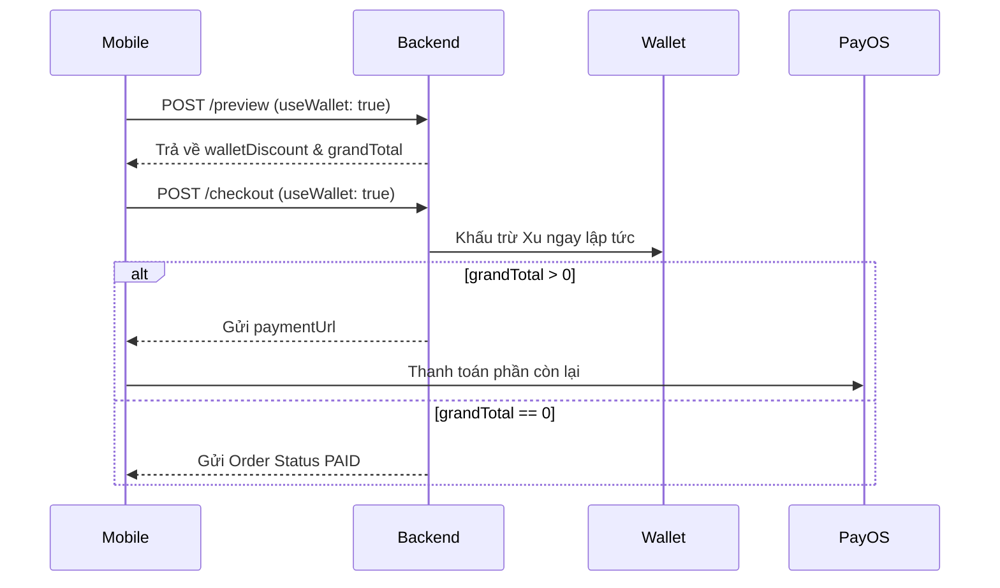

# 📱 Tài liệu Tích hợp Mobile (V3): VOD, Live Class & Thanh toán Xu

Tài liệu này cung cấp hướng dẫn kỹ thuật chi tiết cùng code ví dụ để tích hợp các tính năng mới vào ứng dụng Flutter.

---

## 🏗 1. Logic Điều hướng & Mở khóa bài học (Curriculum)

Học tập trên Mobile cần xử lý logic hiển thị bài học khác nhau tùy theo loại khóa học.

### A. Mô hình tuần tự (Lớp VOD)
Đối với các lớp VOD, bạn phải áp dụng logic **Sequential Unlocking**.

- **Điều kiện mở bài học**: Bài học thứ `N` chỉ được mở khi bài học `N-1` có trạng thái `COMPLETED`.
- **Logic Milestone**: Nếu bài học là một Unit Test/Exam bắt buộc, học viên phải đạt điểm tối thiểu (mặc định là 50% hoặc tùy cấu hình) mới được mở các bài tiếp theo.

**Code Ví dụ (Dart):**
```dart
bool isLessonUnlocked(Lesson current, Lesson? previous, double? milestoneScore) {
  // 1. Kiểm tra nếu là lớp Live Class thì luôn mở
  if (courseType == 'LIVE_CLASS') return true;

  // 2. Kiểm tra bài trước đó
  if (previous != null && !previous.isCompleted) return false;

  // 3. Kiểm tra rào cản Milestone (nếu có)
  if (previous != null && previous.isRequiredExam && (milestoneScore ?? 0) < 50) return false;

  return true;
}
```

### B. Mô hình tự do (Lớp Live Class)
- Đối với lớp LIVE, ứng dụng Mobile cần **bỏ qua hoàn toàn** các bước kiểm tra trên.
- Học viên có thể nhảy bài, xem video buổi 10 trước buổi 1 mà không gặp thông báo lỗi.

---

## 💰 2. Thanh toán kết hợp sử dụng Xu (Coin)

Tính năng này giúp người dùng dùng Xu để giảm giá trực tiếp thay vì chỉ có thể thanh toán 100% bằng Xu.

### A. Quy trình nghiệp vụ (UX Flow)
1. **Màn hình chọn gói**: Hiển thị giá gốc.
2. **Màn hình thanh toán**: 
   - Kiểm tra ví người dùng (`user.walletBalance`).
   - Nếu có xu, hiện checkbox "Dùng Xu để giảm giá".
   - Ngay khi người dùng chọn, gọi API **Preview** để cập nhật số tiền còn lại.
3. **Thanh toán**: Gọi API **Checkout**.

### B. Chi tiết API & Ví dụ (Dart)

Hệ thống hỗ trợ dùng Xu cho **tất cả sản phẩm**: Khóa học (VOD), Lớp Live (Cohort), và Gói AI (Subscription).

#### Step 1: Gọi Preview để lấy giá đã giảm
```dart
Future<void> previewOrder(String productId, String type) async {
  // Payload linh hoạt tùy theo loại sản phẩm
  Map<String, dynamic> payload = {
    "useWalletBalance": true 
  };
  
  if (type == 'VOD') payload['vodPackageIds'] = [productId];
  if (type == 'LIVE') payload['cohortIds'] = [productId];
  if (type == 'AI') payload['subscriptionPlanIds'] = [productId];

  final response = await dio.post('/api/academy/orders/preview', data: payload);

  final data = response.data['data'];
  final int walletDiscount = data['walletDiscount']; // Số tiền được giảm bằng Xu
  final int finalAmount = data['grandTotal']; // Số tiền còn lại phải trả qua ngân hàng
}
```

#### Step 2: Gọi Checkout để tạo đơn hàng
```dart
Future<void> checkoutOrder(String productId, String type) async {
  Map<String, dynamic> payload = {
    "paymentMethod": "PAYOS", 
    "useWalletBalance": true
  };

  if (type == 'VOD') payload['vodPackageIds'] = [productId];
  if (type == 'LIVE') payload['cohortIds'] = [productId];
  if (type == 'AI') payload['subscriptionPlanIds'] = [productId];

  final response = await dio.post('/api/academy/orders/checkout', data: payload);
  final data = response.data['data'];
  
  if (data['paymentUrl'] != null) {
     // Trường hợp 1: Có tiền phải trả -> Mở WebView PayOS
     launchUrl(data['paymentUrl']);
  } else {
     // Trường hợp 2: Xu đã trả hết 100% -> Thành công ngay (Order Status = PAID)
     showSuccessDialog("Mua khóa học thành công!");
  }
}
```

---

## ⚠️ 3. Xử lý lỗi & Trường hợp đặc biệt

### A. Lỗi 400 - Multiple Published Packages
Khi người dùng (lecturer) cố gắng Publish một gói VOD mới trong khi gói cũ vẫn đang Publish.
- **Xử lý**: Hiển thị Alert Dialog yêu cầu người dùng "Unpublish" gói hiện tại trước khi tiếp tục.

### B. Lỗi hết Xu khi đang thanh toán
Xảy ra khi người dùng dùng Xu cho 2 đơn hàng song song.
- **Mã lỗi**: `400 Bad Request`
- **Thông điệp**: "Số dư ví không đủ hoặc đã thay đổi. Vui lòng thử lại."
- **Xử lý**: Yêu cầu người dùng tải lại màn hình thanh toán để cập nhật lại số dư mới nhất.

---

## � 4. Sơ đồ luồng (Sequence Diagram)



---
**Torii Engineering Team**
 - *Cập nhật lần cuối: 16/04/2026*
