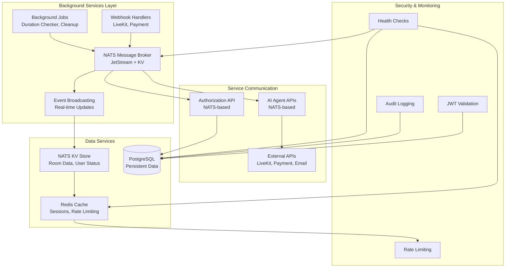

# 3.1.4 Non-Screen Functions
## Torii Nihongo Learning Platform - System Background Services

---

## Overview

Hệ thống Torii Nihongo bao gồm nhiều chức năng non-screen (không có giao diện người dùng) hoạt động ở background để hỗ trợ các nghiệp vụ chính. Các chức năng này bao gồm: **Message Broker Services**, **Webhook Handlers**, **Background Jobs**, **Real-time Event Processing**, và **API Services**.

---

## 1. NATS Message Broker Services

### 1.1 Overview
NATS JetStream được sử dụng làm message broker chính cho giao tiếp giữa các microservices và xử lý real-time events.

### 1.2 NATS Architecture Components

#### 1.2.1 JetStream Configuration
- **Store Directory**: `/data/jetstream`
- **Max Memory**: 1GB
- **Max File Storage**: 10GB
- **Accounts**: System Account (SYS), Platform Account (PNM)

#### 1.2.2 WebSocket Support
- **Port**: 8222
- **Protocol**: WebSocket over NATS
- **Purpose**: Real-time bidirectional communication cho live classes

### 1.3 NATS Message Patterns

#### 1.3.1 Request-Response Pattern (MessagePattern)
Các service sử dụng `@MessagePattern` decorator để xử lý inter-service communication:

**Identity Service Messages:**
- `identity.authorization.checkPermission` - Kiểm tra quyền của user
- `identity.authorization.getUserPermissions` - Lấy danh sách permissions
- `identity.authorization.checkMultiplePermissions` - Kiểm tra nhiều permissions
- `identity.users.getUserById` - Lấy thông tin user theo ID
- `identity.users.verifyUser` - Xác thực user
- `identity.users.getBulk` - Lấy thông tin nhiều users
- `identity.auth.getCurrentUser` - Lấy thông tin user hiện tại
- `identity.auth.getLinkedProviders` - Lấy OAuth providers đã liên kết

**Agents Service Messages:**
- `agents.ai.grammar.check` - Kiểm tra ngữ pháp tiếng Nhật
- `agents.ai.translate` - Dịch văn bản
- `agents.ai.flashcard.create` - Tạo flashcard tự động
- `agents.ai.drill.generate` - Tạo bài tập luyện tập
- `agents.ai.conversation.simulate` - Mô phỏng hội thoại
- `agents.ai.resources.recommend` - Gợi ý tài liệu học tập
- `agents.assessment.test.generate` - Tạo đề thi tự động
- `agents.assessment.test.evaluate` - Chấm điểm tự động
- `agents.assessment.benchmark.get` - Lấy benchmark đánh giá
- `agents.analytics.progress.track` - Theo dõi tiến độ học tập
- `agents.analytics.path.suggest` - Gợi ý lộ trình học tập
- `agents.analytics.weaknesses.identify` - Phân tích điểm yếu

**Meet Service Messages:**
- `webhook.handle` - Xử lý webhook events từ LiveKit

#### 1.3.2 JetStream Key-Value Store
NATS JetStream KV được sử dụng để lưu trữ temporary data:

**Room Information Storage:**
- Room metadata và configuration
- Active room status
- Participant information
- Room duration tracking

**User Session Storage:**
- User connection status (online/offline)
- User info trong live class
- Reconnection tracking

**Webhook Data Storage:**
- Webhook registration cho rooms
- Temporary webhook event data

### 1.4 NATS Authentication & Authorization

#### 1.4.1 Auth Callout Pattern
NATS sử dụng Auth Callout để xác thực users kết nối từ LiveKit:

**Flow:**
1. LiveKit request authentication từ NATS
2. NATS gửi auth request tới Gateway service
3. Gateway verify JWT token
4. Gateway trả về auth response
5. NATS cho phép/từ chối connection

**Configuration:**
- **Issuer**: Account Public Key (PNM)
- **Auth Users**: Authorized service users
- **XKey**: Encryption key cho request/response

---

## 2. Webhook Processing Services

### 2.1 LiveKit Webhook Handler

#### 2.1.1 Purpose
Xử lý các webhook events từ LiveKit server để đồng bộ trạng thái room và participants.

#### 2.1.2 Webhook Events

**Room Events:**
- `room_started` - Room bắt đầu
  - Update room status → ACTIVE
  - Set started timestamp
  - Initialize room duration checker
  - Broadcast room metadata
  
- `room_finished` - Room kết thúc
  - Update room status → ENDED
  - Trigger cleanup tasks
  - Send session_ended notification
  - Delete webhook registration

**Participant Events:**
- `participant_joined` - User tham gia room
  - Increment participant count
  - Handle internal agents (ingress, TTS)
  - Send notification
  
- `participant_left` - User rời room
  - Decrement participant count
  - Mark user offline
  - Safety net check (8s delay)

**Track Events:**
- `track_published` - User bật camera/mic/screen share
  - Send analytics event (STARTED)
  - Broadcast to participants
  
- `track_unpublished` - User tắt camera/mic/screen share
  - Send analytics event (ENDED)
  - Broadcast to participants

#### 2.1.3 Webhook Notifier Service
Service chuyên biệt để gửi webhook notifications:

**Features:**
- Register webhook cho từng room
- Send webhook events qua NATS
- Custom event types (session_ended)
- Cleanup webhook data sau khi room kết thúc

### 2.2 Payment Gateway Webhooks

#### 2.2.1 Payment Completion Webhook
Nhận webhook từ payment gateways (VNPay, MoMo, ZaloPay):

**Flow:**
1. User hoàn thành payment trên gateway
2. Gateway gửi webhook về server
3. Identity service verify webhook signature
4. Update payment status trong database
5. Trigger enrollment creation
6. Send notification cho user

**Supported Gateways:**
- VNPay
- MoMo
- ZaloPay

---

## 3. Background Jobs & Scheduled Tasks

### 3.1 Room Duration Checker

#### 3.1.1 Purpose
Tự động kết thúc rooms khi hết thời gian cho phép.

#### 3.1.2 Implementation
- **Type**: Background service
- **Trigger**: Room started event
- **Storage**: In-memory tracking với room duration info
- **Action**: Gọi LiveKit API để end room khi timeout

#### 3.1.3 Data Structure
```typescript
{
  roomId: string,
  duration: number,        // minutes
  startedAt: number,       // unix timestamp
}
```

### 3.2 User Offline Safety Net

#### 3.2.1 Purpose
Đảm bảo users được mark offline chính xác khi disconnect.

#### 3.2.2 Implementation
- **Type**: Delayed background task
- **Trigger**: participant_left webhook
- **Delay**: 8 seconds
- **Action**: 
  - Check user status trong NATS KV
  - Nếu vẫn "online" → trigger manual disconnect
  - Skip nếu user đã reconnect

### 3.3 Webhook Cleanup Task

#### 3.3.1 Purpose
Xóa webhook registration data sau khi room kết thúc.

#### 3.3.2 Implementation
- **Type**: Delayed background task
- **Trigger**: room_finished webhook
- **Delay**: 2 seconds
- **Action**: Delete webhook data từ NATS KV

---

## 4. Real-time Event Broadcasting

### 4.1 NATS Room Events Service

#### 4.1.1 Purpose
Broadcast real-time events tới tất cả participants trong room.

#### 4.1.2 Event Types

**Room Metadata Updates:**
- Room configuration changes
- Room status changes
- Participant count updates

**User Events:**
- User joined/left
- User status changes (online/offline)
- User reconnection events

**System Events:**
- Room started/ended
- Duration warnings
- Error notifications

#### 4.1.3 Broadcasting Mechanism
- **Protocol**: NATS JetStream Publish
- **Subject Pattern**: `room.{roomId}.events.{eventType}`
- **Delivery**: All active WebSocket connections

### 4.2 Analytics Event Streaming

#### 4.2.1 Purpose
Thu thập và stream analytics data real-time.

#### 4.2.2 Event Categories

**User Activity Events:**
- Microphone status (started/ended)
- Webcam status (started/ended)
- Screen share status (started/ended)

**Learning Progress Events:**
- Lesson completion
- Quiz attempts
- Flashcard reviews

**Engagement Metrics:**
- Time spent in lessons
- Attendance tracking
- Participation metrics

---

## 5. Inter-Service Communication APIs

### 5.1 Internal Service APIs

#### 5.1.1 Authorization Service (NATS-based)
**Purpose**: Centralized permission checking

**Methods:**
- `checkPermission(userId, role, permission)` → boolean
- `getUserPermissions(userId, role)` → string[]
- `checkMultiplePermissions(userId, role, permissions[])` → Record<string, boolean>

**Usage Example:**
```typescript
// From Learning Service
const hasPermission = await this.natsClient.send(
  'identity.authorization.checkPermission',
  { userId, userRole: 'lecturer', permission: 'courses.create' }
).toPromise();
```

#### 5.1.2 AI Agent Services (NATS-based)
**Purpose**: AI-powered learning assistance

**Sensei Agent Methods:**
- `checkGrammar(text)` → GrammarCheckResult
- `translate(text, from, to)` → TranslationResult
- `createFlashcard(word, meaning, example)` → FlashcardData
- `generatePracticeDrill(drillType, level, topic)` → DrillData
- `simulateConversation(topic, level)` → ConversationData
- `recommendResources(concept, level)` → ResourceList

**Assessment Agent Methods:**
- `generateTest(level, topics, questionCount)` → TestData
- `evaluateTest(attemptId, answers)` → EvaluationResult
- `getBenchmark(level)` → BenchmarkData

**Analytics Agent Methods:**
- `trackProgress(userId, courseId)` → ProgressData
- `suggestLearningPath(userId, currentLevel)` → PathSuggestion
- `identifyWeaknesses(userId)` → WeaknessList
- `predictReadiness(userId, examType)` → ReadinessScore

### 5.2 External Service Integrations

#### 5.2.1 LiveKit Service
**Purpose**: WebRTC infrastructure management

**Operations:**
- Create room
- End room
- Generate access tokens
- Get room info
- List participants
- Remove participant
- Update room metadata

#### 5.2.2 FastMCP Service
**Purpose**: AI model communication protocol

**Features:**
- Connect to AI models
- Send prompts
- Receive AI responses
- Streaming support

#### 5.2.3 Payment Gateway APIs
**Purpose**: Payment processing

**Supported Operations:**
- Create payment URL
- Verify payment signature
- Query payment status
- Process refunds

#### 5.2.4 Email Service (SMTP)
**Purpose**: Transactional emails

**Email Types:**
- Verification emails
- Password reset
- Enrollment confirmation
- Payment receipts
- Course completion certificates

#### 5.2.5 Storage Service (S3/MinIO)
**Purpose**: File storage

**Operations:**
- Upload files
- Generate signed URLs
- Delete files
- List files

---

## 6. Data Synchronization Services

### 6.1 Database to Cache Sync

#### 6.1.1 Redis Cache Management
**Purpose**: Improve performance với frequently accessed data

**Cached Data:**
- User sessions
- Course catalog
- Room information (temporary)
- Rate limiting counters

**Cache Strategies:**
- **Write-through**: Update DB và cache đồng thời
- **Cache-aside**: Load từ DB nếu cache miss
- **TTL-based expiration**: Auto cleanup stale data

### 6.2 NATS KV to Database Sync

#### 6.2.1 Room Info Synchronization
**Purpose**: Persist room data từ NATS KV vào PostgreSQL

**Sync Points:**
- Room creation → Save to DB
- Room started → Update status
- Room ended → Final update
- Participant count changes → Update DB

---

## 7. Monitoring & Health Check Services

### 7.1 Service Health Checks

#### 7.1.1 Gateway Health Check
**Endpoint**: `GET /health`

**Checks:**
- NATS connection status
- Database connection
- Redis connection

#### 7.1.2 Microservice Health Checks
**Endpoints**: `GET /health` on each service

**Checks:**
- Database connectivity
- NATS connectivity
- External service availability

### 7.2 NATS Connection Monitoring

#### 7.2.1 Connection Status Tracking
- Monitor NATS connection state
- Auto-reconnect on disconnect
- Log connection events

#### 7.2.2 JetStream Health
- Monitor JetStream availability
- Check stream/consumer status
- Track message processing lag

---

## 8. Security Background Services

### 8.1 JWT Token Validation

#### 8.1.1 Token Verification Service
**Purpose**: Validate JWT tokens cho mọi authenticated requests

**Operations:**
- Verify token signature
- Check token expiration
- Validate token claims
- Blacklist check (for logged out tokens)

### 8.2 Rate Limiting Service

#### 8.2.1 Implementation
**Storage**: Redis

**Limits:**
- General API: 100 requests/minute per IP
- Authentication: 5 requests/minute per IP
- Payment: 10 requests/minute per user

**Algorithm**: Token bucket hoặc sliding window

### 8.3 Audit Logging Service

#### 8.3.1 Purpose
Ghi lại tất cả security-critical actions

**Logged Events:**
- User login/logout
- Permission changes
- Payment transactions
- Data modifications
- Failed authentication attempts

**Storage**: PostgreSQL `audit_logs` table

---

## 9. File Processing Services

### 9.1 Video Transcoding (Future)

#### 9.1.1 Purpose
Convert uploaded videos sang multiple formats/resolutions

**Planned Features:**
- Multiple resolution support (480p, 720p, 1080p)
- Format conversion (MP4, WebM)
- Thumbnail generation
- Subtitle extraction

### 9.2 Recording Processing

#### 9.2.1 LiveKit Recording Handler
**Purpose**: Process recorded live classes

**Operations:**
- Download recording từ LiveKit
- Upload to S3/MinIO
- Generate metadata
- Create database entry
- Send notification

---

## 10. Notification Services

### 10.1 Real-time Notifications (NATS)

#### 10.1.1 Purpose
Gửi notifications real-time cho users đang online

**Delivery**: NATS pub/sub

**Notification Types:**
- Course enrollment confirmed
- Live class starting soon
- Assignment graded
- New message/comment
- Achievement unlocked

### 10.2 Email Notifications (SMTP)

#### 10.2.1 Purpose
Gửi email notifications cho users

**Email Types:**
- Welcome email
- Email verification
- Password reset
- Payment confirmation
- Course completion
- Weekly progress report

---

## 11. Analytics & Reporting Services

### 11.1 Learning Analytics Processor

#### 11.1.1 Purpose
Xử lý và aggregate learning data

**Metrics:**
- Course completion rates
- Average quiz scores
- Time spent per lesson
- Student engagement levels
- Popular courses

### 11.2 Business Intelligence Services

#### 11.2.1 Purpose
Generate reports cho admin/staff

**Reports:**
- Revenue reports
- Enrollment statistics
- User growth metrics
- Course performance
- Instructor ratings

---

## 12. System Architecture Diagram



---

## 13. Technology Stack Summary

| Component | Technology | Purpose |
|-----------|-----------|---------|
| Message Broker | NATS JetStream | Inter-service communication, Real-time events |
| Key-Value Store | NATS KV | Temporary data storage |
| Cache | Redis | Session storage, Rate limiting |
| Database | PostgreSQL | Persistent data storage |
| WebRTC | LiveKit | Live class infrastructure |
| AI Protocol | FastMCP | AI model communication |
| Email | SMTP | Transactional emails |
| Storage | S3/MinIO | File storage |

---

## 14. Deployment Considerations

### 14.1 Scalability
- NATS cluster cho high availability
- Horizontal scaling của microservices
- Redis cluster cho distributed caching
- Database read replicas

### 14.2 Reliability
- Auto-reconnect mechanisms
- Circuit breakers cho external services
- Retry logic với exponential backoff
- Dead letter queues cho failed messages

### 14.3 Monitoring
- NATS monitoring dashboard (port 8222)
- Service health endpoints
- Logging aggregation
- Performance metrics collection

---

**Document Version**: 1.0  
**Last Updated**: 2026-01-13  
**Project**: Torii Nihongo Learning Platform (SP26SE005)
