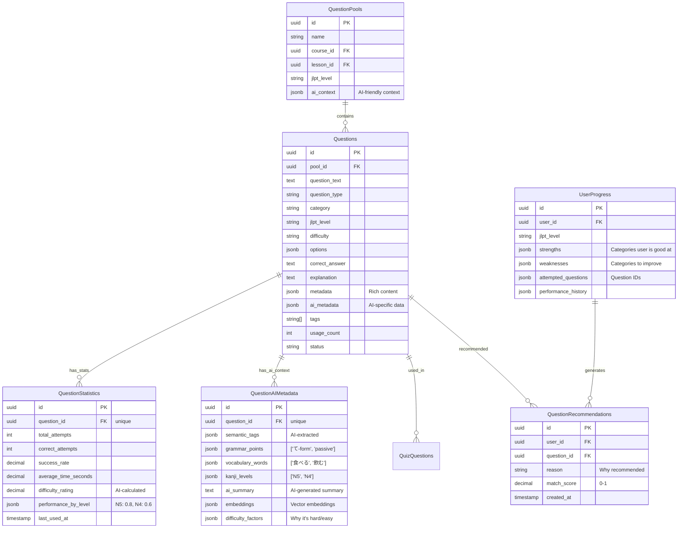

# Question Bank Design - AI Agent Optimized
## Thiết kế tối ưu cho AI Agent đọc và tạo bài thi tự động

---

## Pattern được chọn: **Hybrid Design với AI Metadata**

### Lý do:
1. ✅ **Rich Metadata** - AI cần nhiều context
2. ✅ **Statistics** - AI cần biết performance để recommend
3. ✅ **Question Pools** - AI chọn questions theo context
4. ✅ **JSONB Metadata** - Flexible cho AI context
5. ✅ **Tags & Classification** - AI filter dễ dàng

---

## ERD cho AI-Optimized Design



---

## Database Schema - AI Optimized

```sql
-- ============================================
-- Question Pools (Nhóm câu hỏi)
-- ============================================
CREATE TABLE question_pools (
    id UUID PRIMARY KEY DEFAULT gen_random_uuid(),
    name VARCHAR(255) NOT NULL,
    description TEXT,
    course_id UUID REFERENCES courses(id),
    lesson_id UUID REFERENCES lessons(id),
    jlpt_level VARCHAR(5),
    
    -- AI Context
    ai_context JSONB DEFAULT '{}', -- {
    --   "learning_objectives": ["..."],
    --   "prerequisites": ["..."],
    --   "target_skills": ["..."]
    -- }
    
    created_by UUID REFERENCES users(id),
    created_at TIMESTAMP DEFAULT NOW(),
    updated_at TIMESTAMP DEFAULT NOW()
);

-- ============================================
-- Questions (Core table với AI metadata)
-- ============================================
CREATE TABLE questions (
    id UUID PRIMARY KEY DEFAULT gen_random_uuid(),
    pool_id UUID REFERENCES question_pools(id),
    
    -- Core Content
    question_text TEXT NOT NULL,
    question_type VARCHAR(30) NOT NULL, -- multiple_choice, true_false, fill_blank, essay
    
    -- Classification (for AI filtering)
    category VARCHAR(50), -- vocab, grammar, reading, listening
    subcategory VARCHAR(50),
    jlpt_level VARCHAR(5), -- N5, N4, N3, N2, N1
    difficulty VARCHAR(20), -- easy, medium, hard
    
    -- Answers
    options JSONB, -- {"A": "text", "B": "text", ...}
    correct_answer TEXT,
    explanation TEXT,
    
    -- Rich Content (for different question types)
    metadata JSONB DEFAULT '{}', -- {
    --   "audio_url": "...", (for listening)
    --   "image_url": "...", (for reading)
    --   "reading_passage": "...", (for reading comprehension)
    --   "audio_transcript": "...", (for listening)
    --   "hint": "...",
    --   "romaji": "..." (for N5/N4)
    -- }
    
    -- AI-Specific Metadata (Critical for AI agent)
    ai_metadata JSONB DEFAULT '{}', -- {
    --   "semantic_tags": ["restaurant", "daily_conversation"],
    --   "grammar_points": ["て-form", "passive voice"],
    --   "vocabulary_words": ["食べる", "飲む", "行く"],
    --   "kanji_levels": ["N5", "N4"],
    --   "topic": "food_and_dining",
    --   "context": "restaurant_ordering",
    --   "complexity_score": 0.65, (0-1, AI calculated)
    --   "prerequisite_skills": ["basic_verbs", "particles"],
    --   "learning_objectives": ["understand_て-form", "restaurant_vocab"]
    -- }
    
    -- Management
    tags VARCHAR(50)[] DEFAULT '{}',
    created_by UUID REFERENCES users(id),
    status VARCHAR(20) DEFAULT 'active',
    usage_count INTEGER DEFAULT 0,
    
    created_at TIMESTAMP DEFAULT NOW(),
    updated_at TIMESTAMP DEFAULT NOW()
);

-- ============================================
-- Question Statistics (For AI recommendations)
-- ============================================
CREATE TABLE question_statistics (
    id UUID PRIMARY KEY DEFAULT gen_random_uuid(),
    question_id UUID UNIQUE NOT NULL REFERENCES questions(id) ON DELETE CASCADE,
    
    -- Performance Metrics
    total_attempts INTEGER DEFAULT 0,
    correct_attempts INTEGER DEFAULT 0,
    success_rate DECIMAL(5,2) DEFAULT 0.00, -- Percentage
    average_time_seconds DECIMAL(10,2),
    
    -- AI-Calculated Difficulty (from actual performance)
    difficulty_rating DECIMAL(3,2), -- 0.0-1.0, recalculated by AI
    
    -- Performance by User Level (for AI to match)
    performance_by_level JSONB DEFAULT '{}', -- {
    --   "N5": {"attempts": 100, "success_rate": 0.85},
    --   "N4": {"attempts": 80, "success_rate": 0.65},
    --   "N3": {"attempts": 50, "success_rate": 0.40}
    -- }
    
    -- Performance by Category
    performance_by_category JSONB DEFAULT '{}', -- {
    --   "vocab": {"attempts": 200, "success_rate": 0.75},
    --   "grammar": {"attempts": 150, "success_rate": 0.60}
    -- }
    
    last_used_at TIMESTAMP,
    created_at TIMESTAMP DEFAULT NOW(),
    updated_at TIMESTAMP DEFAULT NOW()
);

-- ============================================
-- User Progress (For AI to understand user level)
-- ============================================
CREATE TABLE user_question_progress (
    id UUID PRIMARY KEY DEFAULT gen_random_uuid(),
    user_id UUID NOT NULL REFERENCES users(id) ON DELETE CASCADE,
    
    -- Current Level Assessment
    estimated_jlpt_level VARCHAR(5), -- AI-estimated based on performance
    confidence_score DECIMAL(3,2), -- 0-1, how confident AI is
    
    -- Strengths & Weaknesses (for AI recommendations)
    strengths JSONB DEFAULT '{}', -- {
    --   "categories": ["vocab", "reading"],
    --   "grammar_points": ["て-form", "passive"],
    --   "jlpt_levels": ["N5", "N4"]
    -- }
    
    weaknesses JSONB DEFAULT '{}', -- {
    --   "categories": ["listening", "grammar"],
    --   "grammar_points": ["conditional", "causative"],
    --   "needs_practice": ["N3"]
    -- }
    
    -- Attempted Questions (to avoid duplicates)
    attempted_question_ids UUID[] DEFAULT '{}',
    
    -- Performance History
    performance_history JSONB DEFAULT '[]', -- [
    --   {"date": "2024-01-01", "category": "vocab", "score": 0.85},
    --   {"date": "2024-01-02", "category": "grammar", "score": 0.60}
    -- ]
    
    created_at TIMESTAMP DEFAULT NOW(),
    updated_at TIMESTAMP DEFAULT NOW(),
    
    UNIQUE(user_id)
);

-- ============================================
-- AI Question Recommendations
-- ============================================
CREATE TABLE ai_question_recommendations (
    id UUID PRIMARY KEY DEFAULT gen_random_uuid(),
    user_id UUID NOT NULL REFERENCES users(id) ON DELETE CASCADE,
    question_id UUID NOT NULL REFERENCES questions(id) ON DELETE CASCADE,
    
    -- AI Reasoning
    reason TEXT, -- "Matches your N4 level and grammar weaknesses"
    match_score DECIMAL(3,2), -- 0-1, how well it matches user
    recommendation_type VARCHAR(50), -- "weakness_practice", "level_up", "review"
    
    -- AI Context
    ai_context JSONB DEFAULT '{}', -- {
    --   "matched_criteria": ["jlpt_level", "weakness_category"],
    --   "estimated_difficulty_for_user": 0.65,
    --   "learning_value": 0.8
    -- }
    
    created_at TIMESTAMP DEFAULT NOW(),
    expires_at TIMESTAMP, -- Recommendations expire after some time
    
    UNIQUE(user_id, question_id)
);

-- ============================================
-- Indexes for AI Queries
-- ============================================
CREATE INDEX idx_questions_ai_metadata ON questions USING GIN (ai_metadata);
CREATE INDEX idx_questions_jlpt_level ON questions (jlpt_level);
CREATE INDEX idx_questions_category ON questions (category);
CREATE INDEX idx_questions_difficulty ON questions (difficulty);
CREATE INDEX idx_questions_tags ON questions USING GIN (tags);
CREATE INDEX idx_question_statistics_success_rate ON question_statistics (success_rate);
CREATE INDEX idx_question_statistics_difficulty ON question_statistics (difficulty_rating);
```

---

## AI Agent Query Patterns

### 1. AI tìm questions phù hợp với user level

```sql
-- AI Agent Query: Find questions for N4 user, focusing on grammar weaknesses
SELECT q.*, qs.success_rate, qs.difficulty_rating
FROM questions q
LEFT JOIN question_statistics qs ON q.id = qs.question_id
LEFT JOIN user_question_progress up ON up.user_id = $userId
WHERE 
    q.jlpt_level = 'N4'
    AND q.category = 'grammar'
    AND q.status = 'active'
    AND q.id != ALL(up.attempted_question_ids) -- Not attempted yet
    AND (
        -- Match user's weaknesses
        q.ai_metadata->>'grammar_points' ?| array(
            SELECT jsonb_array_elements_text(up.weaknesses->'grammar_points')
        )
        OR
        -- Difficulty appropriate for user
        (qs.difficulty_rating BETWEEN 0.5 AND 0.7)
    )
ORDER BY 
    -- Prioritize by match score
    CASE 
        WHEN q.ai_metadata->>'grammar_points' ?| array(
            SELECT jsonb_array_elements_text(up.weaknesses->'grammar_points')
        ) THEN 1
        ELSE 2
    END,
    qs.success_rate DESC
LIMIT 20;
```

### 2. AI tạo quiz tự động

```sql
-- AI Agent: Generate quiz with balanced difficulty
WITH user_level AS (
    SELECT estimated_jlpt_level, weaknesses
    FROM user_question_progress
    WHERE user_id = $userId
),
selected_questions AS (
    SELECT q.*, qs.difficulty_rating
    FROM questions q
    JOIN question_statistics qs ON q.id = qs.question_id
    CROSS JOIN user_level ul
    WHERE 
        q.jlpt_level = ul.estimated_jlpt_level
        AND q.status = 'active'
        AND qs.difficulty_rating BETWEEN 0.4 AND 0.8 -- Appropriate range
        AND (
            -- Mix of categories
            q.category IN ('vocab', 'grammar', 'reading', 'listening')
        )
    ORDER BY RANDOM()
    LIMIT 20
)
SELECT * FROM selected_questions;
```

### 3. AI update statistics sau khi user làm bài

```sql
-- After quiz attempt, update statistics
INSERT INTO question_statistics (question_id, total_attempts, correct_attempts, success_rate)
VALUES ($questionId, 1, $isCorrect, $isCorrect::decimal)
ON CONFLICT (question_id) 
DO UPDATE SET
    total_attempts = question_statistics.total_attempts + 1,
    correct_attempts = question_statistics.correct_attempts + $isCorrect::int,
    success_rate = (
        (question_statistics.correct_attempts + $isCorrect::int)::decimal / 
        (question_statistics.total_attempts + 1)::decimal
    ),
    difficulty_rating = (
        -- AI recalculates difficulty based on success rate
        CASE 
            WHEN (question_statistics.correct_attempts + $isCorrect::int)::decimal / 
                 (question_statistics.total_attempts + 1)::decimal > 0.8 
            THEN 0.3 -- Easy
            WHEN (question_statistics.correct_attempts + $isCorrect::int)::decimal / 
                 (question_statistics.total_attempts + 1)::decimal > 0.5 
            THEN 0.6 -- Medium
            ELSE 0.9 -- Hard
        END
    ),
    last_used_at = NOW();
```

---

## AI Metadata Structure (Critical)

```json
{
  "ai_metadata": {
    "semantic_tags": ["restaurant", "daily_conversation", "food"],
    "grammar_points": ["て-form", "passive voice", "particles"],
    "vocabulary_words": ["食べる", "飲む", "行く", "レストラン"],
    "kanji_levels": ["N5", "N4"],
    "topic": "food_and_dining",
    "context": "restaurant_ordering",
    "complexity_score": 0.65,
    "prerequisite_skills": ["basic_verbs", "particles_を_に"],
    "learning_objectives": [
      "understand_て-form_usage",
      "restaurant_vocabulary",
      "ordering_food"
    ],
    "estimated_time_seconds": 45,
    "cognitive_load": "medium"
  }
}
```

---

## Migration từ hiện tại → AI-Optimized

```sql
-- Step 1: Add question_pools
CREATE TABLE question_pools (...);

-- Step 2: Add AI metadata to questions
ALTER TABLE question_bank 
ADD COLUMN pool_id UUID REFERENCES question_pools(id),
ADD COLUMN ai_metadata JSONB DEFAULT '{}',
ADD COLUMN metadata JSONB DEFAULT '{}';

-- Step 3: Add statistics
CREATE TABLE question_statistics (...);

-- Step 4: Add user progress
CREATE TABLE user_question_progress (...);

-- Step 5: Add AI recommendations
CREATE TABLE ai_question_recommendations (...);

-- Step 6: Add GIN indexes for AI queries
CREATE INDEX idx_questions_ai_metadata ON question_bank USING GIN (ai_metadata);
```

---

## Kết luận

**Pattern được chọn: Hybrid Design với AI Metadata**

**Lý do:**
1. ✅ **Rich AI Metadata** - AI hiểu context của question
2. ✅ **Statistics** - AI biết performance để recommend
3. ✅ **User Progress** - AI biết user level và weaknesses
4. ✅ **Question Pools** - AI chọn questions theo context
5. ✅ **GIN Indexes** - Fast queries cho AI

**AI Agent có thể:**
- ✅ Đọc và hiểu questions qua ai_metadata
- ✅ Filter questions theo user level và weaknesses
- ✅ Tạo quiz tự động với balanced difficulty
- ✅ Recommend questions phù hợp
- ✅ Track và update statistics

