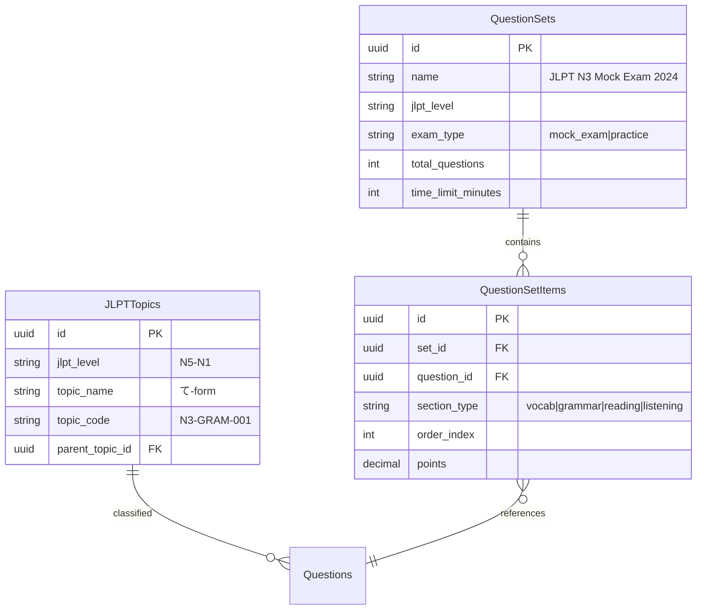

# Question Bank ERD - Production Design
## ERD chi tiết cho hệ thống Question Bank trong production

---

## ERD Production Pattern (Recommended)

```mermaid
erDiagram
    QuestionPools ||--o{ Questions : "contains"
    Questions ||--o{ QuestionAnswers : "has_answers"
    Questions ||--o{ QuestionStatistics : "has_stats"
    Questions ||--o{ QuizQuestions : "used_in_quizzes"
    Questions ||--o{ QuestionAttemptDetails : "answered_in"
    Questions ||--o{ QuestionVersions : "versioned"
    JLPTTopics ||--o{ Questions : "classified_by"
    Tags ||--o{ QuestionTags : "tagged"
    Questions ||--o{ QuestionTags : "has_tags"
    Courses ||--o{ QuestionPools : "has_pools"
    Lessons ||--o{ QuestionPools : "has_pools"
    Users ||--o{ Questions : "creates"
    Users ||--o{ QuestionPools : "creates"
    
    QuestionPools {
        uuid id PK
        string name
        text description
        uuid course_id FK "nullable"
        uuid lesson_id FK "nullable"
        string jlpt_level
        uuid created_by FK
        timestamp created_at
        timestamp updated_at
    }
    
    Questions {
        uuid id PK
        uuid pool_id FK "nullable"
        text question_text
        string question_type "multiple_choice|true_false|fill_blank|essay"
        string category "vocab|grammar|reading|listening"
        string subcategory
        string jlpt_level "N5|N4|N3|N2|N1"
        string difficulty "easy|medium|hard"
        jsonb options "{\"A\": \"text\", \"B\": \"text\"}"
        text correct_answer
        text explanation
        jsonb metadata "{\"audio_url\": \"...\", \"image_url\": \"...\"}"
        string[] tags
        uuid created_by FK
        string status "active|inactive|review|archived"
        int usage_count
        int version
        uuid parent_question_id FK "nullable - for revisions"
        timestamp created_at
        timestamp updated_at
    }
    
    QuestionAnswers {
        uuid id PK
        uuid question_id FK
        text answer_text
        boolean is_correct
        int order_index
        text explanation "optional"
        timestamp created_at
    }
    
    QuestionStatistics {
        uuid id PK
        uuid question_id FK "unique"
        int total_attempts
        int correct_attempts
        decimal average_time_seconds
        decimal difficulty_rating "calculated"
        timestamp last_used_at
        timestamp created_at
        timestamp updated_at
    }
    
    QuestionVersions {
        uuid id PK
        uuid question_id FK
        int version_number
        text question_text
        jsonb options
        text correct_answer
        uuid created_by FK
        timestamp created_at
    }
    
    JLPTTopics {
        uuid id PK
        string jlpt_level "N5|N4|N3|N2|N1"
        string topic_name "て-form, Passive voice"
        string topic_code "N3-GRAM-001"
        uuid parent_topic_id FK "nullable - hierarchy"
        int order_index
        timestamp created_at
    }
    
    Tags {
        uuid id PK
        string name "unique"
        string color "hex"
        timestamp created_at
    }
    
    QuestionTags {
        uuid question_id FK
        uuid tag_id FK
        "PK: (question_id, tag_id)"
    }
```

---

## So sánh: Hiện tại vs Production

### Thiết kế hiện tại (Torii - MVP)

```
question_bank (flat table)
├── id
├── question_text
├── question_type
├── category (string/enum)
├── subcategory (string)
├── jlpt_level
├── difficulty
├── options (JSONB)
├── correct_answer
├── explanation
├── tags (array)
├── created_by
├── status
├── usage_count
└── timestamps
```

**Đặc điểm:**
- ✅ Đơn giản, dễ query
- ✅ Phù hợp < 5,000 questions
- ✅ Performance tốt với indexes
- ❌ Không có question pools
- ❌ Không có statistics tracking
- ❌ Không có versioning

### Production Pattern (Recommended)

```
question_pools (nhóm câu hỏi)
    ↓
questions (câu hỏi)
    ├── question_answers (đáp án - tách riêng)
    ├── question_statistics (thống kê)
    ├── question_versions (versioning)
    └── question_tags (many-to-many)
```

**Đặc điểm:**
- ✅ Question Pools - nhóm theo course/lesson
- ✅ Statistics tracking - analytics
- ✅ Versioning - track changes
- ✅ Answers tách riêng - flexible
- ✅ Tags many-to-many - reusable
- ❌ Phức tạp hơn - nhiều JOIN

---

## Migration Strategy

### Phase 1: MVP (Hiện tại) ✅
```sql
-- Giữ nguyên flat structure
question_bank (current)
```

### Phase 2: Add Question Pools
```sql
-- Thêm bảng pools
CREATE TABLE question_pools (
    id UUID PRIMARY KEY,
    name VARCHAR(255),
    course_id UUID,
    lesson_id UUID,
    created_by UUID
);

-- Thêm FK vào questions
ALTER TABLE question_bank 
ADD COLUMN pool_id UUID REFERENCES question_pools(id);
```

### Phase 3: Add Statistics
```sql
-- Thêm bảng statistics
CREATE TABLE question_statistics (
    id UUID PRIMARY KEY,
    question_id UUID UNIQUE REFERENCES question_bank(id),
    total_attempts INTEGER DEFAULT 0,
    correct_attempts INTEGER DEFAULT 0,
    average_time_seconds DECIMAL(10,2)
);
```

### Phase 4: Add Versioning (Optional)
```sql
-- Thêm versioning
ALTER TABLE question_bank 
ADD COLUMN version INTEGER DEFAULT 1,
ADD COLUMN parent_question_id UUID REFERENCES question_bank(id);
```

---

## Production ERD cho Trung tâm Nhật ngữ

### Đặc thù JLPT:



---

## Kết luận

**Thiết kế hiện tại:**
- ✅ Phù hợp cho MVP
- ✅ Đơn giản, maintainable
- ✅ Performance tốt

**Khi scale:**
- ➕ Thêm Question Pools (khi có nhiều courses)
- ➕ Thêm Statistics (khi cần analytics)
- ➕ Thêm Versioning (khi cần track changes)
- ➕ Thêm Question Sets (cho bộ đề thi thử)

**Pattern khuyến nghị: Hybrid Design**
- Giữ JSONB cho flexibility
- Thêm normalized tables khi cần scale

