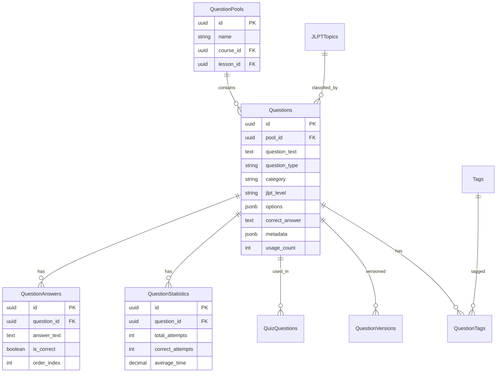

# Question Bank Production Design Patterns
## Cách các trung tâm Nhật ngữ thiết kế Question Bank trong thực tế

---

## 1. Pattern 1: Normalized Design (Industry Standard)

### ERD Structure

```
┌─────────────────┐
│  Categories     │
├─────────────────┤
│ id (PK)         │
│ name            │
│ parent_id (FK)  │──┐
│ description     │  │
│ created_at      │  │
└─────────────────┘  │
         │            │
         │ 1:N        │
         │            │
         ▼            │
┌─────────────────┐  │
│  Questions      │  │
├─────────────────┤  │
│ id (PK)         │  │
│ question_text   │  │
│ question_type   │  │
│ category_id(FK) │──┘
│ difficulty      │
│ jlpt_level      │
│ explanation     │
│ created_by      │
│ status          │
│ usage_count     │
└─────────────────┘
         │
         │ 1:N
         │
         ▼
┌─────────────────┐
│  Question_Answers│
├─────────────────┤
│ id (PK)         │
│ question_id(FK) │
│ answer_text     │
│ is_correct      │
│ order_index     │
└─────────────────┘
```

### Database Schema

```sql
-- Bảng Categories (Taxonomy)
CREATE TABLE question_categories (
    id UUID PRIMARY KEY DEFAULT gen_random_uuid(),
    name VARCHAR(100) NOT NULL,
    slug VARCHAR(100) UNIQUE NOT NULL,
    parent_id UUID REFERENCES question_categories(id),
    description TEXT,
    icon_url TEXT,
    order_index INTEGER DEFAULT 0,
    created_at TIMESTAMP DEFAULT NOW(),
    updated_at TIMESTAMP DEFAULT NOW()
);

-- Bảng Questions (Normalized)
CREATE TABLE questions (
    id UUID PRIMARY KEY DEFAULT gen_random_uuid(),
    question_text TEXT NOT NULL,
    question_type VARCHAR(30) NOT NULL,
    category_id UUID REFERENCES question_categories(id),
    subcategory_id UUID REFERENCES question_categories(id),
    difficulty VARCHAR(20),
    jlpt_level VARCHAR(5),
    explanation TEXT,
    explanation_audio_url TEXT, -- Cho listening
    image_url TEXT, -- Cho reading comprehension
    audio_url TEXT, -- Cho listening questions
    created_by UUID REFERENCES users(id),
    status VARCHAR(20) DEFAULT 'active',
    usage_count INTEGER DEFAULT 0,
    created_at TIMESTAMP DEFAULT NOW(),
    updated_at TIMESTAMP DEFAULT NOW()
);

-- Bảng Answers (Tách riêng - không dùng JSONB)
CREATE TABLE question_answers (
    id UUID PRIMARY KEY DEFAULT gen_random_uuid(),
    question_id UUID NOT NULL REFERENCES questions(id) ON DELETE CASCADE,
    answer_text TEXT NOT NULL,
    is_correct BOOLEAN DEFAULT FALSE,
    order_index INTEGER DEFAULT 0,
    explanation TEXT, -- Giải thích riêng cho từng đáp án
    created_at TIMESTAMP DEFAULT NOW()
);

-- Bảng Question Tags (Many-to-Many)
CREATE TABLE question_tags (
    question_id UUID REFERENCES questions(id) ON DELETE CASCADE,
    tag_id UUID REFERENCES tags(id) ON DELETE CASCADE,
    PRIMARY KEY (question_id, tag_id)
);

CREATE TABLE tags (
    id UUID PRIMARY KEY DEFAULT gen_random_uuid(),
    name VARCHAR(50) UNIQUE NOT NULL,
    color VARCHAR(7), -- Hex color
    created_at TIMESTAMP DEFAULT NOW()
);
```

### Ưu điểm:
- ✅ Normalized - không duplicate data
- ✅ Dễ query statistics theo category
- ✅ Hỗ trợ category hierarchy (parent/child)
- ✅ Answers tách riêng - dễ quản lý
- ✅ Hỗ trợ nhiều đáp án đúng (is_correct có thể có nhiều TRUE)

### Nhược điểm:
- ❌ Phức tạp hơn - nhiều JOIN
- ❌ Performance chậm hơn nếu không optimize

---

## 2. Pattern 2: Hybrid Design (Recommended for Production)

### ERD Structure

```
┌─────────────────┐
│  Question_Pools │ (Nhóm câu hỏi)
├─────────────────┤
│ id (PK)         │
│ name            │
│ description     │
│ course_id (FK)  │
└─────────────────┘
         │
         │ 1:N
         │
         ▼
┌─────────────────┐
│  Questions      │
├─────────────────┤
│ id (PK)         │
│ pool_id (FK)    │──┐
│ question_text   │  │
│ question_type   │  │
│ category        │  │ (String - flexible)
│ jlpt_level      │  │
│ options (JSONB) │  │ (Cho multiple choice)
│ correct_answer  │  │
│ explanation     │  │
│ metadata (JSONB)│  │ (Audio, images, etc.)
└─────────────────┘  │
         │            │
         │ 1:N        │
         │            │
         ▼            │
┌─────────────────┐  │
│  Question_Versions│ │ (Versioning)
├─────────────────┤  │
│ id (PK)         │  │
│ question_id(FK) │──┘
│ version_number  │
│ question_text   │
│ created_at      │
└─────────────────┘
```

### Database Schema

```sql
-- Bảng Question Pools (Nhóm câu hỏi theo course/lesson)
CREATE TABLE question_pools (
    id UUID PRIMARY KEY DEFAULT gen_random_uuid(),
    name VARCHAR(255) NOT NULL,
    description TEXT,
    course_id UUID REFERENCES courses(id),
    lesson_id UUID REFERENCES lessons(id),
    jlpt_level VARCHAR(5),
    created_by UUID REFERENCES users(id),
    created_at TIMESTAMP DEFAULT NOW(),
    updated_at TIMESTAMP DEFAULT NOW()
);

-- Bảng Questions (Hybrid - có cả JSONB và normalized)
CREATE TABLE questions (
    id UUID PRIMARY KEY DEFAULT gen_random_uuid(),
    pool_id UUID REFERENCES question_pools(id),
    
    -- Core fields
    question_text TEXT NOT NULL,
    question_type VARCHAR(30) NOT NULL,
    
    -- Classification (flexible)
    category VARCHAR(50), -- vocab, grammar, reading, listening
    subcategory VARCHAR(50),
    jlpt_level VARCHAR(5),
    difficulty VARCHAR(20),
    
    -- Options (JSONB for flexibility)
    options JSONB, -- {"A": "text", "B": "text", ...}
    correct_answer TEXT, -- Hoặc JSONB cho multiple correct
    
    -- Rich content
    explanation TEXT,
    metadata JSONB, -- {
    --   "audio_url": "...",
    --   "image_url": "...",
    --   "video_url": "...",
    --   "reading_passage": "...",
    --   "hint": "..."
    -- }
    
    -- Management
    tags VARCHAR(50)[] DEFAULT '{}',
    created_by UUID REFERENCES users(id),
    status VARCHAR(20) DEFAULT 'active',
    usage_count INTEGER DEFAULT 0,
    
    -- Versioning
    version INTEGER DEFAULT 1,
    parent_question_id UUID REFERENCES questions(id), -- For revisions
    
    created_at TIMESTAMP DEFAULT NOW(),
    updated_at TIMESTAMP DEFAULT NOW()
);

-- Bảng Question Statistics (Analytics)
CREATE TABLE question_statistics (
    id UUID PRIMARY KEY DEFAULT gen_random_uuid(),
    question_id UUID REFERENCES questions(id),
    total_attempts INTEGER DEFAULT 0,
    correct_attempts INTEGER DEFAULT 0,
    average_time_seconds DECIMAL(10,2),
    difficulty_rating DECIMAL(3,2), -- Calculated from performance
    last_used_at TIMESTAMP,
    created_at TIMESTAMP DEFAULT NOW(),
    updated_at TIMESTAMP DEFAULT NOW(),
    UNIQUE(question_id)
);
```

### Ưu điểm:
- ✅ Flexible - JSONB cho options và metadata
- ✅ Question Pools - nhóm theo course/lesson
- ✅ Versioning - track changes
- ✅ Statistics - analytics riêng
- ✅ Rich content - audio, images, video

---

## 3. Pattern 3: Production Pattern cho Trung tâm Nhật ngữ

### Đặc thù của hệ thống JLPT:

```sql
-- Bảng JLPT Topics (Chủ đề theo cấu trúc JLPT)
CREATE TABLE jlpt_topics (
    id UUID PRIMARY KEY DEFAULT gen_random_uuid(),
    jlpt_level VARCHAR(5) NOT NULL, -- N5, N4, N3, N2, N1
    topic_name VARCHAR(100) NOT NULL, -- "て-form", "Passive voice"
    topic_code VARCHAR(50) UNIQUE, -- "N3-GRAM-001"
    parent_topic_id UUID REFERENCES jlpt_topics(id),
    order_index INTEGER,
    created_at TIMESTAMP DEFAULT NOW()
);

-- Bảng Questions với JLPT structure
CREATE TABLE questions (
    id UUID PRIMARY KEY DEFAULT gen_random_uuid(),
    
    -- JLPT Classification
    jlpt_level VARCHAR(5) NOT NULL,
    jlpt_topic_id UUID REFERENCES jlpt_topics(id),
    
    -- Question Content
    question_text TEXT NOT NULL,
    question_text_romaji TEXT, -- Cho N5/N4
    question_type VARCHAR(30) NOT NULL,
    
    -- Section Type (theo cấu trúc JLPT)
    section_type VARCHAR(50), -- "vocabulary", "grammar", "reading", "listening"
    
    -- For Reading Section
    reading_passage TEXT, -- Đoạn văn cho reading comprehension
    reading_passage_romaji TEXT,
    
    -- For Listening Section
    audio_url TEXT,
    audio_transcript TEXT,
    audio_transcript_romaji TEXT,
    
    -- Answers
    options JSONB, -- {"A": {"text": "...", "romaji": "..."}, ...}
    correct_answer TEXT,
    
    -- Explanation
    explanation TEXT,
    explanation_japanese TEXT, -- Giải thích bằng tiếng Nhật
    explanation_english TEXT, -- Giải thích bằng tiếng Anh
    
    -- Metadata
    difficulty VARCHAR(20),
    kanji_level VARCHAR(20), -- "N5", "N4", etc.
    grammar_points TEXT[], -- ["て-form", "passive"]
    vocabulary_words TEXT[], -- Từ vựng trong câu hỏi
    
    -- Management
    created_by UUID REFERENCES users(id),
    status VARCHAR(20) DEFAULT 'active',
    usage_count INTEGER DEFAULT 0,
    
    created_at TIMESTAMP DEFAULT NOW(),
    updated_at TIMESTAMP DEFAULT NOW()
);

-- Bảng Question Sets (Bộ đề thi thử)
CREATE TABLE question_sets (
    id UUID PRIMARY KEY DEFAULT gen_random_uuid(),
    name VARCHAR(255) NOT NULL,
    description TEXT,
    jlpt_level VARCHAR(5) NOT NULL,
    exam_type VARCHAR(50), -- "mock_exam", "practice", "review"
    total_questions INTEGER DEFAULT 0,
    time_limit_minutes INTEGER,
    created_by UUID REFERENCES users(id),
    created_at TIMESTAMP DEFAULT NOW()
);

-- Bảng Question Set Items
CREATE TABLE question_set_items (
    id UUID PRIMARY KEY DEFAULT gen_random_uuid(),
    set_id UUID REFERENCES question_sets(id) ON DELETE CASCADE,
    question_id UUID REFERENCES questions(id) ON DELETE CASCADE,
    section_type VARCHAR(50), -- "vocab", "grammar", "reading", "listening"
    order_index INTEGER NOT NULL,
    points DECIMAL(5,2) DEFAULT 1.00,
    UNIQUE(set_id, order_index)
);
```

### Đặc điểm:
- ✅ Phân loại theo cấu trúc JLPT thực tế
- ✅ Hỗ trợ romaji cho N5/N4
- ✅ Reading passages riêng
- ✅ Audio transcripts cho listening
- ✅ Question Sets - bộ đề thi thử
- ✅ Section-based (vocab, grammar, reading, listening)

---

## 4. So sánh với thiết kế hiện tại

### Thiết kế hiện tại (Torii):
```
question_bank
├── Flat structure
├── category (string/enum)
├── options (JSONB)
├── tags (array)
└── No category table
```

### Production Pattern (Recommended):
```
question_bank
├── Normalized categories (optional)
├── Question pools (for course/lesson grouping)
├── Versioning support
├── Statistics table
└── Rich metadata (JSONB)
```

---

## 5. Khuyến nghị cho Torii

### Phase 1: MVP (Hiện tại) ✅
- Giữ nguyên flat structure
- Thêm index cho category
- Validation với enum

### Phase 2: Scale (Khi > 5,000 questions)
- Thêm `question_pools` table
- Thêm `question_statistics` table
- Thêm versioning nếu cần

### Phase 3: Advanced (Khi > 20,000 questions)
- Thêm `question_categories` table với hierarchy
- Tách `question_answers` nếu cần nhiều đáp án đúng
- Thêm `question_sets` cho bộ đề thi thử

---

## 6. ERD Production-Ready (Recommended)



---

## 7. Migration Path

### Từ hiện tại → Production:

```sql
-- Step 1: Thêm question_pools (optional)
CREATE TABLE question_pools (...);

-- Step 2: Thêm statistics
CREATE TABLE question_statistics (...);

-- Step 3: Thêm versioning (nếu cần)
ALTER TABLE questions ADD COLUMN version INTEGER DEFAULT 1;
ALTER TABLE questions ADD COLUMN parent_question_id UUID;

-- Step 4: Migrate data (nếu cần tách answers)
-- Giữ nguyên JSONB options nếu đơn giản
-- Hoặc migrate sang question_answers nếu cần flexibility
```

---

## Kết luận

**Thiết kế hiện tại của Torii:**
- ✅ Phù hợp cho MVP
- ✅ Đơn giản, dễ maintain
- ✅ Performance tốt với indexes

**Khi scale lên production:**
- ➕ Thêm Question Pools
- ➕ Thêm Statistics tracking
- ➕ Thêm Versioning (nếu cần)
- ➕ Cân nhắc Category table (nếu > 10K questions)

**Pattern được khuyến nghị: Hybrid Design** - giữ JSONB cho flexibility, thêm normalized tables cho scalability.

