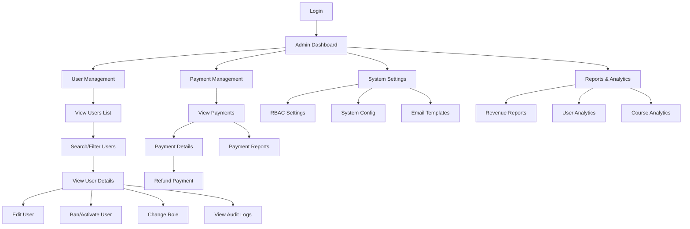
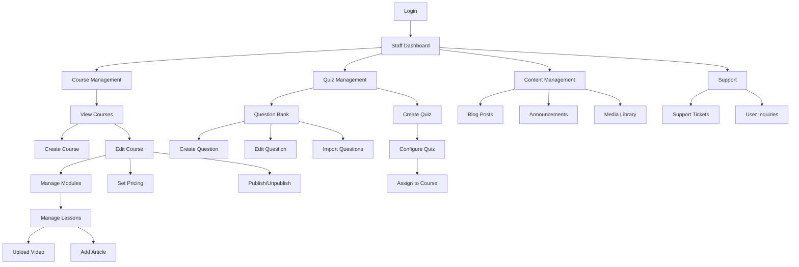
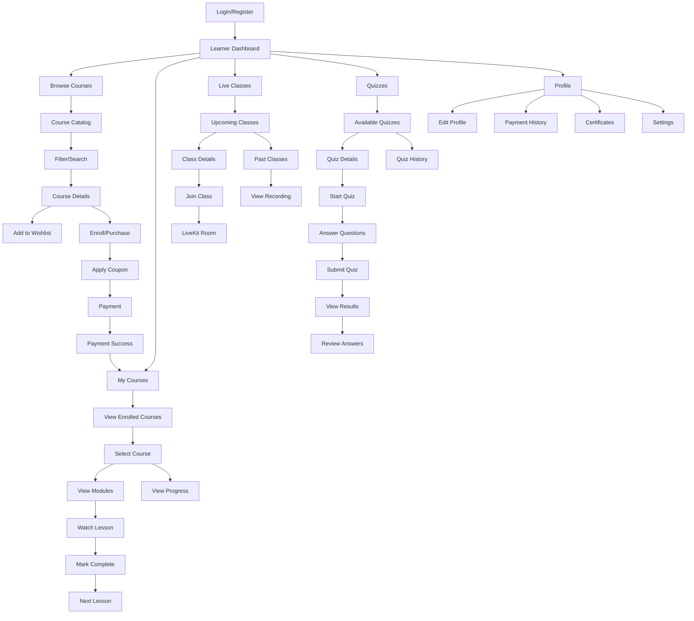
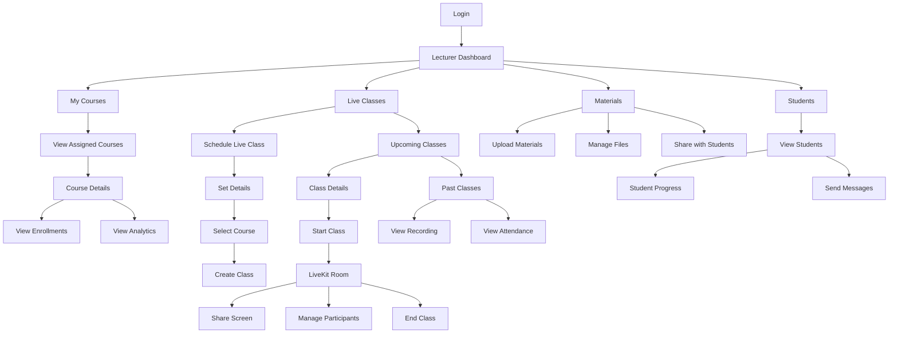

# Screen Flow by User Roles

## 1. Admin Screen Flow



## 2. Staff Screen Flow



## 3. Learner Screen Flow



## 4. Lecturer Screen Flow



## Screen Flow Summary by Role

### Admin
- **Primary Focus**: System administration, user management, payments
- **Key Screens**: Dashboard, User Management, Payment Management, Reports
- **Main Actions**: Manage users, view reports, configure system

### Staff
- **Primary Focus**: Content creation and management
- **Key Screens**: Course Management, Quiz Management, Content Management
- **Main Actions**: Create courses, manage quizzes, handle support

### Learner
- **Primary Focus**: Learning and course consumption
- **Key Screens**: Course Catalog, My Courses, Live Classes, Quizzes
- **Main Actions**: Browse, purchase, learn, take quizzes, join live classes

### Lecturer
- **Primary Focus**: Teaching and live class delivery
- **Key Screens**: Live Classes, Course Analytics, Student Management
- **Main Actions**: Schedule classes, conduct live sessions, upload materials

## Navigation Patterns

### Common Navigation (All Roles)
- Login/Logout
- Profile Settings
- Notifications
- Help/Support

### Role-Specific Navigation

**Admin:**
```
Dashboard → Users → Payments → Settings → Reports
```

**Staff:**
```
Dashboard → Courses → Quizzes → Content → Support
```

**Learner:**
```
Dashboard → Browse → My Courses → Live Classes → Quizzes → Profile
```

**Lecturer:**
```
Dashboard → My Courses → Live Classes → Materials → Students
```

## Mobile vs Web Considerations

### Mobile-First Screens (All Roles)
- Login/Register
- Dashboard
- Course Catalog (Learner)
- My Courses (Learner)
- Live Class Join (Learner)

### Web-Optimized Screens
- Admin Dashboard (complex tables)
- Course Creation (Staff)
- Quiz Builder (Staff)
- Live Class Management (Lecturer)
- Analytics/Reports (Admin, Lecturer)

---

**Related Documents:**
- [Use Cases](srs-06-use-cases.md)
- [User Interface Requirements](srs-04-interfaces.md)
- [System Architecture](srs-03-architecture.md)
