# Screen Flow by User Roles

**Project:** Torii Nihongo Learning Platform  
**Version:** 2.0  
**Last Updated:** 2026-01-14

---

## Overview

This document describes the complete screen flows for all user roles in the Torii Nihongo platform. The flows are based on the actual implemented features in the codebase.

**User Roles:**
- **Admin** - System administration and management
- **Staff** - Content creation and course management
- **Learner** - Course consumption and learning
- **Lecturer** - Teaching and live class delivery

---

## 1. Admin Screen Flow

### Entry Point
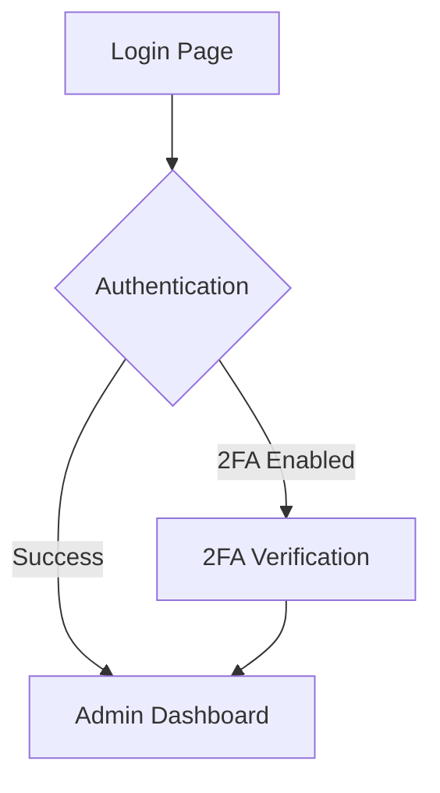

### Main Navigation Flow
```mermaid
flowchart TD
    Dashboard[Admin Dashboard] --> Users[User Management]
    Dashboard --> Courses[Course Management]
    Dashboard --> Finance[Financial Management]
    Dashboard --> QuestionBank[Question Bank]
    Dashboard --> Rooms[Live Rooms Management]
    Dashboard --> Posts[Content Management]
    Dashboard --> Analytics[Analytics & Reports]
    Dashboard --> Settings[System Settings]
    Dashboard --> Auth[Authorization]
    Dashboard --> AI[AI Services]
    
    %% User Management Branch
    Users --> UsersList[Users List]
    UsersList --> UserDetails[User Details]
    UserDetails --> EditUser[Edit User]
    UserDetails --> ChangeRole[Change User Role]
    UserDetails --> BanUser[Ban/Activate User]
    UserDetails --> ResetPassword[Reset Password]
    
    %% Course Management Branch
    Courses --> CoursesList[Courses List]
    CoursesList --> CourseDetail[Course Details]
    CourseDetail --> EditCourse[Edit Course Info]
    CourseDetail --> ManageModules[Manage Modules]
    ManageModules --> ManageLessons[Manage Lessons]
    CourseDetail --> ApproveCourse[Review & Approve]
    CourseDetail --> PublishCourse[Publish/Unpublish]
    
    %% Financial Management Branch
    Finance --> Orders[Orders List]
    Finance --> Transactions[Payment Transactions]
    Transactions --> TransactionDetails[Transaction Details]
    TransactionDetails --> VerifyPayment[Verify Payment]
    TransactionDetails --> RefundPayment[Process Refund]
    
    %% Question Bank Branch
    QuestionBank --> Questions[Questions Tab]
    QuestionBank --> Pools[Question Pools Tab]
    Questions --> CreateQuestion[Create Question]
    Questions --> EditQuestion[Edit Question]
    Questions --> ImportQuestions[Bulk Import]
    Pools --> CreatePool[Create Pool]
    Pools --> PoolDetails[Pool Details]
    PoolDetails --> AssignQuestions[Assign Questions]
    
    %% Live Rooms Branch
    Rooms --> RoomsList[Rooms List]
    RoomsList --> CreateRoom[Schedule Live Class]
    RoomsList --> MonitorSession[Monitor Session]
    RoomsList --> RoomDetails[Room Details]
    
    %% Content Management Branch
    Posts --> PostsList[Posts List]
    PostsList --> CreatePost[Create Post]
    PostsList --> EditPost[Edit Post]
    PostsList --> PublishPost[Publish Post]
    
    %% Analytics Branch
    Analytics --> SystemMetrics[System Metrics]
    Analytics --> RevenueReports[Revenue Reports]
    Analytics --> UserAnalytics[User Analytics]
    Analytics --> CourseAnalytics[Course Analytics]
    
    %% Authorization Branch
    Auth --> AuditLogs[Audit Logs]
    Auth --> Permissions[Permissions Management]
    
    %% Settings Branch
    Settings --> Profile[Admin Profile]
    Settings --> Notifications[Notifications]
    Settings --> SystemConfig[System Configuration]
    
    %% AI Services Branch
    AI --> AIConfig[AI Configuration]
    AI --> AIMonitoring[AI Usage Monitoring]
```

### Admin Dashboard Details
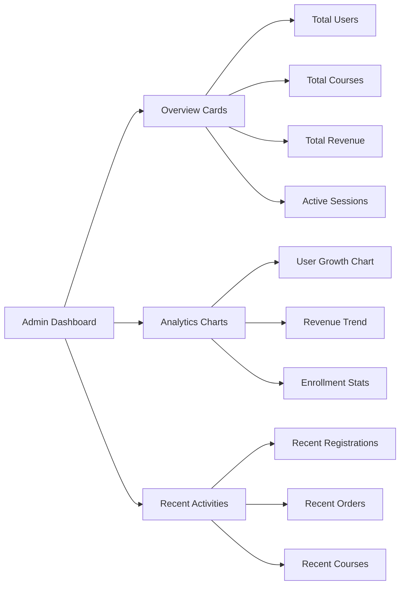

### Course Management Detailed Flow
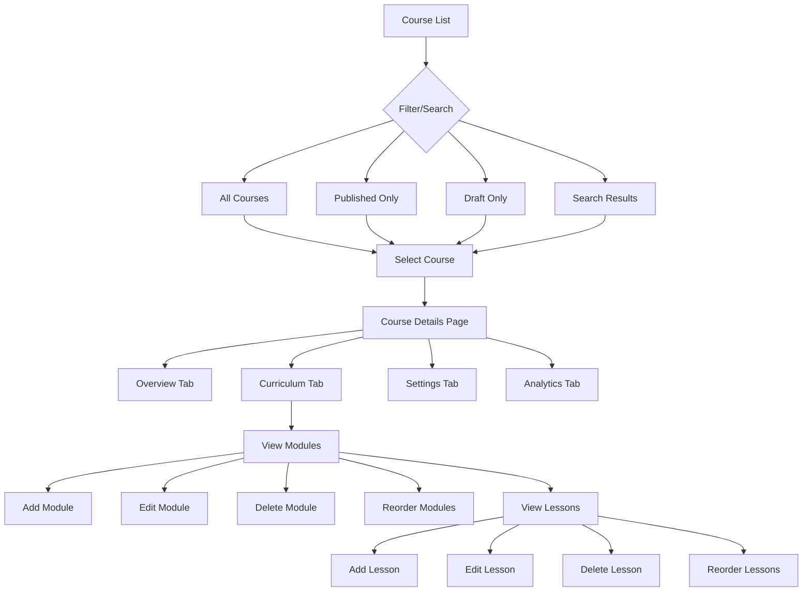

---

## 2. Staff Screen Flow

### Entry Point
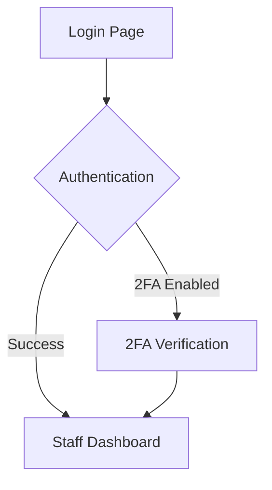

### Main Navigation Flow
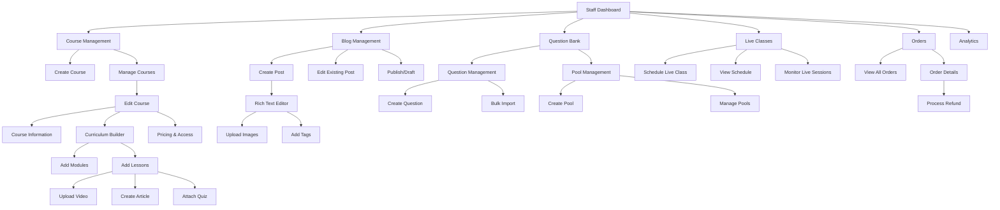

### Content Creation Flow
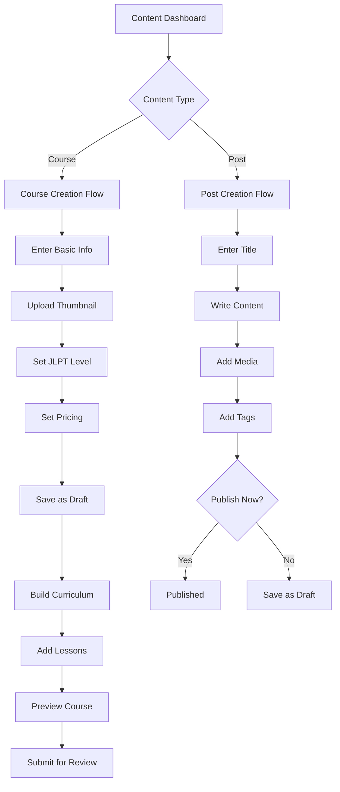

---

## 3. Learner Screen Flow

### Entry Point
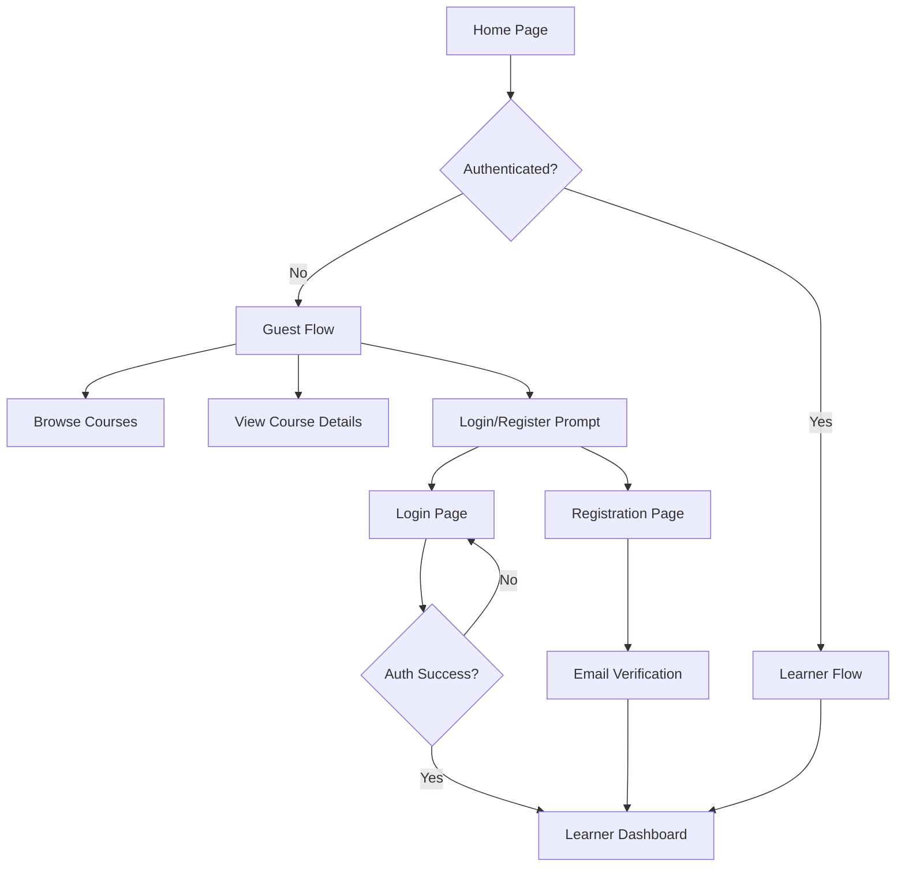

### Main Navigation Flow
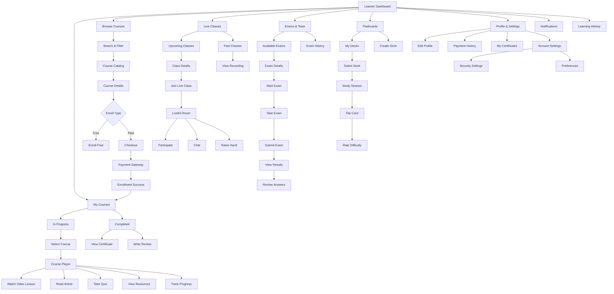

### Course Learning Flow (Detailed)
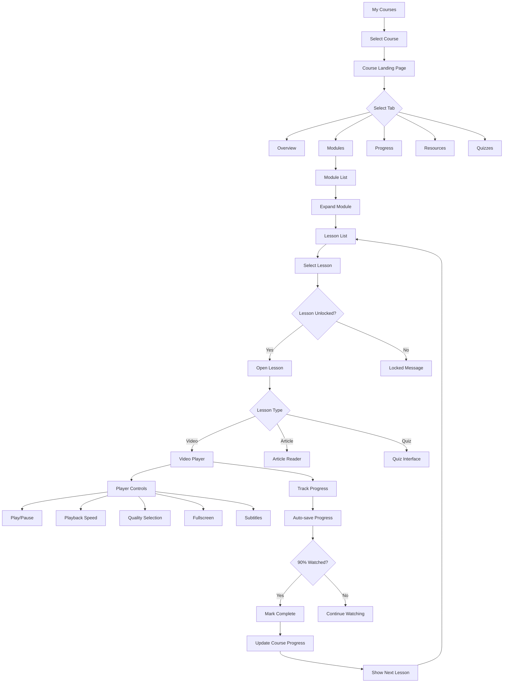

### Checkout & Payment Flow
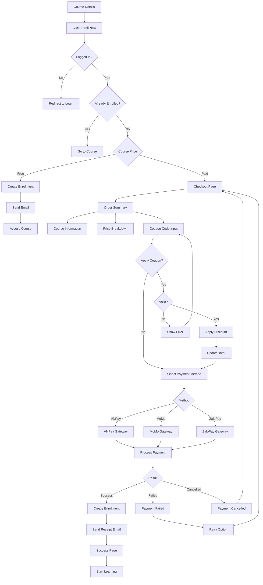

### Quiz Taking Flow
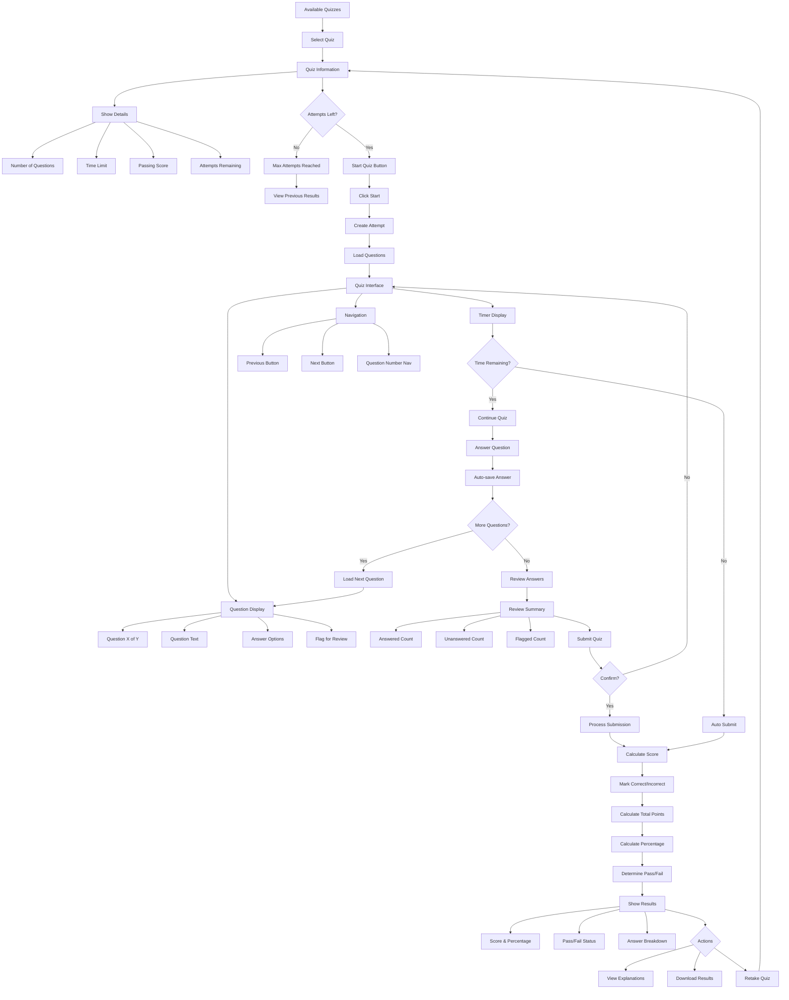

---

## 4. Lecturer Screen Flow

### Entry Point

### Main Navigation Flow
```mermaid
flowchart TD
    Dashboard[Lecturer Dashboard] --> MyCourses[My Courses]
    Dashboard --> LiveClasses[Live Classes]
    Dashboard --> Assignments[Assignments]
    Dashboard --> Students[Students]
    Dashboard --> Materials[Materials]
    Dashboard --> Analytics[Analytics]
    
    %% My Courses Branch
    MyCourses --> AssignedCourses[View Assigned Courses]
    AssignedCourses --> CourseDetails[Course Details]
    CourseDetails --> ViewEnrollments[View Enrollments]
    CourseDetails --> CourseAnalytics[Course Analytics]
    CourseDetails --> ManageContent[Manage Content]
    ManageContent --> EditLessons[Edit Lessons]
    ManageContent --> UploadResources[Upload Resources]
    
    %% Live Classes Branch
    LiveClasses --> Schedule[Schedule New Class]
    LiveClasses --> Upcoming[Upcoming Classes]
    LiveClasses --> Past[Past Classes]
    
    Schedule --> ClassForm[Class Details Form]
    ClassForm --> SetDateTime[Set Date & Time]
    ClassForm --> SetDuration[Set Duration]
    ClassForm --> SelectCourse[Select Course]
    ClassForm --> SetMaxStudents[Set Max Students]
    ClassForm --> CreateClass[Create Class]
    
    Upcoming --> UpcomingDetail[Class Details]
    UpcomingDetail --> StartClass[Start Class]
    StartClass --> LiveRoom[LiveKit Room]
    
    LiveRoom --> HostControls[Host Controls]
    HostControls --> MuteAll[Mute All]
    HostControls --> ShareScreen[Share Screen]
    HostControls --> StartRecording[Start Recording]
    HostControls --> ManageParticipants[Manage Participants]
    HostControls --> EnableChat[Enable/Disable Chat]
    HostControls --> CreatePoll[Create Poll]
    HostControls --> EndClass[End Class]
    
    Past --> PastDetail[Past Class Details]
    PastDetail --> ViewRecording[View Recording]
    PastDetail --> ViewAttendance[View Attendance]
    PastDetail --> ClassStats[Class Statistics]
    
    %% Assignments Branch
    Assignments --> CreateAssignment[Create Assignment]
    Assignments --> ViewSubmissions[View Submissions]
    CreateAssignment --> AssignmentForm[Assignment Form]
    AssignmentForm --> SetDeadline[Set Deadline]
    AssignmentForm --> SetPoints[Set Max Points]
    AssignmentForm --> AttachFiles[Attach Files]
    
    ViewSubmissions --> SubmissionList[Submissions List]
    SubmissionList --> ReviewSubmission[Review Submission]
    ReviewSubmission --> GradeAssignment[Enter Grade]
    ReviewSubmission --> ProvideFeedback[Provide Feedback]
    GradeAssignment --> NotifyStudent[Notify Student]
    
    %% Students Branch
    Students --> StudentList[View Students]
    StudentList --> StudentProfile[Student Profile]
    StudentProfile --> ViewProgress[View Progress]
    StudentProfile --> ViewQuizzes[View Quiz Results]
    StudentProfile --> SendMessage[Send Message]
    
    %% Materials Branch
    Materials --> MaterialsList[My Materials]
    Materials --> UploadNew[Upload New Material]
    MaterialsList --> ShareWithStudents[Share with Students]
    MaterialsList --> OrganizeFolders[Organize in Folders]
    
    %% Analytics Branch
    Analytics --> EngagementMetrics[Engagement Metrics]
    Analytics --> StudentPerformance[Student Performance]
    Analytics --> ClassAttendance[Class Attendance]
    Analytics --> QuizAnalytics[Quiz Analytics]
```

### Live Class Management Flow
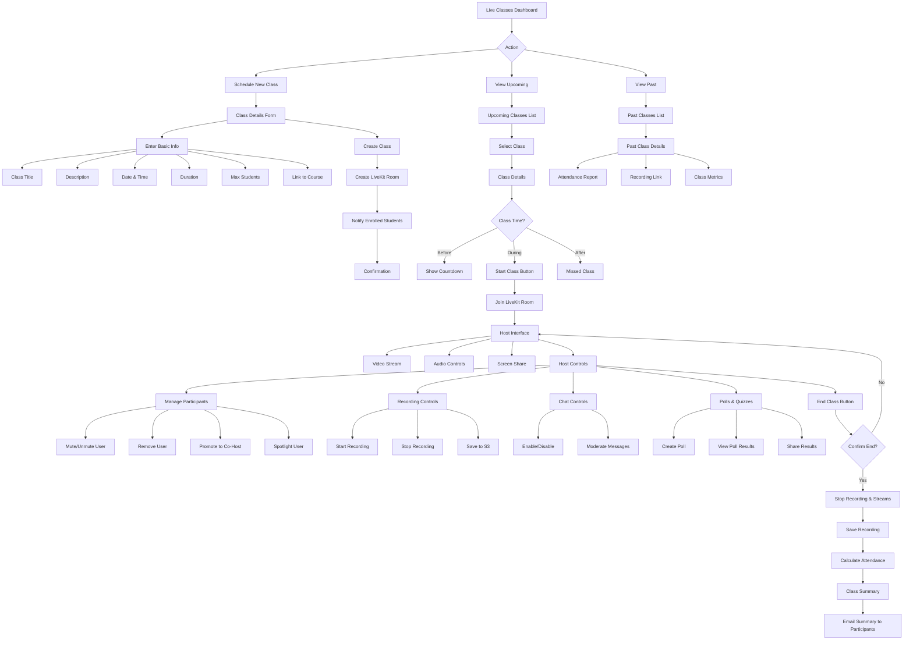

### Assignment Grading Flow
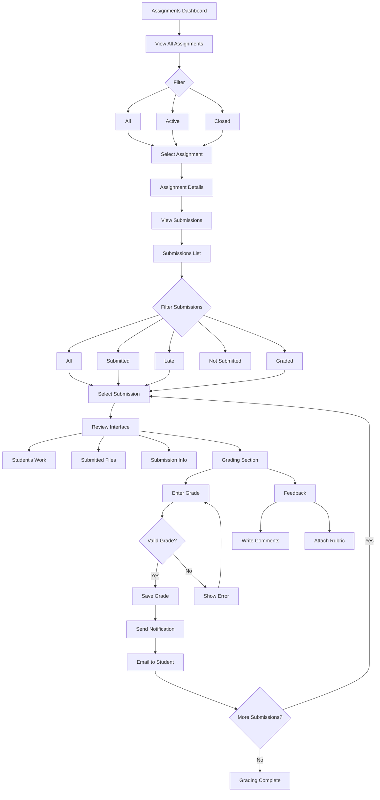

---

## 5. Common Flows (All Roles)

### Authentication Flow
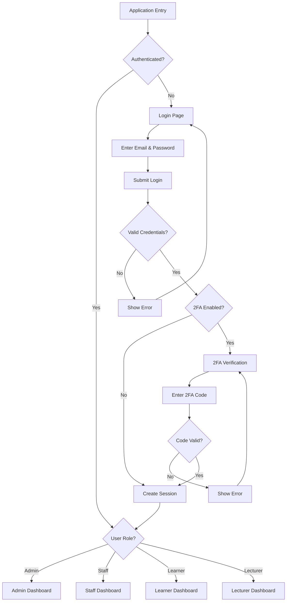

### Profile Management Flow
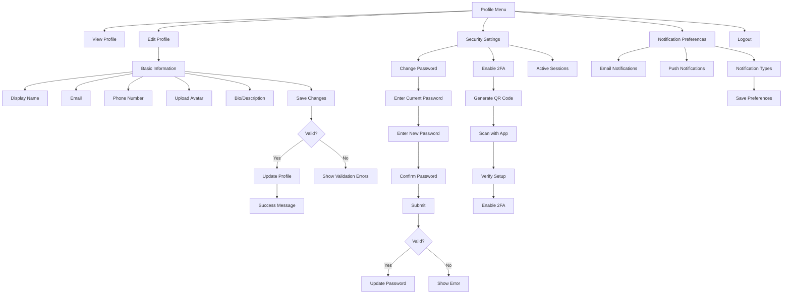

### Notification System
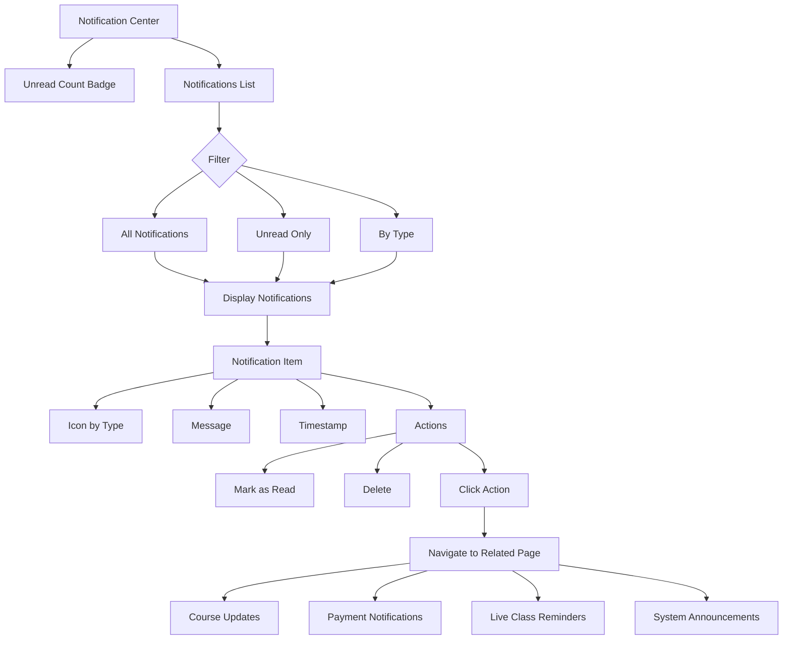

---

## 6. Screen Flow Summary by Role

### Admin Focus Areas
- **Primary Screens**: Dashboard, Users, Courses, Transactions, Question Bank, Analytics
- **Key Actions**: Manage users, approve courses, verify payments, monitor system health
- **Access Level**: Full system access, all CRUD operations
- **Dashboard Type**: System-wide metrics and analytics

### Staff Focus Areas
- **Primary Screens**: Courses, Posts, Question Bank, Live Classes, Orders
- **Key Actions**: Create courses, manage content, handle questions, schedule classes
- **Access Level**: Content management and user support
- **Dashboard Type**: Content and course statistics

### Learner Focus Areas
- **Primary Screens**: My Courses, Browse Courses, Live Classes, Exams, Flashcards
- **Key Actions**: Browse, purchase, learn, take quizzes, join live classes
- **Access Level**: Personal learning progress and content consumption
- **Dashboard Type**: Personal learning progress and recommendations

### Lecturer Focus Areas
- **Primary Screens**: My Courses, Live Classes, Assignments, Students, Analytics
- **Key Actions**: Conduct live classes, grade assignments, track student progress
- **Access Level**: Assigned courses and enrolled students
- **Dashboard Type**: Teaching analytics and student performance

---

## 7. Mobile vs Web Considerations

### Mobile-First Screens (All Roles)
- Login/Register
- Dashboard (simplified layout)
- Course Catalog (touch-optimized)
- My Courses (swipe navigation)
- Live Class Join (mobile-optimized video)
- Notifications

### Web-Optimized Screens
- Admin Dashboard (complex data tables)
- Course Creation/Editing (rich text editor, drag-drop)
- Quiz Builder (complex interface)
- Live Class Host Controls (multiple panels)
- Analytics & Reports (charts, graphs)
- Question Bank Management (bulk operations)

### Responsive Breakpoints
- **Mobile**: < 768px (simplified navigation, stacked layout)
- **Tablet**: 768px - 1024px (sidebar navigation, grid layout)
- **Desktop**: > 1024px (full navigation, multi-column layout)

---

## 8. Key User Journeys

### Journey 1: New Learner Onboarding
1. Visit homepage → Browse courses → View course details
2. Register account → Verify email
3. Return to course → Enroll/Purchase
4. Complete payment → Access course
5. Start first lesson → Track progress
6. Complete course → Download certificate

### Journey 2: Lecturer Teaching a Live Class
1. Login → Navigate to Live Classes
2. Schedule new class → Set details → Create
3. Prepare materials → Upload to Materials
4. Class time → Start class → Join LiveKit room
5. Teach students → Share screen → Interact via chat
6. End class → Save recording → View attendance
7. Review class metrics → Grade participation

### Journey 3: Admin Managing System
1. Login → View dashboard → Check system health
2. Review pending courses → Approve/Reject
3. Monitor live sessions → Check for issues
4. View payment transactions → Verify payments
5. Manage users → Handle support tickets
6. Review analytics → Generate reports
7. Configure system settings

### Journey 4: Staff Creating Content
1. Login → Navigate to Courses
2. Create new course → Add basic info
3. Build curriculum → Add modules and lessons
4. Upload videos → Create articles
5. Create quizzes → Add to lessons
6. Preview course → Submit for approval
7. Course approved → Monitor enrollments

---

## Related Documents

- [Use Case Specifications](srs-06-use-cases.md)
- [User Interface Requirements](srs-04-interfaces.md)
- [System Architecture](srs-03-architecture.md)
- [Admin Use Cases](use-cases/uc-admin.md)
- [Staff Use Cases](use-cases/uc-staff.md)
- [Lecturer Use Cases](use-cases/uc-lecturer.md)
- [Learning & Assessments Use Cases](use-cases/uc-learning-assessments.md)
- [Courses & Enrollment Use Cases](use-cases/uc-courses-enrollment.md)
- [Flashcards & Community Use Cases](use-cases/uc-flashcards-community.md)
- [Live Classes (Learner) Use Cases](use-cases/uc-live-classes-learner.md)

---

**Version History:**
- **v1.0** (2026-01-11): Initial version with basic screen flows
- **v2.0** (2026-01-14): Complete rewrite based on actual codebase implementation
