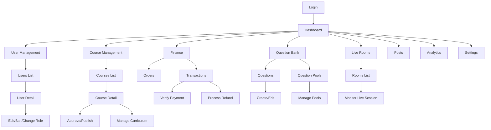
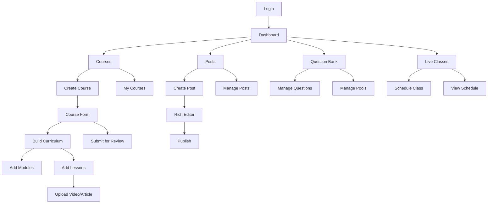
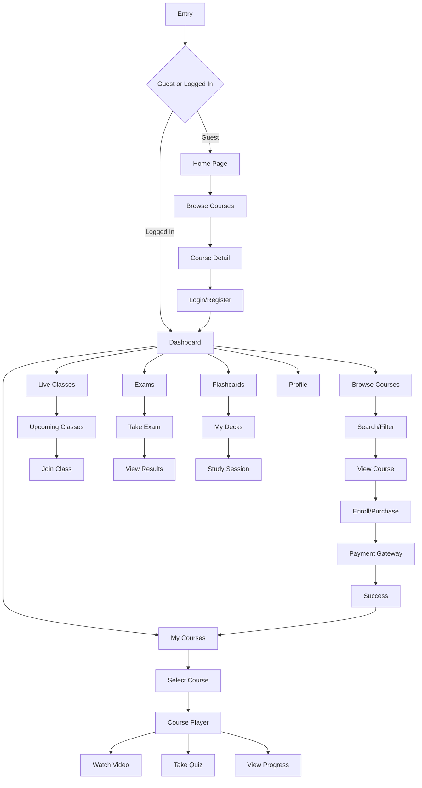
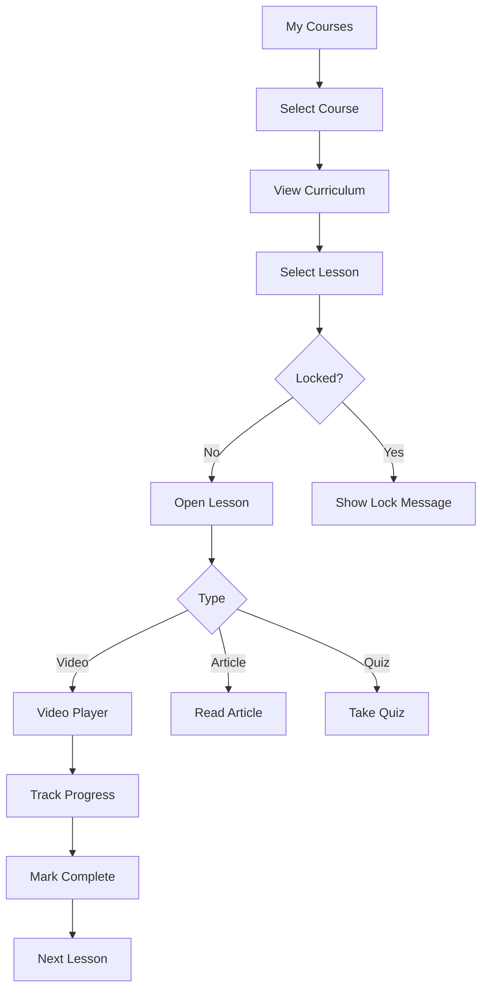
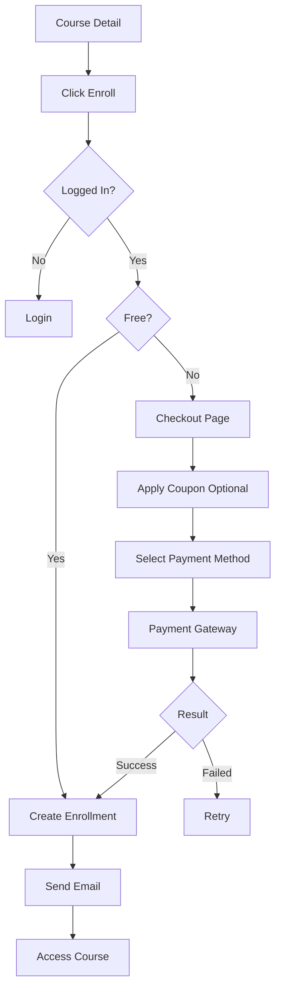
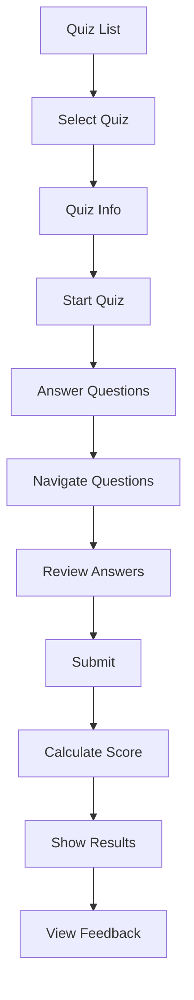
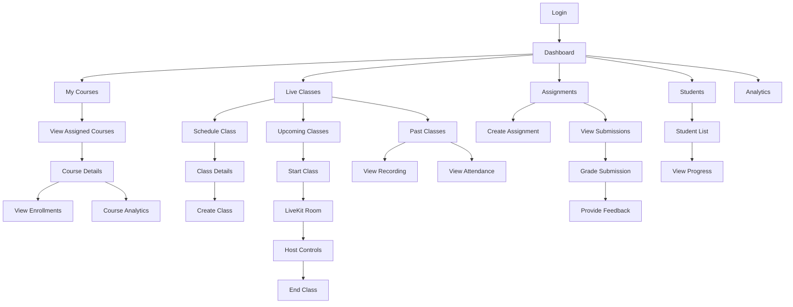
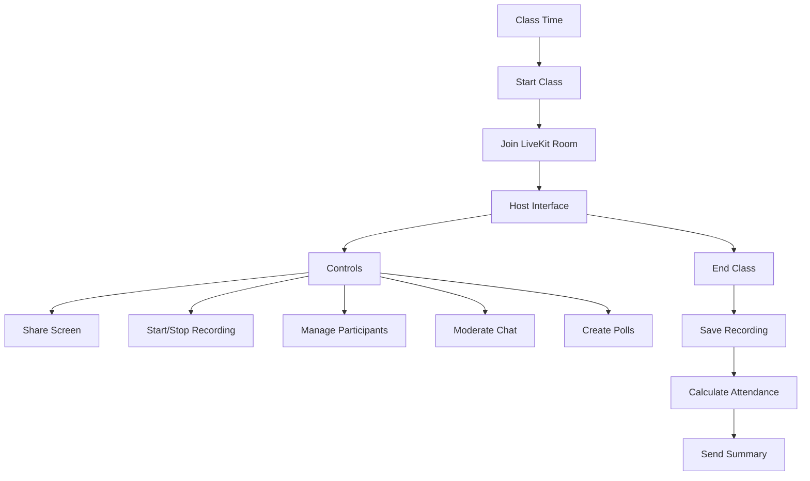
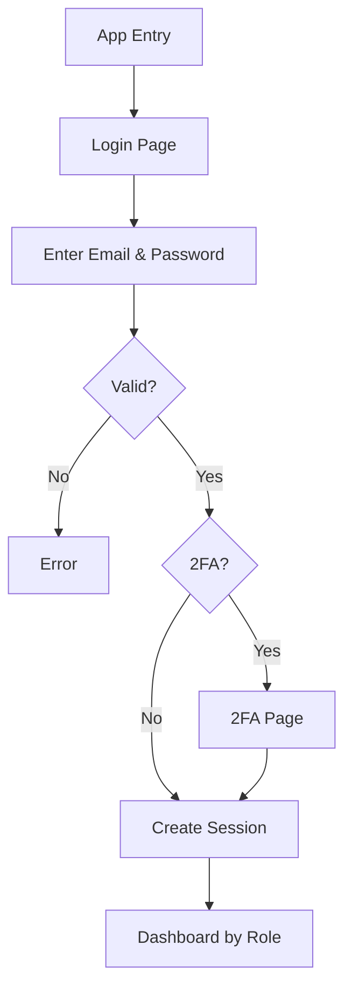

# Screen Flow Overview

**Project:** Torii Nihongo Learning Platform  
**Version:** 1.0  
**Last Updated:** 2026-01-14

---

## Overview

Tài liệu này mô tả các luồng màn hình chính cho từng vai trò người dùng trong hệ thống Torii Nihongo, tập trung vào các chức năng cốt lõi.

---

## 1. Admin Flow

### Main Navigation

### Key Features
- **Dashboard**: System metrics, user stats, revenue overview
- **User Management**: CRUD users, role assignment, ban/activate
- **Course Management**: Approve courses, manage content, publish/unpublish
- **Finance**: View transactions, verify payments, process refunds
- **Question Bank**: Manage questions and pools
- **Live Rooms**: Monitor live sessions
- **Analytics**: System-wide reports

---

## 2. Staff Flow

### Main Navigation

### Key Features
- **Course Management**: Create/edit courses, build curriculum, upload content
- **Post Management**: Create/edit blog posts
- **Question Bank**: Create questions, manage pools
- **Live Classes**: Schedule live sessions

---

## 3. Learner Flow

### Main Navigation

### Course Learning Flow

### Purchase Flow

### Quiz Taking Flow

### Key Features
- **Browse & Search**: Find courses by keyword, JLPT level, price
- **Purchase**: Enroll in free/paid courses, apply coupons, payment gateway
- **Learning**: Watch videos, read articles, take quizzes, track progress
- **Live Classes**: Join live sessions with video/audio
- **Exams**: Take JLPT practice tests, view results
- **Flashcards**: Study with spaced repetition
- **Profile**: Manage profile, view payment history, certificates

---

## 4. Lecturer Flow

### Main Navigation

### Live Class Hosting

### Key Features
- **My Courses**: View assigned courses, enrollments, analytics
- **Live Classes**: Schedule, host, manage live sessions with full controls
- **Assignments**: Create assignments, grade submissions, provide feedback
- **Students**: View student list, progress, quiz results
- **Analytics**: Teaching metrics, student performance

---

## 5. Common Features (All Roles)

### Authentication

### Profile Management
- View/Edit profile information
- Upload avatar
- Change password
- Enable/Disable 2FA
- Manage notification preferences

### Notifications
- Email notifications
- In-app notifications
- Real-time updates
- Notification preferences

---

## 6. Summary by Role

| Role | Primary Focus | Key Screens | Main Actions |
|------|--------------|-------------|--------------|
| **Admin** | System Management | Dashboard, Users, Courses, Finance, Analytics | Manage users, approve content, monitor system, verify payments |
| **Staff** | Content Creation | Courses, Posts, Question Bank, Live Classes | Create courses, write posts, manage questions, schedule classes |
| **Learner** | Learning | Browse, My Courses, Live Classes, Exams, Flashcards | Browse courses, purchase, learn, take quizzes, join live classes |
| **Lecturer** | Teaching | My Courses, Live Classes, Assignments, Students | Conduct classes, grade assignments, track student progress |

---

## 7. Platform Considerations

### Web Application (Desktop)
**Optimized for:**
- Admin Dashboard (data tables, charts)
- Course Creation (rich editor, drag-drop)
- Question Bank Management
- Live Class Hosting (multiple controls)
- Analytics & Reports

### Mobile/Responsive Web
**Optimized for:**
- Course Browsing
- Video Learning
- Live Class Joining (as participant)
- Quiz Taking
- Notifications

### Key Responsive Breakpoints
- **Mobile**: < 768px
- **Tablet**: 768px - 1024px  
- **Desktop**: > 1024px

---

## 8. Key User Journeys

### Journey 1: New Learner
1. Browse courses → View details → Register → Verify email
2. Choose course → Enroll/Purchase → Complete payment
3. Access course → Start learning → Track progress → Complete → Get certificate

### Journey 2: Lecturer Teaching
1. Login → Schedule live class → Prepare materials
2. Start class → Join LiveKit → Teach students → End class
3. Review attendance → Grade participation → View analytics

### Journey 3: Admin Management
1. Login → View dashboard → Check metrics
2. Review pending courses → Approve/Reject
3. Monitor transactions → Verify payments
4. Manage users → Handle issues

### Journey 4: Staff Content Creation
1. Login → Create course → Add info → Build curriculum
2. Upload videos → Create quizzes → Preview
3. Submit for review → Course approved → Monitor enrollments

---

## Related Documents

- [Detailed Screen Flows](screen-flow-by-roles.md) - Chi tiết đầy đủ
- [Use Case Specifications](srs-06-use-cases.md)
- [User Interface Requirements](srs-04-interfaces.md)
- [System Architecture](srs-03-architecture.md)

---

**Note:** Đây là phiên bản tóm gọn. Xem [screen-flow-by-roles.md](screen-flow-by-roles.md) để có chi tiết đầy đủ về từng flow.
