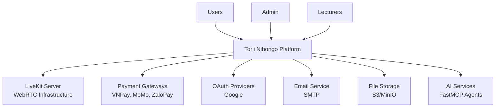

# Software Requirements Specification (SRS)
## Section 2: Overall Description

---

## 2.1 Product Perspective

### 2.1.1 System Context

Torii Nihongo là một hệ thống độc lập (standalone system) với các tích hợp bên ngoài:

### 2.1.2 System Interfaces

#### External Systems
1. **LiveKit Server:** WebRTC infrastructure cho live classes
   - Protocol: WebRTC, HTTP REST API
   - Authentication: JWT tokens via NATS auth callout

2. **Payment Gateways:**
   - VNPay, MoMo, ZaloPay
   - Protocol: HTTP REST API, Webhooks
   - Security: PCI-DSS compliance

3. **OAuth Providers:**
   - Google OAuth 2.0
   - Protocol: OAuth 2.0, OpenID Connect

4. **Email Service:**
   - SMTP server
   - Protocol: SMTP/TLS
   - Purpose: Notifications, password reset, verification

5. **File Storage:**
   - S3-compatible storage (MinIO for dev, AWS S3 for prod)
   - Protocol: S3 API
   - Purpose: Course videos, materials, user uploads

6. **AI Services (FastMCP):**
   - FastMCP protocol
   - Agents: Sensei, Assessment, Analytics

### 2.1.3 User Interfaces
- **Web Admin Dashboard:** React application (Vite)
- **Web Learner Platform:** Next.js application
- **Mobile App:** (Future - Not in current scope)

---

## 2.2 Product Functions

Hệ thống cung cấp các chức năng chính sau:

### 2.2.1 User Management
- Đăng ký, đăng nhập (Email/Password, OAuth)
- Quản lý profile
- Two-factor authentication (2FA)
- Role-based access control (RBAC)
- Session management

### 2.2.2 Course Management
- Tạo, chỉnh sửa, xóa courses (VOD và Live)
- Quản lý modules và lessons
- Upload video, materials
- Course approval workflow
- Course search và filtering

### 2.2.3 Enrollment & Learning
- Course enrollment
- Progress tracking
- Lesson completion tracking
- Course completion certificates
- Gift courses

### 2.2.4 Live Classes (WebRTC)
- Schedule live classes
- Join live sessions
- Interactive whiteboard
- Chat và screen sharing
- Recording support
- Attendance tracking
- Class materials sharing

### 2.2.5 Assessments & Quizzes
- Question bank management
- Create quizzes (practice, JLPT mock)
- Take quizzes với time limit
- Auto-grading
- Detailed results và analytics
- Performance tracking

### 2.2.6 Payments & Financial
- Multiple payment methods
- Coupon system
- User wallet (credits)
- Payment history
- Refund processing

### 2.2.7 Flashcards
- Create flashcard decks
- Spaced Repetition System (SRS)
- Review tracking
- Public/private decks

### 2.2.8 Assignments
- Create assignments
- Submit assignments
- Grade assignments
- Feedback system

### 2.2.9 Gamification
- Points system
- Achievements và badges
- Streak tracking
- Leaderboards

### 2.2.10 Community
- Blog posts
- Comments
- Notifications
- Social features

### 2.2.11 AI Features (FastMCP)
- Grammar assistance (Sensei Agent)
- Translation support
- Test generation (Assessment Agent)
- Progress analytics (Analytics Agent)
- Personalized recommendations

---

## 2.3 User Classes and Characteristics

### 2.3.1 Learners
**Characteristics:**
- Age: 16-60+
- Technical skill: Basic to intermediate
- Primary goal: Learn Japanese, prepare for JLPT
- Usage pattern: Daily to weekly
- Device: Desktop, laptop, mobile

**Responsibilities:**
- Browse and purchase courses
- Watch video lessons
- Join live classes
- Take quizzes and exams
- Study flashcards
- Submit assignments
- Track progress

**Access Level:**
- Read: Own courses, progress, results
- Write: Own profile, flashcards, submissions
- No access: Admin functions, other users' data

### 2.3.2 Lecturers
**Characteristics:**
- Age: 25-60+
- Technical skill: Intermediate
- Primary goal: Teach and manage classes
- Usage pattern: Regular (during teaching periods)
- Device: Desktop, laptop

**Responsibilities:**
- View assigned live classes
- Manage live sessions
- Check attendance
- Create and grade assignments
- Upload teaching materials
- Provide feedback

**Access Level:**
- Read: Assigned courses, enrolled students
- Write: Live classes, assignments, materials
- No access: Payment data, other lecturers' classes

### 2.3.3 Staff
**Characteristics:**
- Age: 22-50+
- Technical skill: Intermediate to advanced
- Primary goal: Manage platform content
- Usage pattern: Daily
- Device: Desktop, laptop

**Responsibilities:**
- Manage courses (create, edit, approve)
- Manage question banks
- Create quizzes and exams
- Manage coupons and promotions
- Monitor live sessions
- Manage blog posts

**Access Level:**
- Read: All courses, users (limited), analytics
- Write: Courses, questions, quizzes, coupons, blogs
- No access: Payment processing, user passwords

### 2.3.4 Admin
**Characteristics:**
- Age: 25-60+
- Technical skill: Advanced
- Primary goal: System administration
- Usage pattern: Daily
- Device: Desktop, laptop

**Responsibilities:**
- Manage all users (activate, deactivate, delete)
- Manage payments và transactions
- View system statistics và analytics
- Manage system settings
- Audit logs review

**Access Level:**
- Full access to all system functions
- Can override permissions
- Access to sensitive data (payments, user data)

---

## 2.4 Operating Environment

### 2.4.1 Development Environment
- **OS:** Windows, macOS, Linux
- **Node.js:** v20+
- **Package Manager:** PNPM
- **Database:** PostgreSQL (Docker)
- **Message Broker:** NATS (Docker)
- **WebRTC:** LiveKit (Docker)
- **Cache:** Redis (Docker)

### 2.4.2 Production Environment
- **Hosting:** Cloud-based (AWS, Azure, or similar)
- **OS:** Linux (Ubuntu 22.04+)
- **Containerization:** Docker, Kubernetes (optional)
- **Database:** PostgreSQL 15+ (managed service)
- **Message Broker:** NATS JetStream
- **WebRTC:** LiveKit Cloud or self-hosted
- **Cache:** Redis 7+ (managed service)
- **File Storage:** S3-compatible storage
- **CDN:** CloudFront or similar

### 2.4.3 Browser Support
**Desktop:**
- Chrome 100+ (Recommended)
- Firefox 100+
- Safari 15+
- Edge 100+

**Mobile:**
- Chrome Mobile (Android)
- Safari Mobile (iOS)
- Samsung Internet

**Not Supported:**
- Internet Explorer
- Older browsers (< 2 years)

### 2.4.4 Mobile Support
- **Web App:** Responsive design, mobile-optimized
- **Native App:** Future enhancement (not in current scope)
- **Features:** All core features accessible on mobile web

### 2.4.5 Network Requirements
- **Minimum:** 3G connection (384 kbps)
- **Recommended:** 4G/WiFi (5+ Mbps)
- **For Live Classes:** Stable connection, 2+ Mbps upload
- **Latency:** < 200ms for optimal experience

---

## 2.5 Design and Implementation Constraints

### 2.5.1 Technology Constraints
- **Backend:** Must use NestJS framework
- **Database:** Must use PostgreSQL (Prisma ORM)
- **Real-time:** Must use LiveKit for WebRTC
- **Message Broker:** Must use NATS
- **Frontend:** React (Admin), Next.js (Learner)
- **Language:** TypeScript for all code

### 2.5.2 Regulatory Constraints
- **Data Protection:** Comply with Vietnamese data protection laws
- **Payment Security:** PCI-DSS compliance for payment processing
- **Accessibility:** WCAG 2.1 Level AA compliance (target)
- **Content:** No illegal or inappropriate content

### 2.5.3 Standards Compliance
- **API:** RESTful API design principles
- **Security:** OWASP Top 10 security practices
- **Code Quality:** ESLint, Prettier standards
- **Documentation:** OpenAPI/Swagger for API docs

### 2.5.4 Hardware Constraints
- **Server:** Minimum 4 CPU cores, 8GB RAM per service
- **Database:** Minimum 16GB RAM, SSD storage
- **Client:** Modern device with browser support

### 2.5.5 Time Constraints
- **Development Phase:** 6-12 months
- **MVP Release:** 3-4 months
- **Full Release:** 6-12 months

---

## 2.6 Assumptions and Dependencies

### 2.6.1 Assumptions
1. Users have stable internet connection
2. Users have modern browsers installed
3. Users understand basic web navigation
4. Payment gateways are available and reliable
5. LiveKit infrastructure is stable
6. AI services (FastMCP) are available
7. Email service is configured and working
8. File storage service is available

### 2.6.2 Dependencies
1. **External Services:**
   - LiveKit Server (WebRTC)
   - Payment Gateways (VNPay, MoMo, ZaloPay)
   - OAuth Providers (Google)
   - Email Service (SMTP)
   - File Storage (S3-compatible)

2. **Infrastructure:**
   - PostgreSQL database
   - NATS message broker
   - Redis cache
   - CDN for static assets

3. **Third-party Libraries:**
   - NestJS framework
   - Prisma ORM
   - React/Next.js
   - LiveKit SDK
   - FastMCP SDK

4. **Development Tools:**
   - Node.js v20+
   - PNPM package manager
   - Docker & Docker Compose
   - Git version control

### 2.6.3 Risks and Mitigations
| Risk | Impact | Mitigation |
|------|-------|------------|
| Payment gateway downtime | High | Multiple gateway support, fallback options |
| LiveKit service outage | High | Service monitoring, backup infrastructure |
| Database performance issues | Medium | Proper indexing, query optimization, caching |
| High concurrent users | Medium | Horizontal scaling, load balancing |
| AI service unavailability | Low | Graceful degradation, fallback to manual processes |

---

**Next Section:** [Section 3: System Architecture](srs-03-architecture.md)

