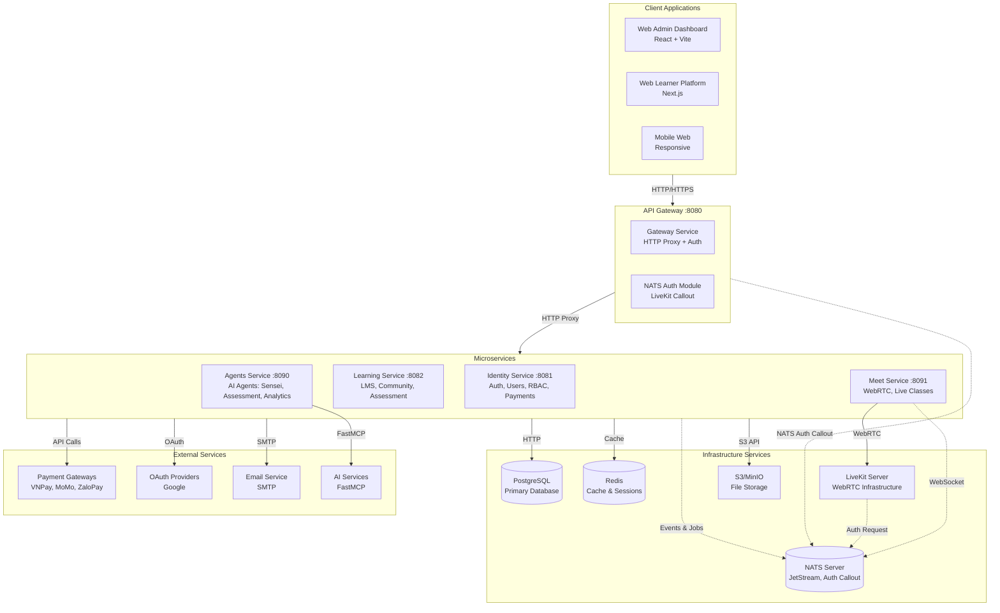
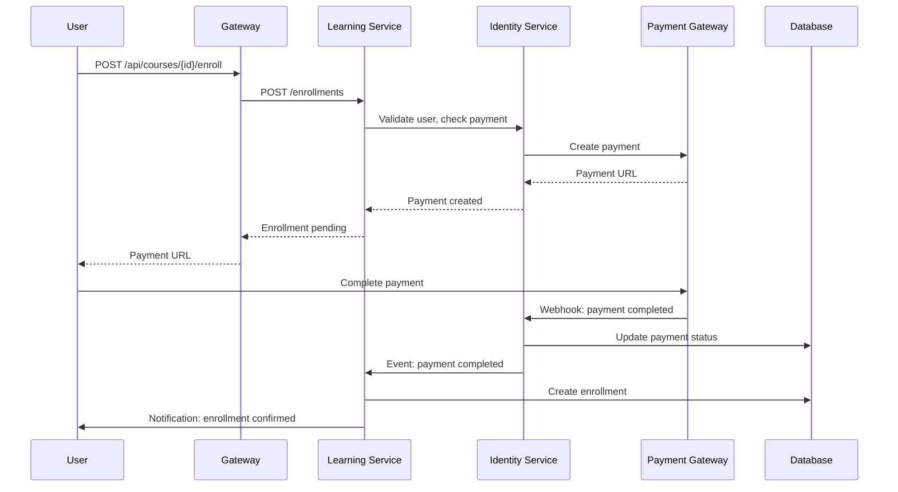
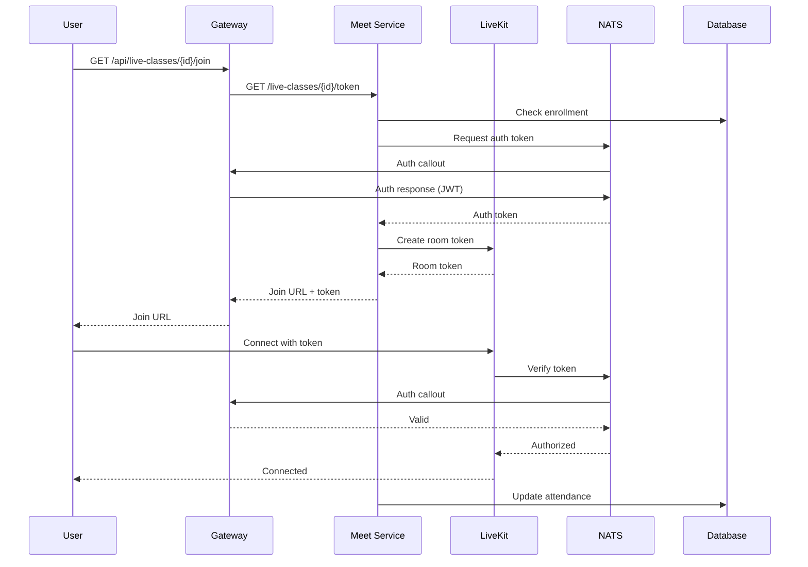
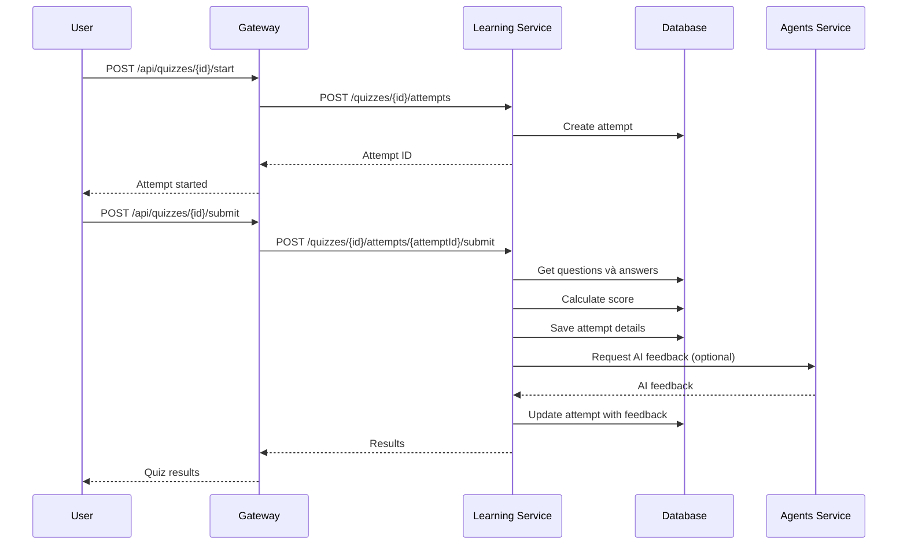

# Software Requirements Specification (SRS)
## Section 3: System Architecture

---

## 3.1 Architecture Overview

Torii Nihongo sử dụng **Microservices Architecture** với pattern **HTTP Proxy + NATS Hybrid** để đảm bảo scalability, maintainability, và real-time capabilities.

### 3.1.1 Architecture Diagram



### 3.1.2 Architecture Principles

1. **Separation of Concerns:** Mỗi service quản lý một bounded context riêng
2. **API Gateway Pattern:** Single entry point cho tất cả clients
3. **Event-Driven:** NATS cho real-time events và async jobs
4. **Database per Service:** Shared database với Prisma (consolidated model)
5. **Stateless Services:** Services không lưu state, sử dụng database và cache
6. **Horizontal Scaling:** Services có thể scale độc lập

---

## 3.2 Service Descriptions

### 3.2.1 Gateway Service (Port 8080)

**Purpose:** Single entry point cho tất cả client requests

**Responsibilities:**
- HTTP request routing và proxy
- Authentication và authorization
- Rate limiting
- Request logging
- CORS handling
- NATS auth callout cho LiveKit

**Technology:**
- NestJS
- HTTP Proxy middleware
- JWT validation
- NATS client

**Endpoints:**
- `/api/*` - Proxy to microservices
- `/health` - Health check

**Communication:**
- HTTP: Client → Gateway → Microservices
- NATS: Gateway ↔ NATS (auth callout)

---

### 3.2.2 Identity Service (Port 8081)

**Purpose:** Core authentication và user management

**Responsibilities:**
- User registration và login
- JWT token generation và validation
- OAuth integration (Google)
- Two-factor authentication (2FA)
- User profile management
- RBAC (Role-Based Access Control)
- Audit logging
- Payment processing
- Coupon management
- User wallet management

**Modules:**
- **Auth Module:** Registration, login, JWT, OAuth
- **Users Module:** User CRUD, profile management
- **RBAC Module:** Roles và permissions
- **2FA Module:** TOTP-based 2FA
- **Payments Module:** Payment processing, transactions
- **Coupons Module:** Coupon management
- **Wallets Module:** User wallet và credits

**Database Tables:**
- users, user_identities, sessions, two_factor_auth
- role_permissions, audit_logs
- payments, coupons, user_wallets, wallet_transactions

**API Endpoints:**
- `/auth/*` - Authentication endpoints
- `/users/*` - User management
- `/payments/*` - Payment endpoints
- `/coupons/*` - Coupon endpoints

---

### 3.2.3 Learning Service (Port 8082)

**Purpose:** Unified learning platform

**Responsibilities:**
- Course management (VOD và Live)
- Module và lesson management
- Enrollment management
- Progress tracking
- Quiz và question bank management
- Flashcard management
- Blog và community
- Notifications
- Gamification (points, achievements)

**Modules:**
- **LMS Module:** Courses, modules, lessons, enrollments
- **Assessment Module:** Question banks, quizzes, attempts
- **Flashcard Module:** Decks, cards, SRS algorithm
- **Community Module:** Blog posts, comments
- **Notification Module:** User notifications
- **Gamification Module:** Points, achievements, badges

**Database Tables:**
- courses, modules, lessons, enrollments, lesson_progress
- question_bank, quizzes, quiz_questions, quiz_attempts, quiz_attempt_details
- flashcard_decks, flashcards, flashcard_reviews
- blog_posts, blog_comments, notifications
- wishlist, reviews
- achievements, user_achievements, user_points

**API Endpoints:**
- `/courses/*` - Course management
- `/enrollments/*` - Enrollment endpoints
- `/quizzes/*` - Quiz endpoints
- `/flashcards/*` - Flashcard endpoints
- `/blog/*` - Blog endpoints
- `/notifications/*` - Notification endpoints

---

### 3.2.4 Agents Service (Port 8090)

**Purpose:** AI-powered learning support

**Responsibilities:**
- Sensei Agent: Grammar assistance, translation
- Assessment Agent: Test generation và evaluation
- Analytics Agent: Progress tracking và recommendations
- FastMCP protocol integration

**Modules:**
- **Sensei Module:** Grammar, translation, flashcards support
- **Assessment Module:** AI-powered test generation
- **Analytics Module:** Learning analytics và recommendations

**Communication:**
- HTTP: REST API cho client requests
- FastMCP: Communication với AI models
- NATS: Events và async processing

**API Endpoints:**
- `/agents/sensei/*` - Sensei agent endpoints
- `/agents/assessment/*` - Assessment agent endpoints
- `/agents/analytics/*` - Analytics agent endpoints

---

### 3.2.5 Meet Service (Port 8091)

**Purpose:** Live class engine với WebRTC

**Responsibilities:**
- Live class scheduling
- LiveKit room management
- Live class enrollments
- Attendance tracking
- Class materials management
- Assignment management
- Real-time WebSocket communication

**Modules:**
- **LiveClass Module:** Live class CRUD, scheduling
- **Room Module:** LiveKit room management
- **Enrollment Module:** Live class enrollments
- **Material Module:** Class materials
- **Assignment Module:** Assignments và submissions
- **WebSocket Module:** Real-time communication via NATS

**Database Tables:**
- live_classes, live_class_enrollments
- class_materials, assignments, submissions
- room_info, room_files, room_analytics, room_artifacts

**Communication:**
- HTTP: REST API
- NATS: WebSocket events, auth callout
- LiveKit: WebRTC infrastructure

**API Endpoints:**
- `/live-classes/*` - Live class management
- `/rooms/*` - Room management
- `/assignments/*` - Assignment endpoints
- `/materials/*` - Material endpoints

---

## 3.3 Technology Stack

### 3.3.1 Backend

| Technology | Version | Purpose |
|------------|---------|---------|
| Node.js | v20+ | Runtime environment |
| TypeScript | 5.0+ | Programming language |
| NestJS | 10.0+ | Framework |
| Prisma | 5.0+ | ORM |
| PostgreSQL | 15+ | Primary database |
| NATS | 2.10+ | Message broker |
| Redis | 7+ | Cache và sessions |
| LiveKit | Latest | WebRTC infrastructure |

### 3.3.2 Frontend

| Technology | Version | Purpose |
|------------|---------|---------|
| React | 18+ | Admin dashboard UI |
| Next.js | 14+ | Learner platform (SSR) |
| TypeScript | 5.0+ | Type safety |
| Vite | 5+ | Build tool (Admin) |
| Tailwind CSS | 3+ | Styling |
| shadcn/ui | Latest | UI components |

### 3.3.3 Infrastructure

| Technology | Purpose |
|------------|---------|
| Docker | Containerization |
| Docker Compose | Local development |
| PostgreSQL | Database |
| NATS JetStream | Message broker |
| Redis | Cache |
| LiveKit | WebRTC |
| S3/MinIO | File storage |

### 3.3.4 Development Tools

| Tool | Purpose |
|------|---------|
| PNPM | Package manager |
| TurboRepo | Monorepo management |
| ESLint | Code linting |
| Prettier | Code formatting |
| Git | Version control |

---

## 3.4 Data Flow Diagrams

### 3.4.1 Course Purchase Flow



### 3.4.2 Live Class Join Flow



### 3.4.3 Quiz Submission Flow



---

## 3.5 Deployment Architecture

### 3.5.1 Development Environment

```
┌─────────────────────────────────────┐
│  Docker Compose (Local)             │
│  ┌──────────┐  ┌──────────┐       │
│  │PostgreSQL│  │  NATS    │       │
│  └──────────┘  └──────────┘       │
│  ┌──────────┐  ┌──────────┐       │
│  │  Redis   │  │ LiveKit  │       │
│  └──────────┘  └──────────┘       │
└─────────────────────────────────────┘
         ↑
         │ Local Network
         │
┌─────────────────────────────────────┐
│  Development Machine                │
│  ┌──────────┐  ┌──────────┐       │
│  │ Gateway  │  │ Identity │       │
│  └──────────┘  └──────────┘       │
│  ┌──────────┐  ┌──────────┐       │
│  │ Learning │  │  Agents  │       │
│  └──────────┘  └──────────┘       │
│  ┌──────────┐                      │
│  │  Meet   │                      │
│  └──────────┘                      │
└─────────────────────────────────────┘
```

### 3.5.2 Production Environment

```
┌─────────────────────────────────────────────┐
│  Load Balancer (NGINX/ALB)                  │
└─────────────────────────────────────────────┘
         │
    ┌────┴────┐
    │        │
┌───▼───┐ ┌──▼───┐
│Gateway│ │Gateway│ (Multiple instances)
└───┬───┘ └───┬───┘
    │         │
┌───▼─────────▼──────────────────────────────┐
│  Microservices (Kubernetes/Docker Swarm)    │
│  ┌──────────┐  ┌──────────┐  ┌──────────┐  │
│  │ Identity │  │ Learning │  │  Agents │  │
│  └──────────┘  └──────────┘  └──────────┘  │
│  ┌──────────┐                              │
│  │  Meet   │                              │
│  └──────────┘                              │
└─────────────────────────────────────────────┘
         │
┌─────────▼───────────────────────────────────┐
│  Infrastructure Services                    │
│  ┌──────────┐  ┌──────────┐  ┌──────────┐ │
│  │PostgreSQL│  │  NATS    │  │  Redis   │ │
│  │(Managed) │  │(Cluster) │  │(Cluster) │ │
│  └──────────┘  └──────────┘  └──────────┘ │
│  ┌──────────┐  ┌──────────┐              │
│  │ LiveKit │  │   S3     │              │
│  │(Cloud)  │  │(Storage) │              │
│  └──────────┘  └──────────┘              │
└───────────────────────────────────────────┘
```

### 3.5.3 Scaling Strategy

1. **Horizontal Scaling:**
   - Gateway: Multiple instances behind load balancer
   - Services: Scale independently based on load
   - Database: Read replicas for read-heavy operations

2. **Vertical Scaling:**
   - Database: Increase resources for heavy queries
   - Services: Increase CPU/RAM for compute-intensive tasks

3. **Caching Strategy:**
   - Redis for frequently accessed data
   - CDN for static assets
   - Application-level caching

4. **Database Optimization:**
   - Proper indexing
   - Query optimization
   - Connection pooling
   - Read replicas

---

**Next Section:** [Section 4: External Interface Requirements](srs-04-interfaces.md)


