# Software Requirements Specification (SRS)
## Section 7: System Models - Use Cases

---

## 7.1 Use Case Diagram

```mermaid
graph TB
    subgraph Actors
        Learner[Learner]
        Lecturer[Lecturer]
        Staff[Staff]
        Admin[Admin]
    end
    
    subgraph Course Management
        UC1[Browse Courses]
        UC2[Purchase Course]
        UC3[Access Course Content]
        UC4[Manage Courses]
    end
    
    subgraph Live Classes
        UC5[Schedule Live Class]
        UC6[Join Live Class]
        UC7[Manage Live Session]
        UC8[Upload Materials]
    end
    
    subgraph Assessments
        UC9[Take Quiz]
        UC10[View Results]
        UC11[Create Quiz]
        UC12[Manage Question Bank]
    end
    
    subgraph Payments
        UC13[Process Payment]
        UC14[Apply Coupon]
        UC15[View Payment History]
        UC16[Manage Payments]
    end
    
    subgraph User Management
        UC17[Register/Login]
        UC18[Manage Profile]
        UC19[Manage Users]
        UC20[RBAC Management]
    end
    
    Learner --> UC1
    Learner --> UC2
    Learner --> UC3
    Learner --> UC6
    Learner --> UC9
    Learner --> UC10
    Learner --> UC13
    Learner --> UC14
    Learner --> UC15
    Learner --> UC17
    Learner --> UC18
    
    Lecturer --> UC5
    Lecturer --> UC7
    Lecturer --> UC8
    
    Staff --> UC4
    Staff --> UC11
    Staff --> UC12
    
    Admin --> UC16
    Admin --> UC19
    Admin --> UC20
```

---

## 7.2 Detailed Use Cases

### UC-01: Browse Courses

**Actor:** Learner

**Preconditions:** User is logged in

**Main Flow:**
1. Learner navigates to course catalog
2. System displays list of available courses
3. Learner can filter by:
   - JLPT level (N5-N1)
   - Course type (VOD, Live)
   - Price range
   - Rating
4. Learner can search by title, tags
5. Learner clicks on a course
6. System displays course details:
   - Description, modules, lessons
   - Instructor information
   - Price, reviews
   - Preview video
7. Learner can add course to wishlist

**Alternative Flows:**
- 3a. No courses match filters → Display "No courses found"
- 5a. Learner clicks "Enroll" → Go to UC-02

**Postconditions:** Course details displayed

---

### UC-02: Purchase Course

**Actor:** Learner

**Preconditions:** User is logged in, viewing course details

**Main Flow:**
1. Learner clicks "Enroll" or "Purchase"
2. System checks if course is free
   - If free: Go to step 6
3. System displays payment page with:
   - Course price
   - Discount (if any)
   - Final price
4. Learner can apply coupon code
5. Learner selects payment method
6. System processes payment:
   - If payment gateway: Redirect to gateway
   - If wallet: Deduct from wallet
7. Payment gateway processes payment
8. System receives payment webhook
9. System creates enrollment
10. System sends confirmation email
11. System redirects to course page

**Alternative Flows:**
- 4a. Invalid coupon → Display error, continue without coupon
- 7a. Payment failed → Display error, allow retry
- 9a. User already enrolled → Display message, redirect to course

**Postconditions:** Course enrolled, payment recorded

---

### UC-03: Access Course Content

**Actor:** Learner

**Preconditions:** User is enrolled in course

**Main Flow:**
1. Learner navigates to "My Courses"
2. System displays enrolled courses
3. Learner clicks on a course
4. System displays course modules and lessons
5. Learner clicks on a lesson
6. System loads lesson content:
   - Video player (if video lesson)
   - Article content (if article lesson)
7. System tracks progress:
   - Updates watched_duration
   - Updates last_watched_at
8. Learner completes lesson
9. System marks lesson as completed
10. System updates course progress percentage

**Alternative Flows:**
- 5a. Lesson is locked → Display "Complete previous lessons"
- 7a. Learner pauses video → Save progress, resume later

**Postconditions:** Lesson progress updated

---

### UC-05: Schedule Live Class

**Actor:** Lecturer

**Preconditions:** User is logged in as lecturer

**Main Flow:**
1. Lecturer navigates to "Live Classes"
2. Lecturer clicks "Create Live Class"
3. System displays form:
   - Title, description
   - Start time, duration
   - Maximum students
   - Related course (optional)
4. Lecturer fills in details
5. Lecturer submits form
6. System validates:
   - Start time in future
   - Duration > 0
   - Max students > 0
7. System creates live class
8. System generates meeting_id (LiveKit room)
9. System sends notification to enrolled students (if course-related)
10. System displays success message

**Alternative Flows:**
- 6a. Validation fails → Display errors, allow correction
- 8a. LiveKit error → Display error, allow retry

**Postconditions:** Live class created and scheduled

---

### UC-06: Join Live Class

**Actor:** Learner

**Preconditions:** User is enrolled in live class

**Main Flow:**
1. Learner navigates to "Live Classes"
2. System displays upcoming live classes
3. Learner clicks on a live class
4. System checks:
   - Enrollment status
   - Class start time
5. If class started: Display "Join" button
6. Learner clicks "Join"
7. System requests auth token from LiveKit via NATS
8. System generates room access token
9. System redirects to LiveKit room
10. Learner connects to WebRTC room
11. System updates attendance:
    - Sets joined_at timestamp
    - Sets attendance_status = 'attended'
12. Learner participates in class
13. System tracks participation duration

**Alternative Flows:**
- 4a. Class not started → Display countdown
- 4b. Class ended → Display "Class ended"
- 7a. Auth failed → Display error, retry
- 10a. Connection failed → Display error, retry

**Postconditions:** Learner joined live class, attendance recorded

---

### UC-09: Take Quiz

**Actor:** Learner

**Preconditions:** User is logged in, quiz is available

**Main Flow:**
1. Learner navigates to "Quizzes"
2. System displays available quizzes
3. Learner clicks on a quiz
4. System displays quiz details:
   - Title, description
   - Time limit
   - Number of questions
   - Previous attempts (if any)
5. Learner clicks "Start Quiz"
6. System checks max attempts
7. System creates quiz attempt
8. System displays first question
9. Learner answers questions
10. System tracks:
    - Time remaining
    - Answers
    - Flagged questions
11. Learner submits quiz
12. System calculates score:
    - Compares answers with correct answers
    - Calculates points
    - Determines pass/fail
13. System saves attempt details
14. System displays results:
    - Score, percentage
    - Pass/fail status
    - Correct/incorrect answers
    - Explanations (if enabled)

**Alternative Flows:**
- 6a. Max attempts reached → Display error
- 9a. Time expired → Auto-submit quiz
- 11a. Learner abandons → Save as "abandoned"

**Postconditions:** Quiz attempt saved, results displayed

---

### UC-13: Process Payment

**Actor:** Learner, System

**Preconditions:** User is logged in, payment required

**Main Flow:**
1. System initiates payment (from UC-02)
2. System creates payment record (status: 'pending')
3. System redirects to payment gateway
4. Payment gateway processes payment
5. Payment gateway sends webhook to system
6. System verifies webhook signature
7. System updates payment status:
   - If success: status = 'completed'
   - If failure: status = 'failed'
8. System processes enrollment (if payment successful)
9. System sends confirmation email
10. System redirects user to course page

**Alternative Flows:**
- 6a. Invalid signature → Log error, mark as suspicious
- 7a. Payment failed → Display error, allow retry
- 8a. Enrollment already exists → Skip enrollment creation

**Postconditions:** Payment processed, enrollment created (if successful)

---

### UC-17: Register/Login

**Actor:** Learner, Lecturer, Staff, Admin

**Preconditions:** None

**Main Flow (Registration):**
1. User navigates to registration page
2. User fills in:
   - Email
   - Password
   - Display name
3. User submits form
4. System validates:
   - Email format
   - Password strength
   - Email uniqueness
5. System creates user account
6. System sends verification email
7. System displays "Check your email" message

**Main Flow (Login):**
1. User navigates to login page
2. User enters email and password
3. User submits form
4. System validates credentials
5. System checks 2FA (if enabled)
6. System generates JWT tokens
7. System creates session
8. System redirects to dashboard

**Alternative Flows:**
- 4a. Email exists → Display error
- 4b. Weak password → Display requirements
- 5a. Invalid credentials → Display error
- 5b. Account not verified → Display "Verify email" message
- 5c. Account banned → Display ban message

**Postconditions:** User registered/logged in

---

### UC-19: Manage Users

**Actor:** Admin

**Preconditions:** User is logged in as admin

**Main Flow:**
1. Admin navigates to "Users Management"
2. System displays user list with:
   - Email, name, role
   - Status (active, banned, deleted)
   - Last login
3. Admin can:
   - Search users
   - Filter by role, status
   - Sort by various fields
4. Admin clicks on a user
5. System displays user details
6. Admin can:
   - Activate/deactivate user
   - Change role
   - Reset password
   - View audit logs
7. Admin makes changes
8. System updates user
9. System logs action in audit log
10. System displays success message

**Alternative Flows:**
- 7a. Invalid changes → Display validation errors
- 8a. Database error → Display error, rollback

**Postconditions:** User updated, audit log created

---

## 7.3 Use Case Priority

| Use Case | Priority | Description |
|----------|----------|-------------|
| UC-17 | P0 | Critical - User registration/login |
| UC-02 | P0 | Critical - Course purchase |
| UC-03 | P0 | Critical - Access course content |
| UC-06 | P0 | Critical - Join live class |
| UC-09 | P1 | High - Take quiz |
| UC-01 | P1 | High - Browse courses |
| UC-05 | P1 | High - Schedule live class |
| UC-13 | P1 | High - Process payment |
| UC-19 | P2 | Medium - Manage users |
| UC-04 | P2 | Medium - Manage courses |
| UC-11 | P2 | Medium - Create quiz |
| Others | P3 | Low - Nice to have |

**Priority Levels:**
- **P0:** Must have for MVP
- **P1:** High priority, needed soon
- **P2:** Medium priority
- **P3:** Low priority, future enhancement

---

**Next Section:** [Section 8: API Specifications](srs-07-api-specifications.md)

