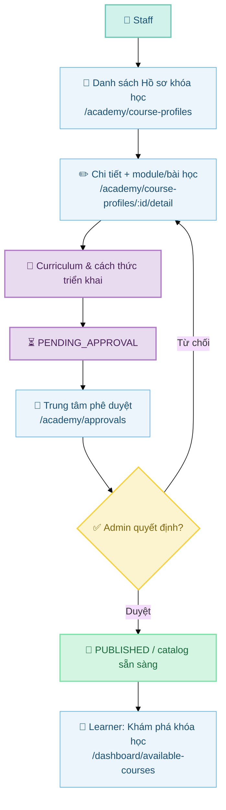
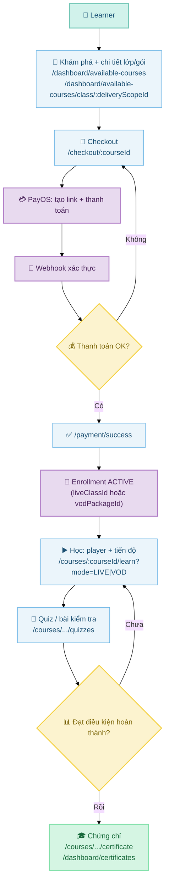
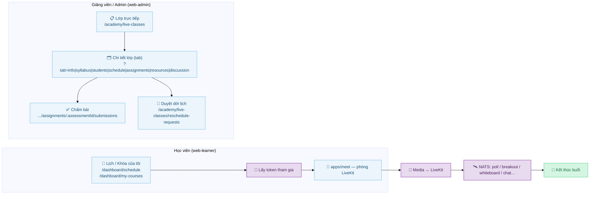
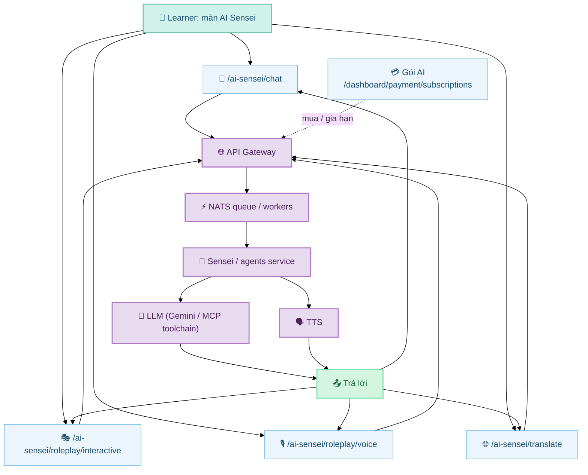
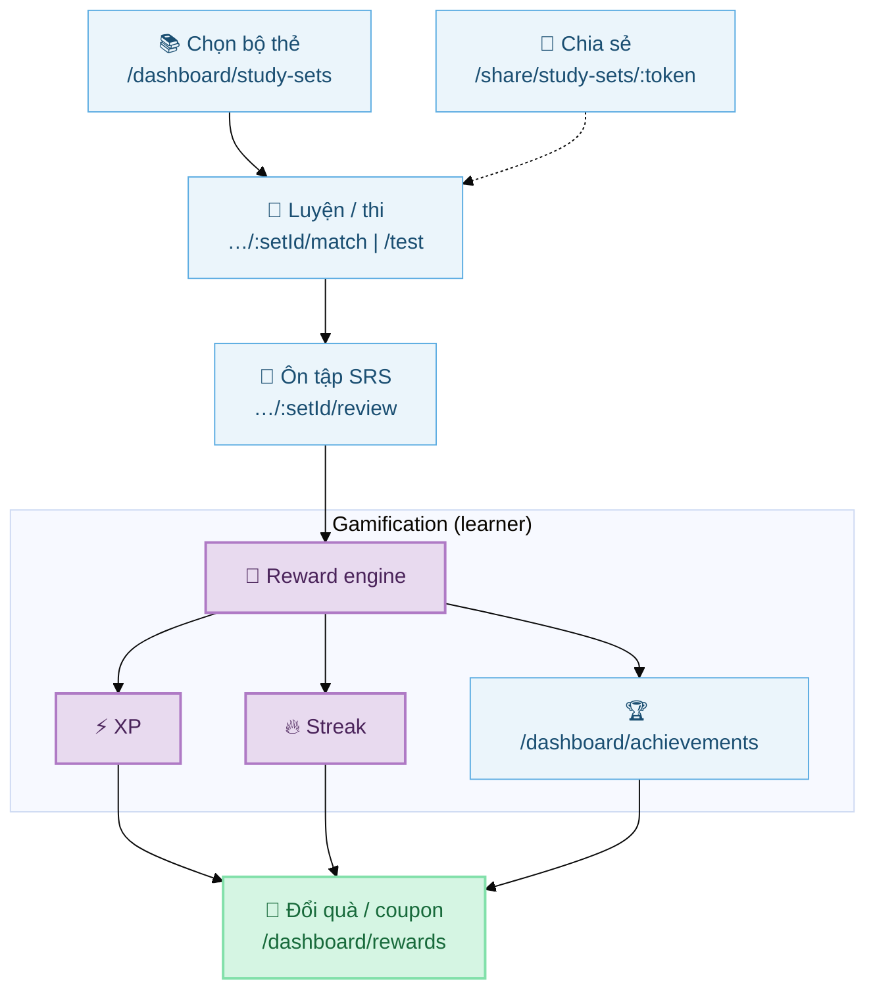
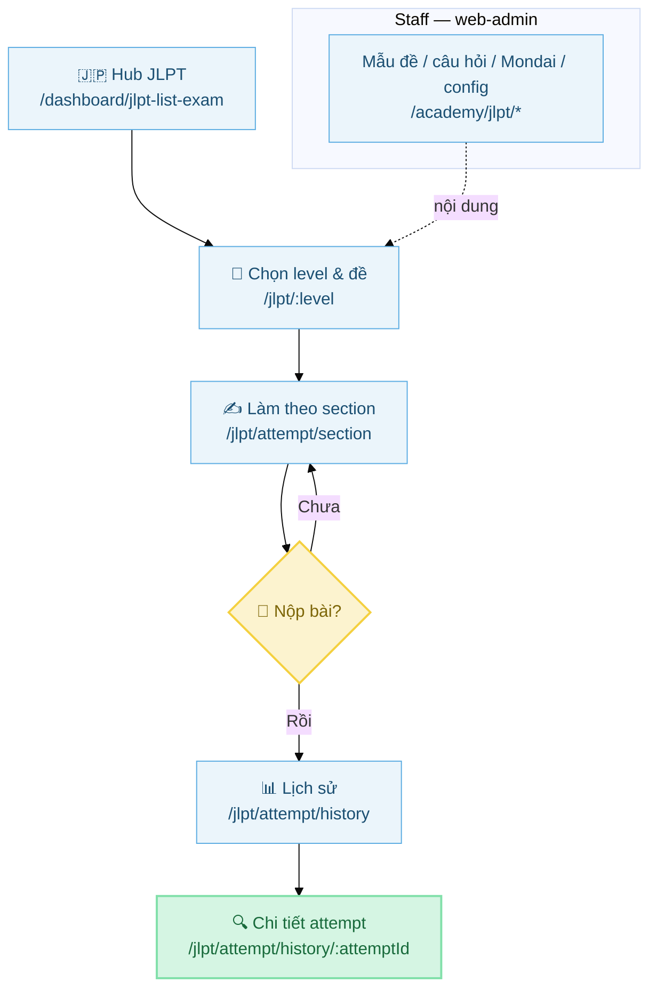
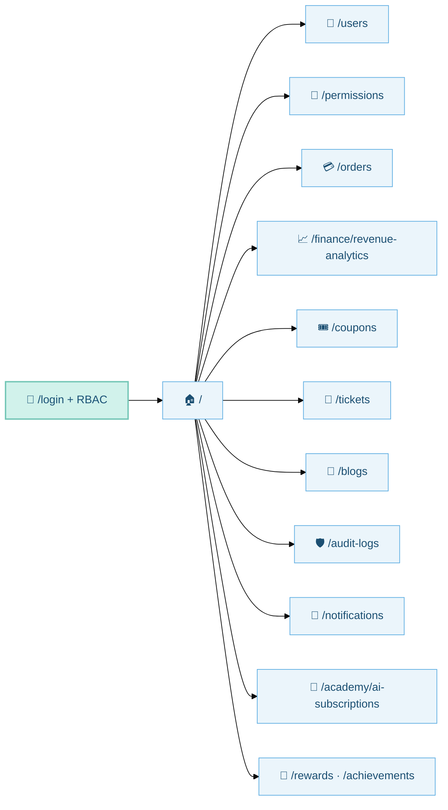
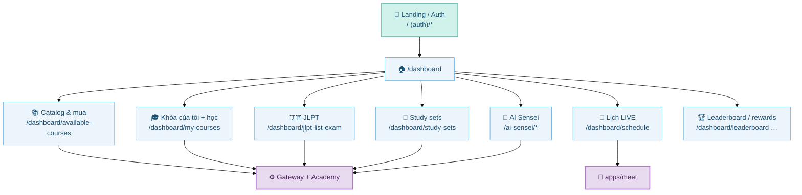

# Torii Academy: Luồng nghiệp vụ & màn hình chính

Tài liệu phục vụ báo cáo / onboarding: **luồng nghiệp vụ** và **route màn hình** chính trong monorepo Torii (học viên `web-learner`, vận hành `web-admin`, phòng học `meet`, backend `apps/server`, AI/voice tùy triển khai).

---

## Ánh xạ nhanh: tính năng ↔ ứng dụng ↔ route

| Nhóm nghiệp vụ | Ứng dụng | Màn hình / route tiêu biểu |
|----------------|----------|----------------------------|
| Catalog & phê duyệt | `web-admin` | `/academy/course-profiles`, `/academy/cohorts`, `/academy/vod-packages`, `/academy/approvals` + các trang preview |
| Lớp LIVE & chấm bài | `web-admin` + `meet` | `/academy/live-classes`, `/academy/live-classes/:id/detail?tab=…`, `…/assignments/:assessmentId/submissions` |
| Mua → ghi danh → học | `web-learner` + Academy service | `/dashboard/available-courses`, `/checkout/:courseId`, `/payment/success`, `/courses/:courseId/learn` |
| VOD / quiz / chứng chỉ | `web-learner` | `/courses/.../quizzes`, `/courses/.../certificate`, `/dashboard/certificates` |
| JLPT mock | `web-admin` (nội dung) + `web-learner` (thi) | Admin: `/academy/jlpt/*`; Learner: `/dashboard/jlpt-list-exam`, `/jlpt/:level`, `/jlpt/attempt`, history |
| Study sets & gamification | Cả hai | Learner: `/dashboard/study-sets`, `…/match`, `…/test`, `…/review`, `/share/study-sets/:token`; Admin: `/academy/study-set-catalogs`; `/dashboard/rewards`, `/dashboard/leaderboard`, `/dashboard/achievements` |
| AI Sensei | `web-learner` + gateway/agents | `/ai-sensei/*`, `/dashboard/payment/subscriptions` |
| Vận hành | `web-admin` | `/users`, `/permissions`, `/orders`, `/finance/revenue-analytics`, `/coupons`, `/tickets`, `/blogs`, `/audit-logs`, `/notifications` |

Tham chiếu spec backend (commerce/enrollment): `apps/server/services/academy/live-class-commerce-spec.md`. RBAC: `apps/server/config/rbac-v2-mapping.md`, `rbac-v2-runbook.md`.

---

## Hướng dẫn màu sắc (Mermaid)

Các sơ đồ dùng bảng màu thống nhất:

- **Aqua**: điểm vào / người dùng (`start`)
- **Purple**: backend, service, đổi trạng thái (`process`)
- **Vàng**: kiểm tra / rẽ nhánh (`decision`)
- **Xanh lá**: hoàn thành / hiển thị công khai (`finish`)
- **Xanh nhạt viền**: **màn hình UI** với route (`screen`)

---

## 01 — Pipeline phê duyệt catalog (Course Profile → công khai)

*Staff tạo/chỉnh Hồ sơ khóa học; Admin phê duyệt trước khi lên catalog cho học viên.*

---

## 02 — Mua hàng (PayOS) → Ghi danh → Học → Hoàn thành

*Theo mô hình Order/Enrollment: học viên chọn cohort/gói LIVE/VOD → checkout PayOS → webhook → enrollment ACTIVE → học theo `enrollmentId`.*

---

## 03 — Lớp trực tiếp (LiveKit + NATS, app `meet`)

---

## 04 — AI Sensei (Gateway, queue, LLM, TTS)

---

## 05 — Study Sets & gamification

**Nội dung (Staff):** `/academy/study-set-catalogs` và `/academy/study-set-catalogs/:id`.

---

## 06 — Hành trình JLPT mock

Tham chiếu thêm: `docs/spec/JLPT_MOCK_EXAM_SPEC.md`.

---

## 07 — Vận hành & quản trị (`web-admin`)

Cấu hình route & permission: `apps/web-admin/src/App.tsx`, menu: `apps/web-admin/src/config/navigation.tsx`.

---

## 08 — Bản đồ tổng: học viên từ dashboard đến các trụ cột

Menu sidebar học viên: `apps/web-learner/config/navigation.ts`.

---

## Gợi ý slide báo cáo

1. Một slide **bản đồ tổng (08)**.  
2. **Thương mại + enrollment (02)** và **phê duyệt catalog (01)**.  
3. **LIVE (03)** — nêu rõ `web-learner` + `meet` + tab quản lý `web-admin`.  
4. **AI (04)** + **SRS / gamification (05)**.  
5. **JLPT (06)** + **vận hành admin (07)**.

---

## Cập nhật tài liệu

Khi thêm route hoặc đổi permission, cập nhật đồng thời:

- `apps/web-admin/src/App.tsx`
- `apps/web-admin/src/config/navigation.tsx`
- `apps/web-learner/app/**/page.tsx` và `apps/web-learner/config/navigation.ts`
- Spec liên quan trong `apps/server/services/academy/` hoặc `docs/spec/`
